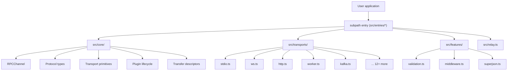
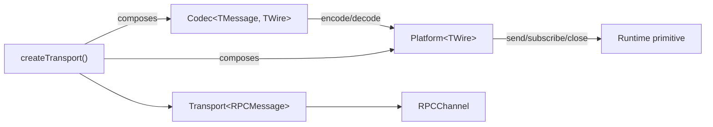
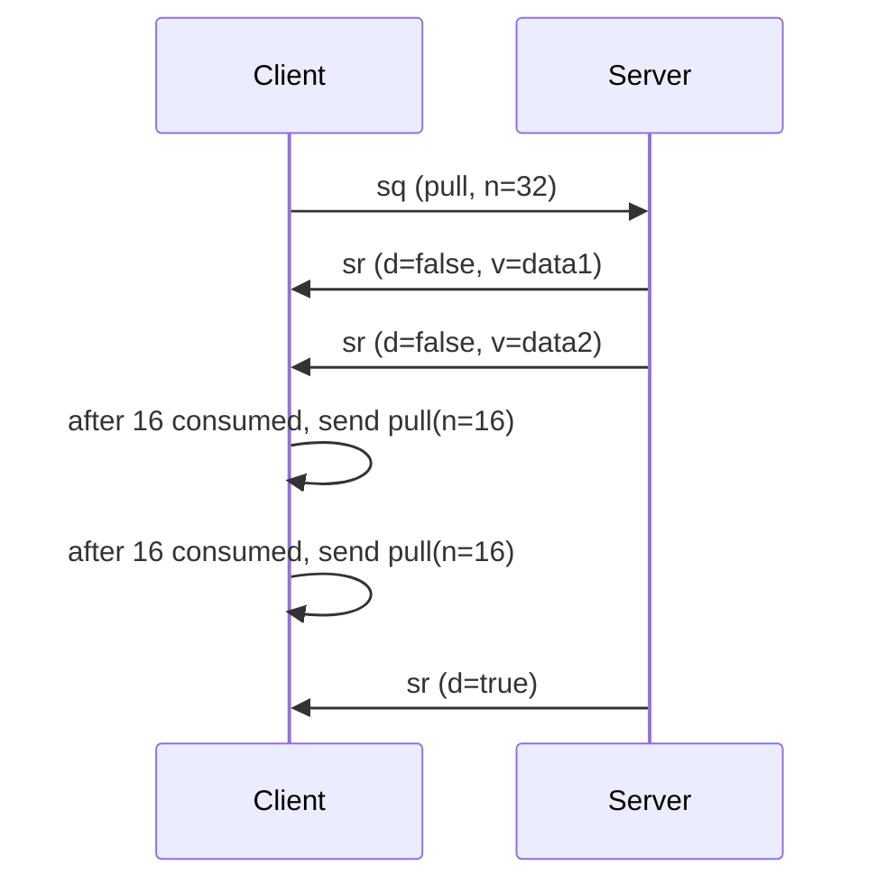
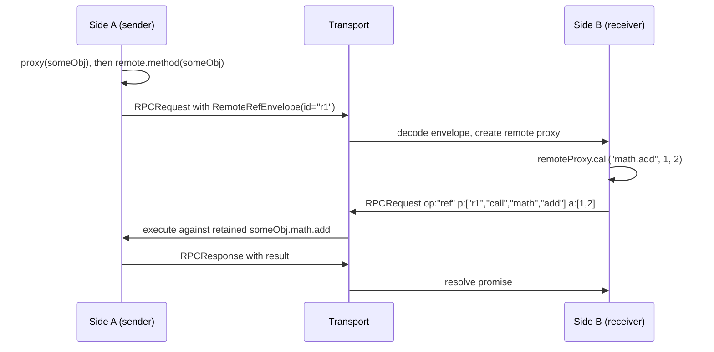
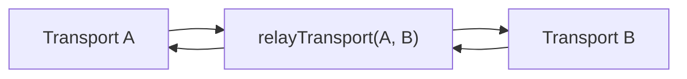

# Architecture

<cite>
**Referenced Files in This Document**
- [packages/kkrpc/src/core/channel.ts](file://packages/kkrpc/src/core/channel.ts)
- [packages/kkrpc/src/core/protocol.ts](file://packages/kkrpc/src/core/protocol.ts)
- [packages/kkrpc/src/core/transport.ts](file://packages/kkrpc/src/core/transport.ts)
- [packages/kkrpc/src/core/plugins.ts](file://packages/kkrpc/src/core/plugins.ts)
- [packages/kkrpc/src/core/codecs.ts](file://packages/kkrpc/src/core/codecs.ts)
- [packages/kkrpc/src/core/transfer.ts](file://packages/kkrpc/src/core/transfer.ts)
- [packages/kkrpc/src/core/streaming-channel.ts](file://packages/kkrpc/src/core/streaming-channel.ts)
- [packages/kkrpc/src/core/remote-ref-channel.ts](file://packages/kkrpc/src/core/remote-ref-channel.ts)
- [packages/kkrpc/src/core/remote-ref.ts](file://packages/kkrpc/src/core/remote-ref.ts)
- [packages/kkrpc/src/relay.ts](file://packages/kkrpc/src/relay.ts)
- [packages/kkrpc/ARCHITECTURE.md](file://packages/kkrpc/ARCHITECTURE.md)
</cite>

## Table of Contents

1. [Layering](#layering)
2. [Native Transport Architecture](#native-transport-architecture)
3. [Message Protocol](#message-protocol)
4. [Plugin System](#plugin-system)
5. [Streaming Architecture](#streaming-architecture)
6. [Remote References Architecture](#remote-references-architecture)
7. [Transport Relay](#transport-relay)
8. [Error and Timeout Semantics](#error-and-timeout-semantics)

## Layering

kkrpc v2.0.0 is organized around a strict separation of concerns with four source directories:

- **`src/core/`** — `RPCChannel`, protocol types, transport primitives, plugin lifecycle, transfer descriptors, and shared remote-ref markers. This is the stable, runtime-agnostic foundation.
- **`src/transports/`** — Native transport factories that create `Platform<TWire>` and `Transport<RPCMessage>` instances for each runtime primitive (stdio, WebSocket, Worker, HTTP, Electron IPC, Kafka, etc.).
- **`src/features/`** — Optional plugin-based feature implementations: validation (Standard Schema v1), middleware (onion interceptors), and SuperJSON codecs.
- **`src/entries/`** — Published entry point files that re-export from the other directories. Each subpath in `package.json` maps to one entry file.



**Diagram sources**

- [packages/kkrpc/src/core/index.ts](file://packages/kkrpc/src/core/index.ts#L1-L107)
- [packages/kkrpc/src/entries/mod.ts](file://packages/kkrpc/src/entries/mod.ts#L1-L17)
- [packages/kkrpc/ARCHITECTURE.md](file://packages/kkrpc/ARCHITECTURE.md)

**Section sources**

- [packages/kkrpc/src/core/channel.ts](file://packages/kkrpc/src/core/channel.ts#L1-L17)
- [packages/kkrpc/src/core/transport.ts](file://packages/kkrpc/src/core/transport.ts#L1-L8)
- [packages/kkrpc/ARCHITECTURE.md](file://packages/kkrpc/ARCHITECTURE.md)

## Native Transport Architecture

The v2.0.0 rewrite replaced the legacy adapter pattern with a **Transport/Platform/Codec composition** model. This is the defining architectural change of the release.



**Diagram sources**

- [packages/kkrpc/src/core/transport.ts](file://packages/kkrpc/src/core/transport.ts#L48-L68)
- [packages/kkrpc/src/core/transport.ts](file://packages/kkrpc/src/core/transport.ts#L90-L121)

### Key Concepts

- **`Platform<TWire>`** — Wraps a runtime I/O primitive (e.g., Node.js `process.stdin/stdout`, browser `WebSocket`, `MessagePort`). Declares `capabilities` (objectMode, transfer) and exposes `send`, `subscribe`, and `close`.
- **`Codec<TMessage, TWire>`** — Encodes/decodes protocol messages to/from wire values. Built-in codecs: `objectCodec` (identity, preserves transferables), `jsonCodec` (plain JSON), `jsonLineCodec` (newline-delimited JSON).
- **`createTransport()`** — Composes a platform and codec into a message-level `Transport<RPCMessage>`. Computes transfer support by AND-ing platform and codec capabilities. Accepts optional override `TransportCapabilities`.
- **`TransportCapabilities`** — Feature negotiation flags: `objectMode`, `transfer`, `broadcast`, `remoteRefs`. These are checked by `RPCChannel` to enable/disable features.

The native transport factories in `src/transports/` return **ready-to-use** `Transport<RPCMessage>` instances, not intermediary adapters. For example, `nodeStdioTransport()` returns a transport that composes `stdioPlatform()` with `jsonLineCodec()`.

**Section sources**

- [packages/kkrpc/src/core/transport.ts](file://packages/kkrpc/src/core/transport.ts#L10-L121)
- [packages/kkrpc/src/core/codecs.ts](file://packages/kkrpc/src/core/codecs.ts#L1-L54)
- [packages/kkrpc/src/transports/stdio.ts](file://packages/kkrpc/src/transports/stdio.ts#L152-L160)
- [packages/kkrpc/src/transports/ws.ts](file://packages/kkrpc/src/transports/ws.ts#L55-L114)

## Message Protocol

The protocol uses compact JSON-compatible records to remain portable across object-mode, string, and stream-based transports. Instead of class instances, messages are plain objects with single-letter keys for wire efficiency.

### Request Records

```typescript
interface RPCRequest {
	t: "q" // Message tag
	id: string // Request id for response matching
	op: RPCOperation // "call" | "get" | "set" | "new" | "ref"
	p: string[] // Property path on the exposed API
	a?: unknown[] // Encoded arguments
	v?: unknown // Encoded value (for set operations)
	meta?: RPCMessageMetadata // Optional metadata (trace, correlation)
}
```

### Response Records

```typescript
interface RPCResponse {
	t: "r" // Message tag
	id: string // Matched request id
	v?: unknown // Successful result value
	e?: RPCError // Error payload { n, m, s? }
}
```

### Stream Records

Stream operations use separate message types for control (`t: "sq"` with `pull`/`return`/`throw` ops) and data (`t: "sr"` with stream id, done flag, and value).

### Callback Records

Callback invocations use `t: "cb"` with a callback id and encoded arguments. Callbacks are encoded as special envelopes inside argument arrays using the `__kkrpc_next_arg__` tag, preventing user data from being confused with callback markers.

**Section sources**

- [packages/kkrpc/src/core/protocol.ts](file://packages/kkrpc/src/core/protocol.ts#L1-L118)
- [packages/kkrpc/src/core/channel.ts](file://packages/kkrpc/src/core/channel.ts#L58-L83)
- [packages/kkrpc/src/core/channel.ts](file://packages/kkrpc/src/core/channel.ts#L444-L473)

## Plugin System

Plugins implement receive-side hooks using an onion model. The plugin lifecycle runs for every incoming request:

1. **`onRequest(ctx)`** — Inspect or mutate the incoming request context (args, metadata, state) before handler execution. Validation runs here.
2. **`wrapHandler(ctx, next)`** — Wrap local handler invocation. Middleware interceptors run here. Can short-circuit by not calling `next()`.
3. **`onResponse(ctx)`** — Inspect or transform the successful result before serialization.
4. **`onError(ctx)`** — Observe or replace the error before serialization.

```typescript
interface RPCPlugin {
	name?: string
	onRequest?(ctx: RPCRequestContext): void | Promise<void>
	wrapHandler?(ctx: RPCHandlerContext, next: () => Promise<unknown>): Promise<unknown>
	onResponse?(ctx: RPCResponseContext): void | Promise<void>
	onError?(ctx: RPCErrorContext): void | Promise<void>
}
```

Each request carries a shared mutable `state` bag (`Record<string, unknown>`) that all plugins can read and write to coordinate cross-cutting concerns like authentication, logging metadata, or metrics spans.

Built-in plugin implementations:

- **`validationPlugin()`** — Standard Schema v1 input/output validation via `onRequest`/`onResponse`
- **`middlewarePlugin()`** — Onion-style interceptor chain via `wrapHandler`
- **`inspectorPlugin()`** — Observability event emission via `onRequest`/`onResponse`/`onError`

**Section sources**

- [packages/kkrpc/src/core/plugins.ts](file://packages/kkrpc/src/core/plugins.ts#L1-L127)
- [packages/kkrpc/src/core/channel.ts](file://packages/kkrpc/src/core/channel.ts#L371-L415)
- [packages/kkrpc/src/features/validation.ts](file://packages/kkrpc/src/features/validation.ts#L497-L508)
- [packages/kkrpc/src/features/middleware.ts](file://packages/kkrpc/src/features/middleware.ts#L79-L98)
- [packages/kkrpc/src/entries/inspector.ts](file://packages/kkrpc/src/entries/inspector.ts#L226-L239)

## Streaming Architecture

Streaming is an opt-in feature through `kkrpc/streaming` and `StreamingRPCChannel`. The base `RPCChannel` intentionally excludes stream state machine to keep simple browser bundles small.

`StreamingRPCChannel` extends `RPCChannel` and adds:

- **Stream reference encoding** — Async iterables returned by handlers are replaced with stream reference envelopes (`__kkrpc_next_stream__`) before serialization.
- **Pull-credit flow control** — The remote consumer grants credit (`STREAM_CREDIT_WINDOW = 32`), and the producer pumps values as long as credit remains. Credit is replenished in batches of 16.
- **Stream dispatch** — Handles `t: "sq"` control messages (`pull`, `return`, `throw`) and `t: "sr"` data/acknowledgement messages.
- **`for await` support** — Remote proxies created by `StreamingRPCChannel` include `Symbol.asyncIterator` in the proxy trap, enabling `for await (const chunk of remote.streamMethod())`.
- **Lazy async iteration** — A returned promise from a streaming method is also an `AsyncIterable`, allowing both `await` and `for await` on the same call.



**Diagram sources**

- [packages/kkrpc/src/core/streaming-channel.ts](file://packages/kkrpc/src/core/streaming-channel.ts#L32-L33)
- [packages/kkrpc/src/core/streaming-channel.ts](file://packages/kkrpc/src/core/streaming-channel.ts#L320-L329)
- [packages/kkrpc/src/core/streaming-channel.ts](file://packages/kkrpc/src/core/streaming-channel.ts#L493-L535)

**Section sources**

- [packages/kkrpc/src/core/streaming-channel.ts](file://packages/kkrpc/src/core/streaming-channel.ts#L1-L646)
- [packages/kkrpc/src/entries/streaming.ts](file://packages/kkrpc/src/entries/streaming.ts#L1-L73)

## Remote References Architecture

Remote references are an opt-in feature through `kkrpc/remote-refs`, providing Comlink-style explicit `proxy(value)` references that cross the RPC boundary by reference rather than by value.

`RemoteReferenceRPCChannel` extends `RPCChannel` and adds:

- **`proxy()` marker** — A `WeakSet`-based non-enumerable marker that tags objects/functions for by-reference transfer. Marked values are not serialized; instead they are retained on the sender side and accessed through `op: "ref"` RPC operations.
- **`RemoteRefEnvelope`** — Wire format: `{ __kkrpc_ref__: true, id: string, kind: "function" | "object", p?: string[] }`. Sent in place of the actual proxy-marked value.
- **Remote proxy creation** — When a `RemoteRefEnvelope` is decoded, the receiver creates a local proxy (`createRemoteFunction()` or `createRemoteObject()`) that forwards property access, method calls, and setters back to the sender.
- **`releaseProxy()`** — Deterministic cleanup. Calling `releaseProxy(value)` sends a `ref/{id}/release` request and marks the local proxy as released. Releasing is idempotent.
- **Cycle detection** — Recursive encoding/decoding of plain objects and arrays detects cycles during remote-ref rewriting and throws `RPCEncodeError` if cycles would require partial cloning.
- **Tombstone tracking** — Released local ref IDs are kept for up to 1024 entries to provide clean error messages for late callers instead of ambiguous "unknown ref" errors.



**Diagram sources**

- [packages/kkrpc/src/core/remote-ref.ts](file://packages/kkrpc/src/core/remote-ref.ts#L1-L119)
- [packages/kkrpc/src/core/remote-ref-channel.ts](file://packages/kkrpc/src/core/remote-ref-channel.ts#L688-L749)
- [packages/kkrpc/src/core/remote-ref-channel.ts](file://packages/kkrpc/src/core/remote-ref-channel.ts#L609-L686)

**Section sources**

- [packages/kkrpc/src/core/remote-ref.ts](file://packages/kkrpc/src/core/remote-ref.ts#L1-L119)
- [packages/kkrpc/src/core/remote-ref-channel.ts](file://packages/kkrpc/src/core/remote-ref-channel.ts#L112-L750)
- [packages/kkrpc/src/entries/remote-refs.ts](file://packages/kkrpc/src/entries/remote-refs.ts#L1-L85)

## Transport Relay

The relay module (`src/relay.ts`) enables bidirectional message forwarding between two transports without exposing a local API. This is useful for proxying connections across boundaries such as Web Worker ↔ main thread ↔ iframe.



**Diagram sources**

- [packages/kkrpc/src/relay.ts](file://packages/kkrpc/src/relay.ts#L17-L30)

When the destination transport supports transferables, the relay collects transferable objects from message payloads (ArrayBuffer, MessagePort, ImageBitmap, OffscreenCanvas, ReadableStream, WritableStream, TransformStream) and forwards them with the send call.

**Section sources**

- [packages/kkrpc/src/relay.ts](file://packages/kkrpc/src/relay.ts#L1-L92)

## Error and Timeout Semantics

Errors are serialized as enhanced objects preserving `name`, `message`, `stack`, `cause`, and custom enumerable properties. `RPCTimeoutError` is raised by a per-pending-request timer (default 30s, configurable or `0` to disable).

Destroying a channel:

1. Rejects all pending requests with `"RPC channel destroyed"`
2. Clears timeout timers
3. Clears callback records
4. Calls `transport.close()` to release runtime resources
5. For `RemoteReferenceRPCChannel`: releases all remote proxy records and clears local ref tracking
6. For `StreamingRPCChannel`: cancels producer-side iterators, rejects stream waiters, clears stream state

Write failures immediately reject the matching pending request instead of waiting for a timeout, and for remote-ref channels roll back any new reference records created during encoding.

**Section sources**

- [packages/kkrpc/src/core/channel.ts](file://packages/kkrpc/src/core/channel.ts#L131-L153)
- [packages/kkrpc/src/core/channel.ts](file://packages/kkrpc/src/core/channel.ts#L212-L224)
- [packages/kkrpc/src/core/channel.ts](file://packages/kkrpc/src/core/channel.ts#L266-L277)
- [packages/kkrpc/src/core/channel.ts](file://packages/kkrpc/src/core/channel.ts#L285-L320)
- [packages/kkrpc/src/core/remote-ref-channel.ts](file://packages/kkrpc/src/core/remote-ref-channel.ts#L141-L152)
- [packages/kkrpc/src/core/streaming-channel.ts](file://packages/kkrpc/src/core/streaming-channel.ts#L149-L170)
