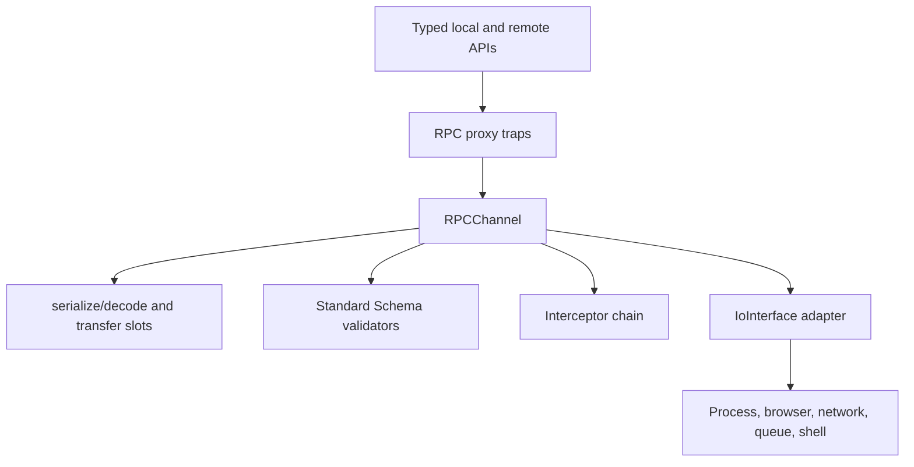
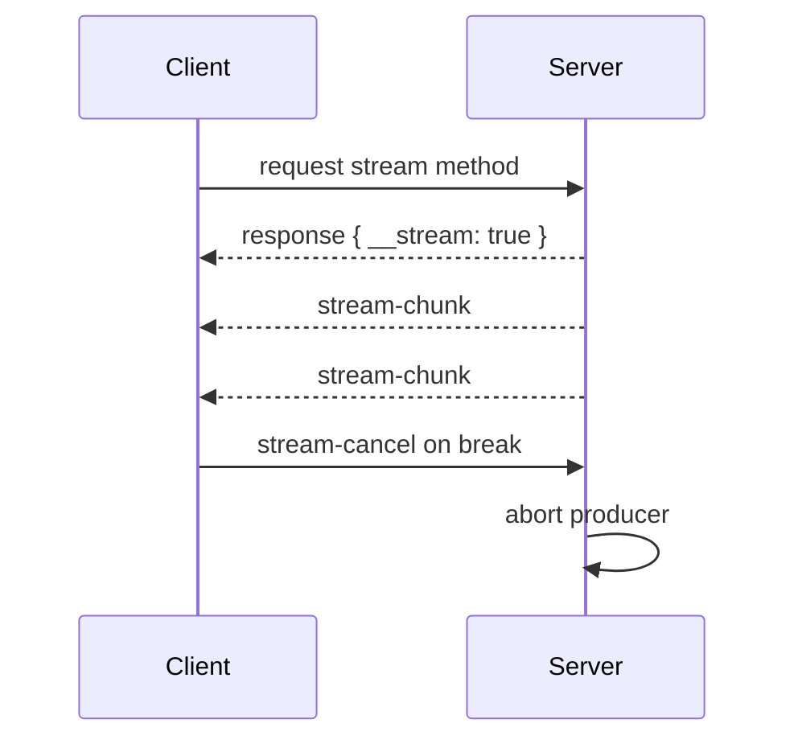

# Architecture

<cite>
**Referenced Files in This Document**
- [packages/kkrpc/src/channel.ts](file://packages/kkrpc/src/channel.ts)
- [packages/kkrpc/src/serialization.ts](file://packages/kkrpc/src/serialization.ts)
- [packages/kkrpc/src/interface.ts](file://packages/kkrpc/src/interface.ts)
- [packages/kkrpc/src/middleware.ts](file://packages/kkrpc/src/middleware.ts)
- [.journal/2026-02-07.md](file://.journal/2026-02-07.md)
</cite>

## Table of Contents

1. [Layering](#layering)
2. [Message Protocol](#message-protocol)
3. [Error and Timeout Semantics](#error-and-timeout-semantics)
4. [Streaming Semantics](#streaming-semantics)

## Layering

kkrpc is organized around a strict separation between the transport layer and the RPC layer. The
transport layer implements `IoInterface`; the RPC layer owns proxy creation, pending request
tracking, validation, middleware execution, serialization, transfer slot reconstruction, streaming,
and lifecycle cleanup.

**Diagram sources**

- [packages/kkrpc/src/channel.ts](file://packages/kkrpc/src/channel.ts#L115-L174)
- [packages/kkrpc/src/channel.ts](file://packages/kkrpc/src/channel.ts#L551-L590)
- [packages/kkrpc/src/interface.ts](file://packages/kkrpc/src/interface.ts#L29-L45)

**Section sources**

- [packages/kkrpc/src/channel.ts](file://packages/kkrpc/src/channel.ts#L115-L174)
- [packages/kkrpc/src/channel.ts](file://packages/kkrpc/src/channel.ts#L507-L590)
- [packages/kkrpc/src/interface.ts](file://packages/kkrpc/src/interface.ts#L29-L45)

## Message Protocol

The protocol supports ordinary calls, callbacks, property access, constructor calls, and streaming.
String transports use newline-delimited JSON or SuperJSON. Structured clone capable transports can
send a versioned object envelope with transfer slots and attached transferred values.

**Section sources**

- [packages/kkrpc/src/serialization.ts](file://packages/kkrpc/src/serialization.ts#L8-L28)
- [packages/kkrpc/src/serialization.ts](file://packages/kkrpc/src/serialization.ts#L55-L69)
- [packages/kkrpc/src/serialization.ts](file://packages/kkrpc/src/serialization.ts#L131-L190)
- [packages/kkrpc/src/serialization.ts](file://packages/kkrpc/src/serialization.ts#L192-L212)

## Error and Timeout Semantics

Errors are serialized as enhanced objects that preserve `name`, `message`, `stack`, `cause`, and
custom enumerable properties. `RPCTimeoutError` uses the same cross-wire pattern and is raised by a
per-pending-request timer when the channel-level timeout is enabled. Destroying a channel rejects
pending requests, clears timers, cancels producer-side streams, rejects consumer stream waiters,
frees callbacks, and delegates to the adapter's `destroy` hook.

**Section sources**

- [packages/kkrpc/src/serialization.ts](file://packages/kkrpc/src/serialization.ts#L87-L129)
- [packages/kkrpc/src/channel.ts](file://packages/kkrpc/src/channel.ts#L28-L55)
- [packages/kkrpc/src/channel.ts](file://packages/kkrpc/src/channel.ts#L1061-L1084)
- [packages/kkrpc/src/channel.ts](file://packages/kkrpc/src/channel.ts#L1140-L1175)
- [.journal/2026-02-07.md](file://.journal/2026-02-07.md#L24-L40)

## Streaming Semantics

Handlers can return `AsyncIterable` values. The receiver gets an initial stream marker response,
then consumes `stream-chunk`, `stream-end`, and `stream-error` messages through an `AsyncIterable`.
Breaking from `for await` sends `stream-cancel`, which aborts the producer-side loop.

**Diagram sources**

- [packages/kkrpc/src/channel.ts](file://packages/kkrpc/src/channel.ts#L585-L590)
- [packages/kkrpc/src/channel.ts](file://packages/kkrpc/src/channel.ts#L802-L874)
- [packages/kkrpc/src/channel.ts](file://packages/kkrpc/src/channel.ts#L884-L987)

**Section sources**

- [packages/kkrpc/src/channel.ts](file://packages/kkrpc/src/channel.ts#L585-L590)
- [packages/kkrpc/src/channel.ts](file://packages/kkrpc/src/channel.ts#L802-L874)
- [packages/kkrpc/src/channel.ts](file://packages/kkrpc/src/channel.ts#L884-L987)
- [.journal/2026-02-07.md](file://.journal/2026-02-07.md#L88-L134)
