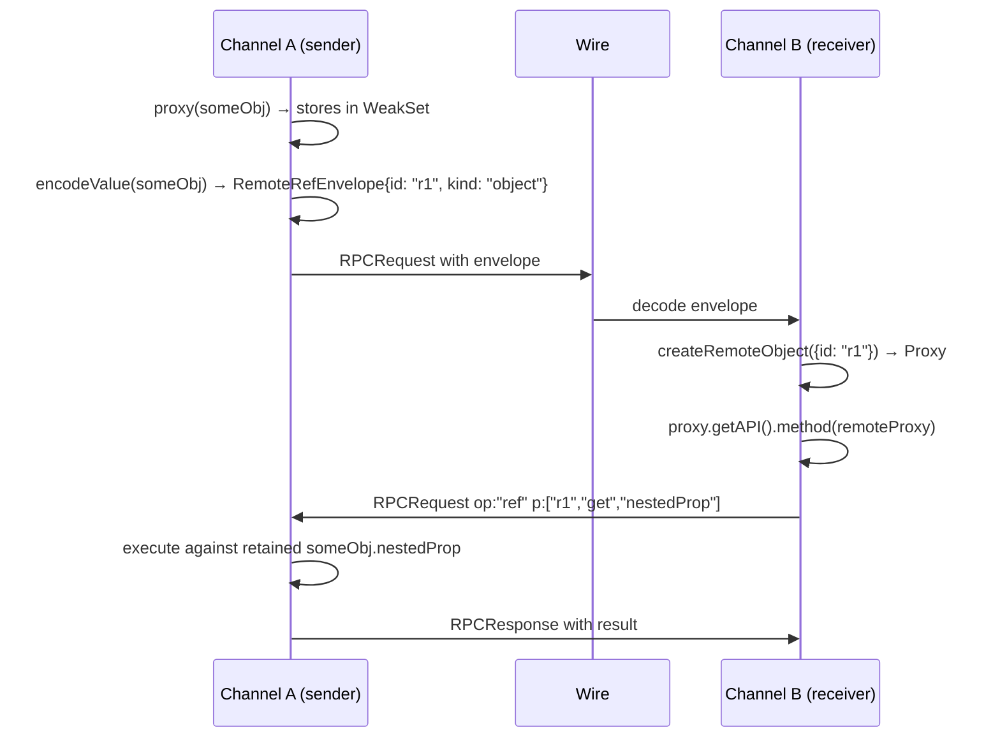

# Remote References

<cite>
**Referenced Files in This Document**
- [packages/kkrpc/src/core/remote-ref.ts](file://packages/kkrpc/src/core/remote-ref.ts)
- [packages/kkrpc/src/core/remote-ref-channel.ts](file://packages/kkrpc/src/core/remote-ref-channel.ts)
- [packages/kkrpc/src/entries/remote-refs.ts](file://packages/kkrpc/src/entries/remote-refs.ts)
- [packages/kkrpc/src/core/channel.ts](file://packages/kkrpc/src/core/channel.ts)
- [packages/kkrpc/__tests__/remote-refs.test.ts](file://packages/kkrpc/__tests__/remote-refs.test.ts)
</cite>

## Table of Contents

1. [Overview](#overview)
2. [Proxy Marker](#proxy-marker)
3. [RemoteRef Channel Architecture](#remoteref-channel-architecture)
4. [Encode/Decode Strategy](#encodedecode-strategy)
5. [Lifecycle and Cleanup](#lifecycle-and-cleanup)
6. [Cycle Detection](#cycle-detection)
7. [Usage Patterns](#usage-patterns)

## Overview

Remote references provide Comlink-style explicit `proxy()` references that cross the RPC boundary **by reference** rather than by value. Import from `kkrpc/remote-refs`:

```typescript
import { proxy, releaseProxy } from "kkrpc/remote-refs"
```

When an object or function is marked with `proxy(value)` and passed as an argument or returned from a method, it is not serialized. Instead, the sender retains the value, sends a lightweight `RemoteRefEnvelope` across the wire, and the receiver creates a local proxy facade. All subsequent operations on the proxy (property access, method calls, setters) are forwarded back to the sender through `op: "ref"` protocol messages.

**Diagram sources**

- [packages/kkrpc/src/core/remote-ref.ts](file://packages/kkrpc/src/core/remote-ref.ts#L61-L67)
- [packages/kkrpc/src/core/remote-ref.ts](file://packages/kkrpc/src/core/remote-ref.ts#L94-L106)
- [packages/kkrpc/src/core/remote-ref-channel.ts](file://packages/kkrpc/src/core/remote-ref-channel.ts#L688-L749)

**Section sources**

- [packages/kkrpc/src/core/remote-ref.ts](file://packages/kkrpc/src/core/remote-ref.ts#L1-L119)
- [packages/kkrpc/src/entries/remote-refs.ts](file://packages/kkrpc/src/entries/remote-refs.ts#L1-L85)

## Proxy Marker

The `proxy()` function uses a `WeakSet` to non-enumerably mark objects and functions:

```typescript
import { isRemoteProxy, proxy } from "kkrpc/remote-refs"

const obj = { hello: "world" }
const marked = proxy(obj)
// marked === obj (identity preserved)
// marked crosses the wire by reference

const callback = proxy((result: string) => console.log(result))
// Marked functions are callable remotely through request/response RPC
```

Key behaviors:

- Marking is persistent for the object's lifetime
- Marking is non-enumerable (stored in a `WeakSet`, not on the object itself)
- `proxy()` returns the same object reference (identity-preserving)
- Plain unmarked functions inside data are NOT proxied — they throw `RPCEncodeError`

**Section sources**

- [packages/kkrpc/src/core/remote-ref.ts](file://packages/kkrpc/src/core/remote-ref.ts#L51-L76)
- [packages/kkrpc/src/core/remote-ref-channel.ts](file://packages/kkrpc/src/core/remote-ref-channel.ts#L326-L328)

## RemoteRef Channel Architecture

`RemoteReferenceRPCChannel` extends the base `RPCChannel` with:

1. **Local reference tracking** — `WeakMap<object, string>` and `Map<string, LocalRefRecord>` to map proxy-marked values to reference IDs and track their lifecycle.
2. **Remote proxy management** — A `Set<RemoteProxyRecord>` for all decoded remote proxies that can be deterministically released.
3. **Argument/value encoding** — Recursive encoding that rewrites proxy-marked values into `RemoteRefEnvelope` instances.
4. **Ref request handling** — Handles `op: "ref"` requests for `apply`, `get`, `set`, `call`, and `release` operations on locally retained values.

### Wire Format

```typescript
interface RemoteRefEnvelope {
	readonly __kkrpc_ref__: true
	readonly id: string // Unique reference id
	readonly kind: "function" | "object"
	readonly p?: string[] // Optional sub-path for nested access
}
```

### Local Reference Records

```typescript
type LocalRefRecord = {
	kind: RemoteRefKind
	value?: unknown
	receiver?: unknown // Tracked for method receiver binding
	released: boolean
}
```

**Section sources**

- [packages/kkrpc/src/core/remote-ref-channel.ts](file://packages/kkrpc/src/core/remote-ref-channel.ts#L112-L151)
- [packages/kkrpc/src/core/remote-ref.ts](file://packages/kkrpc/src/core/remote-ref.ts#L10-L22)

## Encode/Decode Strategy

### Encoding (sender side)

When encoding values for outbound messages:

1. **Transfer descriptors** are consumed first (delegated to base `RPCChannel`)
2. **Remote proxies** from the same channel are re-encoded by reference (prevents double-wrapping)
3. **Explicit `proxy()` markers** are detected via `isExplicitProxyTarget()` and retained as local refs
4. **Unmarked functions** throw `RPCEncodeError` (prevents accidental cross-context leaks)
5. **Plain arrays/objects** are shallow-copied only when a nested proxy marker or remote proxy is rewritten

### Decoding (receiver side)

When decoding inbound values:

1. **`RemoteRefEnvelope`** instances are replaced with local proxy facades
2. **`createRemoteFunction()`** creates a callable proxy that forwards to `op: "ref"` with path `[refId, "apply"]`
3. **`createRemoteObject()`** creates a path-building `Proxy` for property get/set/method calls with path `[refId, "get"/"set"/"call", ...propertyPath]`



**Diagram sources**

- [packages/kkrpc/src/core/remote-ref-channel.ts](file://packages/kkrpc/src/core/remote-ref-channel.ts#L304-L370)
- [packages/kkrpc/src/core/remote-ref-channel.ts](file://packages/kkrpc/src/core/remote-ref-channel.ts#L609-L686)

**Section sources**

- [packages/kkrpc/src/core/remote-ref-channel.ts](file://packages/kkrpc/src/core/remote-ref-channel.ts#L304-L370)
- [packages/kkrpc/src/core/remote-ref-channel.ts](file://packages/kkrpc/src/core/remote-ref-channel.ts#L609-L686)

## Lifecycle and Cleanup

### Release

```typescript
import { releaseProxy } from "kkrpc/remote-refs"

// Release a remote proxy — sends ref/{id}/release, marks local proxy as unusable
await releaseProxy(remoteProxy)
// Subsequent calls throw RPCRemoteReferenceReleasedError
```

### Channel Destroy

When the channel is destroyed:

1. All remote proxy records are marked as released (`markReleased()`)
2. Local ref WeakMaps are cleared
3. A bounded tombstone list (1024 entries) keeps released IDs for clean error messages

### Write Failure Rollback

If a transport write fails during an outgoing request that created new reference records, those records are rolled back via `rollbackNewRefs()`:

```typescript
private rollbackNewRefs(state: RewriteState): void {
  for (const ref of state.newRefs) {
    this.localRefs.delete(ref.id)
    // Clean up WeakMap entries
  }
}
```

**Section sources**

- [packages/kkrpc/src/core/remote-ref.ts](file://packages/kkrpc/src/core/remote-ref.ts#L94-L106)
- [packages/kkrpc/src/core/remote-ref-channel.ts](file://packages/kkrpc/src/core/remote-ref-channel.ts#L141-L152)
- [packages/kkrpc/src/core/remote-ref-channel.ts](file://packages/kkrpc/src/core/remote-ref-channel.ts#L514-L540)

## Cycle Detection

Recursive encoding/decoding of plain objects and arrays detects cycles during remote-ref rewriting. If a cycle is encountered while rewriting is active (i.e., a proxy marker or remote proxy was replaced in the same graph), the operation throws `RPCEncodeError`:

```typescript
const a: Record<string, unknown> = { name: "a" }
const b: Record<string, unknown> = { name: "b", ref: a }
a.ref = b

// This throws: "Cannot perform cyclic remote-reference rewriting"
await remote.method(proxy(a), proxy(b))
```

When no rewriting occurs (no proxy markers in the graph), cycles pass through without error for plain data structures.

**Section sources**

- [packages/kkrpc/src/core/remote-ref-channel.ts](file://packages/kkrpc/src/core/remote-ref-channel.ts#L447-L455)

## Usage Patterns

### Passing Callbacks by Reference

```typescript
import { proxy, releaseProxy } from "kkrpc/remote-refs"

// Mark a callback forward to the remote side
const onProgress = proxy((percent: number) => {
	console.log(`Progress: ${percent}%`)
})

await remote.longOperation(onProgress)
// Remote side calls onProgress(50) → triggers our local callback
```

### Sharing State Objects

```typescript
import { proxy } from "kkrpc/remote-refs"

const sharedState = proxy({ count: 0 })

// Remote can read/write sharedState.count
await remote.increment(sharedState)
// sharedState.count is now 1 locally
```

### Cleaning Up

```typescript
// Always release proxies when done
const ref = proxy(someExpensiveResource)
await remote.useResource(ref)
await releaseProxy(remoteRef) // or use the returned proxy's release

// Forgetting to release keeps the value retained on the sender side
```

**Section sources**

- [packages/kkrpc/src/core/remote-ref.ts](file://packages/kkrpc/src/core/remote-ref.ts#L61-L67)
- [packages/kkrpc/**tests**/remote-refs.test.ts](file://packages/kkrpc/__tests__/remote-refs.test.ts)
