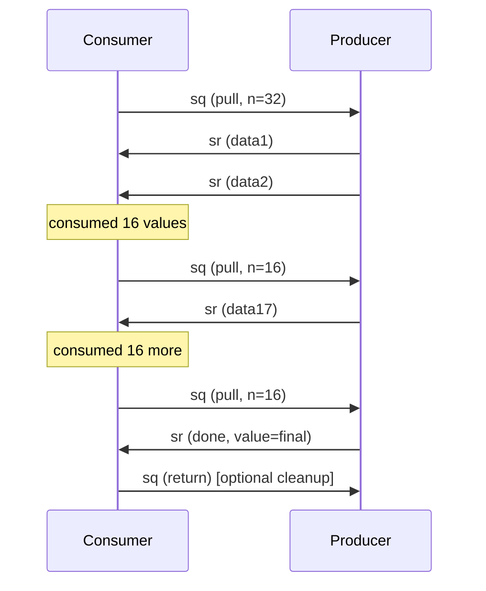

# Streaming

<cite>
**Referenced Files in This Document**
- [packages/kkrpc/src/core/streaming-channel.ts](file://packages/kkrpc/src/core/streaming-channel.ts)
- [packages/kkrpc/src/core/channel.ts](file://packages/kkrpc/src/core/channel.ts)
- [packages/kkrpc/src/core/protocol.ts](file://packages/kkrpc/src/core/protocol.ts)
- [packages/kkrpc/src/entries/streaming.ts](file://packages/kkrpc/src/entries/streaming.ts)
- [packages/kkrpc/__tests__/streaming.test.ts](file://packages/kkrpc/__tests__/streaming.test.ts)
</cite>

## Table of Contents

1. [Overview](#overview)
2. [Stream Protocol Messages](#stream-protocol-messages)
3. [Pull-Credit Flow Control](#pull-credit-flow-control)
4. [Producer-Side Pumping](#producer-side-pumping)
5. [Consumer-Side Async Iteration](#consumer-side-async-iteration)
6. [Lazy Iteration from Promises](#lazy-iteration-from-promises)
7. [Error Handling and Cleanup](#error-handling-and-cleanup)

## Overview

Streaming is an opt-in feature accessed through `kkrpc/streaming`. The `StreamingRPCChannel` class extends the base `RPCChannel` with:

- Async iterable return values — handlers can return `AsyncIterable<T>`
- Streaming input arguments — callers can pass `AsyncIterable` values as arguments
- Bidirectional stream control — `pull` (credit), `return`, and `throw` operations
- Both `await` and `for await` on the same call result

Streaming is opt-in because the stream state machine adds bundle weight. The base `RPCChannel` intentionally does not support streaming.

```typescript
import { StreamingRPCChannel } from "kkrpc/streaming"

const channel = new StreamingRPCChannel(transport, { expose: api })
const remote = channel.getAPI()

// Consumer
for await (const chunk of remote.streamValues()) {
	console.log(chunk)
}
```

**Section sources**

- [packages/kkrpc/src/core/streaming-channel.ts](file://packages/kkrpc/src/core/streaming-channel.ts#L1-L9)
- [packages/kkrpc/src/core/streaming-channel.ts](file://packages/kkrpc/src/core/streaming-channel.ts#L130-L147)
- [packages/kkrpc/src/entries/streaming.ts](file://packages/kkrpc/src/entries/streaming.ts)

## Stream Protocol Messages

Streaming uses two additional message types beyond the base request/response/callback protocol:

### Stream Control (Consumer → Producer)

```typescript
interface RPCStreamRequest {
	t: "sq" // Stream control tag
	id: string // Control request id
	sid: string // Stream id
	op: RPCStreamOperation // "pull" | "return" | "throw"
	n?: number // Credit amount (for pull)
	v?: unknown // Value (for return/throw)
}
```

### Stream Data (Producer → Consumer)

```typescript
interface RPCStreamResponse {
	t: "sr" // Stream data tag
	id: string // Message id
	sid: string // Stream id
	d?: boolean // Whether the iterator is done
	v?: unknown // Yielded or returned value
	e?: RPCError // Error when the iterator failed
}
```

**Section sources**

- [packages/kkrpc/src/core/protocol.ts](file://packages/kkrpc/src/core/protocol.ts#L86-L118)
- [packages/kkrpc/src/core/streaming-channel.ts](file://packages/kkrpc/src/core/streaming-channel.ts#L110-L128)

## Pull-Credit Flow Control

Streams use a credit-based flow control system to bound buffering:

```
Window size:        STREAM_CREDIT_WINDOW = 32
Replenish batch:    STREAM_CREDIT_REPLENISH = 16
```



**Diagram sources**

- [packages/kkrpc/src/core/streaming-channel.ts](file://packages/kkrpc/src/core/streaming-channel.ts#L32-L33)
- [packages/kkrpc/src/core/streaming-channel.ts](file://packages/kkrpc/src/core/streaming-channel.ts#L320-L329)
- [packages/kkrpc/src/core/streaming-channel.ts](file://packages/kkrpc/src/core/streaming-channel.ts#L573-L579)

When the consumer:

1. **Starts iteration** — Sends initial `pull(n=32)` to the producer
2. **Consumes values** — After every 16 consumed values, sends `pull(n=16)` to replenish credit
3. **Calls `return()` or `throw()`** — Sends a control message and waits for acknowledgement
4. **Breaks from `for await`** — Implicitly calls `return()`, which aborts the producer loop

**Section sources**

- [packages/kkrpc/src/core/streaming-channel.ts](file://packages/kkrpc/src/core/streaming-channel.ts#L320-L329)
- [packages/kkrpc/src/core/streaming-channel.ts](file://packages/kkrpc/src/core/streaming-channel.ts#L573-L579)
- [packages/kkrpc/src/core/streaming-channel.ts](file://packages/kkrpc/src/core/streaming-channel.ts#L331-L361)

## Producer-Side Pumping

When the producer receives a `pull` control, it pumps values from the local async iterator:

```typescript
private async pumpLocalStream(streamId: string, stream: LocalStreamState): Promise<void> {
  if (stream.pumping || stream.closed) return
  stream.pumping = true
  try {
    while (!this.destroyed && !stream.closed && stream.credit > 0) {
      stream.credit--
      const result = await stream.iterator.next()
      // Send sr(done, value) or sr(data)
    }
  } finally {
    stream.pumping = false
    // Resume if more credit came in while pumping
  }
}
```

Key behaviors:

- `pumping` flag prevents concurrent pump loops for the same stream
- Credit is decremented before each `iterator.next()` call
- Write failures close the stream and stop pumping
- After pumping completes, if more credit arrived, the pump resumes automatically
- Stream reference envelopes (`__kkrpc_next_stream__`) replace async iterables in encoded values

**Section sources**

- [packages/kkrpc/src/core/streaming-channel.ts](file://packages/kkrpc/src/core/streaming-channel.ts#L492-L535)
- [packages/kkrpc/src/core/streaming-channel.ts](file://packages/kkrpc/src/core/streaming-channel.ts#L293-L308)

## Consumer-Side Async Iteration

When the consumer receives a `RemoteStreamState`, it creates a local async iterable:

```typescript
const iterator: AsyncIterator<unknown> = {
	next: async () => {
		// Check buffer first, then wait for more data or done
		const buffered = readBuffered()
		if (buffered) return buffered
		if (stream.error) throw stream.error
		if (stream.done) return { done: true, value: undefined }
		return await new Promise((resolve, reject) => {
			stream.waiters.push({ resolve, reject })
			start() // Send initial pull if not started
		})
	},
	return: async (value?) => {
		// Send return control, clean up waiters
		return await this.requestStreamControl(streamId, "return", value)
	},
	throw: async (error?) => {
		// Send throw control, reject waiters
		return await this.requestStreamControl(streamId, "throw", error)
	}
}
```

Buffered values are consumed first. If the buffer is empty, the consumer waits on a promise that is resolved when the next stream data message arrives.

**Section sources**

- [packages/kkrpc/src/core/streaming-channel.ts](file://packages/kkrpc/src/core/streaming-channel.ts#L581-L633)
- [packages/kkrpc/src/core/streaming-channel.ts](file://packages/kkrpc/src/core/streaming-channel.ts#L311-L318)

## Lazy Iteration from Promises

StreamingRPCChannel supports a pattern where remote method calls that return promises can also be consumed with `for await`:

```typescript
// Both work:
const result = await remote.streamMethod()
for await (const chunk of remote.streamMethod()) {
	console.log(chunk)
}
// Combined:
for await (const chunk of await remote.streamMethod()) {
	console.log(chunk)
}
```

This is implemented by decorating the promise with `Symbol.asyncIterator`:

```typescript
private withAsyncIterator(promise: Promise<unknown>): Promise<unknown> & AsyncIterable<unknown> {
  Object.defineProperty(promise, Symbol.asyncIterator, {
    configurable: true,
    value: () => this.createAsyncIteratorFromPromise(promise)
  })
  return promise as Promise<unknown> & AsyncIterable<unknown>
}
```

**Section sources**

- [packages/kkrpc/src/core/streaming-channel.ts](file://packages/kkrpc/src/core/streaming-channel.ts#L537-L570)
- [packages/kkrpc/src/core/streaming-channel.ts](file://packages/kkrpc/src/core/streaming-channel.ts#L172-L197)

## Error Handling and Cleanup

### Write Failures

Stream write failures close the local iterator and reject pending stream control requests:

```typescript
private closeLocalStreamAfterWriteFailure(streamId: string, stream: LocalStreamState): void {
  if (stream.closed) return
  stream.closed = true
  this.localStreams.delete(streamId)
  void stream.iterator.return?.()
}
```

### Remote Stream Error Delivery

When a producer encounters an error, it sends an `sr` with an error payload, which rejects all consumer waiters.

### Channel Destroy

On `destroy()`:

1. All pending stream control requests are rejected
2. Local iterators are closed via `iterator.return()`
3. Remote stream waiters are rejected
4. All stream state is cleared
5. Super.destroy() cleans up the base channel

### Stream Input Cleanup

If a request handler throws after receiving streaming arguments, the decoded remote streams are closed during error handling to prevent resource leaks:

```typescript
private async closeDecodedRemoteStreams(streams: AsyncIterable<unknown>[]): Promise<void> {
  for (const stream of streams) {
    try { await stream[Symbol.asyncIterator]().return?.() }
    catch { /* Preserve original error; cleanup is best-effort */ }
  }
}
```

**Section sources**

- [packages/kkrpc/src/core/streaming-channel.ts](file://packages/kkrpc/src/core/streaming-channel.ts#L373-L379)
- [packages/kkrpc/src/core/streaming-channel.ts](file://packages/kkrpc/src/core/streaming-channel.ts#L149-L170)
- [packages/kkrpc/src/core/streaming-channel.ts](file://packages/kkrpc/src/core/streaming-channel.ts#L636-L645)
