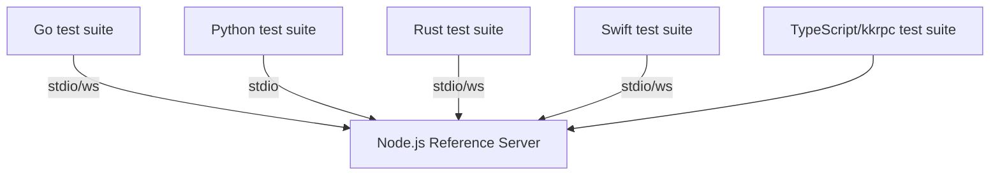

# Cross Language Interop

<cite>
**Referenced Files in This Document**
- [interop/README.md](file://interop/README.md)
- [interop/AGENTS.md](file://interop/AGENTS.md)
- [interop/go/kkrpc/protocol.go](file://interop/go/kkrpc/protocol.go)
- [interop/go/kkrpc/server.go](file://interop/go/kkrpc/server.go)
- [interop/go/kkrpc/client.go](file://interop/go/kkrpc/client.go)
- [interop/go/kkrpc/server_test.go](file://interop/go/kkrpc/server_test.go)
- [interop/python/kkrpc/protocol.py](file://interop/python/kkrpc/protocol.py)
- [interop/python/kkrpc/server.py](file://interop/python/kkrpc/server.py)
- [interop/python/kkrpc/client.py](file://interop/python/kkrpc/client.py)
- [interop/python/tests/test_stdio.py](file://interop/python/tests/test_stdio.py)
- [interop/rust/src/lib.rs](file://interop/rust/src/lib.rs)
- [interop/swift/Sources/kkrpc/Protocol.swift](file://interop/swift/Sources/kkrpc/Protocol.swift)
- [interop/swift/Sources/kkrpc/Server.swift](file://interop/swift/Sources/kkrpc/Server.swift)
- [interop/swift/Sources/kkrpc/Client.swift](file://interop/swift/Sources/kkrpc/Client.swift)
- [interop/swift/Tests/kkrpcTests/kkrpcTests.swift](file://interop/swift/Tests/kkrpcTests/kkrpcTests.swift)
- [interop/node/server.ts](file://interop/node/server.ts)
- [interop/node/ws-server.ts](file://interop/node/ws-server.ts)
- [packages/kkrpc/src/core/protocol.ts](file://packages/kkrpc/src/core/protocol.ts)
</cite>

## Table of Contents

1. [Interop Scope](#interop-scope)
2. [Protocol Subset](#protocol-subset)
3. [Language Implementations](#language-implementations)
4. [Test Infrastructure](#test-infrastructure)
5. [Design Constraints](#design-constraints)

## Interop Scope

The `interop/` directory documents and implements JSON-only compatibility layers so non-JavaScript runtimes can communicate with a TypeScript kkrpc endpoint over line-delimited stdio or WebSocket text frames. The interop layer targets the same compact protocol as the TypeScript core but uses a JSON-only v1 protocol rather than SuperJSON.

Supported languages:
- **Go** — Full server and client with stdio and WebSocket transports, test suite
- **Python** — Server and client with stdio transport, test suite, type annotations
- **Rust** — Server and client with stdio and WebSocket transports, test suite
- **Swift** — Server and client with stdio and WebSocket transports, comprehensive test suite
- **Node.js** — Reference test server for compatibility verification

**Section sources**

- [interop/README.md](file://interop/README.md#L1-L30)
- [interop/AGENTS.md](file://interop/AGENTS.md#L1-L9)

## Protocol Subset

The interop protocol implements the same compact RPC message types as the TypeScript core:

| Message | Tag | Purpose |
|---|---|---|
| Request | `t: "q"` | Remote call, get, set, new operations |
| Response | `t: "r"` | Result or error response |
| Callback | `t: "cb"` | Callback invocation |

All implementations target `version: "json"` (plain JSON, not SuperJSON). Callback arguments are encoded as special markers and decoded to function calls that route back over the transport.

Key protocol fields:
- `id` — String UUID for request/response matching
- `op` — Operation type (`"call"`, `"get"`, `"set"`, `"new"`)
- `p` — String array property path on the exposed API
- `a` — Encoded argument array (with callback/value envelopes)
- `v` — Value for set operations
- `e` — Error payload with `n` (name), `m` (message), `s` (stack)

**Section sources**

- [packages/kkrpc/src/core/protocol.ts](file://packages/kkrpc/src/core/protocol.ts#L1-L118)
- [interop/go/kkrpc/protocol.go](file://interop/go/kkrpc/protocol.go#L1-L50)
- [interop/python/kkrpc/protocol.py](file://interop/python/kkrpc/protocol.py#L1-L30)
- [interop/rust/src/lib.rs](file://interop/rust/src/lib.rs#L1-L50)
- [interop/swift/Sources/kkrpc/Protocol.swift](file://interop/swift/Sources/kkrpc/Protocol.swift#L1-L30)

## Language Implementations

### Go (`interop/go/`)

The Go implementation provides:
- `kkrpc/protocol.go` — Message type definitions and JSON serialization
- `kkrpc/server.go` — RPC server with stdio transport, request routing, callback support, error handling
- `kkrpc/client.go` — RPC client with stdio transport, response matching, callback encoding
- `kkrpc/server_test.go` — Test suite with request/response tests

Key features:
- Stdio transport with newline-delimited JSON
- Concurrent request handling with goroutines
- Callback argument encoding/decoding
- Error serialization preserving name and message

### Python (`interop/python/`)

The Python implementation provides:
- `kkrpc/protocol.py` — Dataclass-based message types with JSON serialization
- `kkrpc/server.py` — Async server with stdio transport and method routing
- `kkrpc/client.py` — Async client with stdio and response matching
- `tests/test_stdio.py` — Stdio transport tests

Key features:
- Async/await design matching the TypeScript core
- Typed dataclasses for protocol messages
- Callback support through argument envelope encoding
- Type annotations compatible with modern Python type checkers

### Rust (`interop/rust/`)

The Rust implementation provides:
- `src/lib.rs` — Comprehensive server and client with both stdio and WebSocket transports
- Stdio and WebSocket integration tests

Key features:
- WebSocket transport support (in addition to stdio)
- Serde-based JSON serialization for protocol messages
- Concurrent request handling
- Thread-safe callback routing

### Swift (`interop/swift/`)

The Swift implementation provides:
- `Sources/kkrpc/Protocol.swift` — Codable protocol message types
- `Sources/kkrpc/Server.swift` — Server with stdio transport and method routing
- `Sources/kkrpc/Client.swift` — Client with stdio transport and response matching
- `Sources/kkrpc/Transport.swift` — Transport abstraction layer
- `Tests/kkrpcTests/kkrpcTests.swift` — Comprehensive test suite

Key features:
- Swift Codable for JSON serialization
- Async/await Swift concurrency
- Callback support through argument encoding
- Transport abstraction supporting stdio and WebSocket

### Node.js Reference Server (`interop/node/`)

The Node.js `interop/node/` directory provides:
- `server.ts` — HTTP and stdio test server exposing a shared API for cross-language tests
- `ws-server.ts` — WebSocket test server for WebSocket-based interop tests

**Section sources**

- [interop/go/kkrpc/server.go](file://interop/go/kkrpc/server.go#L1-L144)
- [interop/go/kkrpc/client.go](file://interop/go/kkrpc/client.go#L1-L75)
- [interop/python/kkrpc/server.py](file://interop/python/kkrpc/server.py#L1-L105)
- [interop/python/kkrpc/client.py](file://interop/python/kkrpc/client.py#L1-L60)
- [interop/rust/src/lib.rs](file://interop/rust/src/lib.rs#L1-L357)
- [interop/swift/Sources/kkrpc/Server.swift](file://interop/swift/Sources/kkrpc/Server.swift#L1-L117)
- [interop/swift/Sources/kkrpc/Client.swift](file://interop/swift/Sources/kkrpc/Client.swift#L1-L78)
- [interop/node/server.ts](file://interop/node/server.ts#L1-L13)
- [interop/node/ws-server.ts](file://interop/node/ws-server.ts#L1-L11)

## Test Infrastructure

Cross-language testing uses the Node.js reference servers as the common endpoint:

**Diagram sources**

- [interop/go/kkrpc/server_test.go](file://interop/go/kkrpc/server_test.go#L1-L83)
- [interop/python/tests/test_stdio.py](file://interop/python/tests/test_stdio.py#L1-L79)
- [interop/rust/tests/stdio.rs](file://interop/rust/tests/stdio.rs#L1-L2)
- [interop/swift/Tests/kkrpcTests/kkrpcTests.swift](file://interop/swift/Tests/kkrpcTests/kkrpcTests.swift#L1-L159)

Each language implementation independently implements the protocol and validates against the same shared API. Tests cover:
- Basic function calls with string/number arguments
- Multiple concurrent requests
- Error handling (unknown methods, invalid arguments)
- Callback passing and invocation
- Get and set operations on exposed objects

## Design Constraints

The current interop layer intentionally omits:
- **Transfer slots and structured clone** — Keeps cross-language baseline simple
- **Streaming** — Async iterables are not yet supported in interop
- **Remote references** — `proxy()` is a TypeScript-specific concept
- **Message metadata** — Not yet implemented in interop implementations

The implementation priority is: implement newline-delimited JSON, the common message shape, IDs, and callback placeholders first; add richer JS-specific serialization later only when a target runtime needs it.

**Section sources**

- [interop/README.md](file://interop/README.md#L159-L180)
