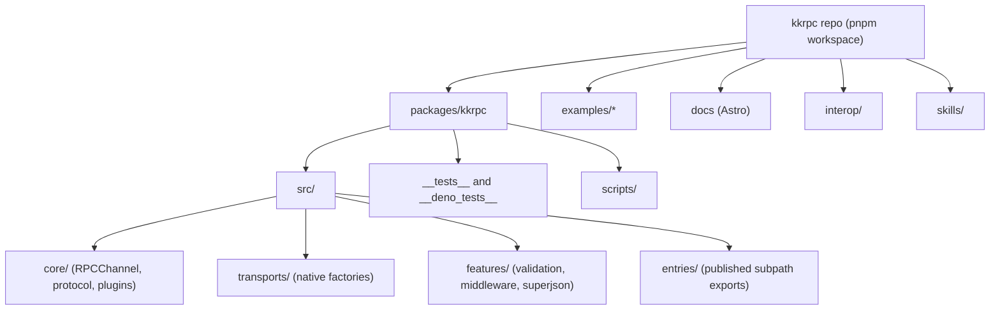
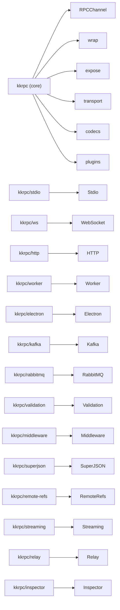
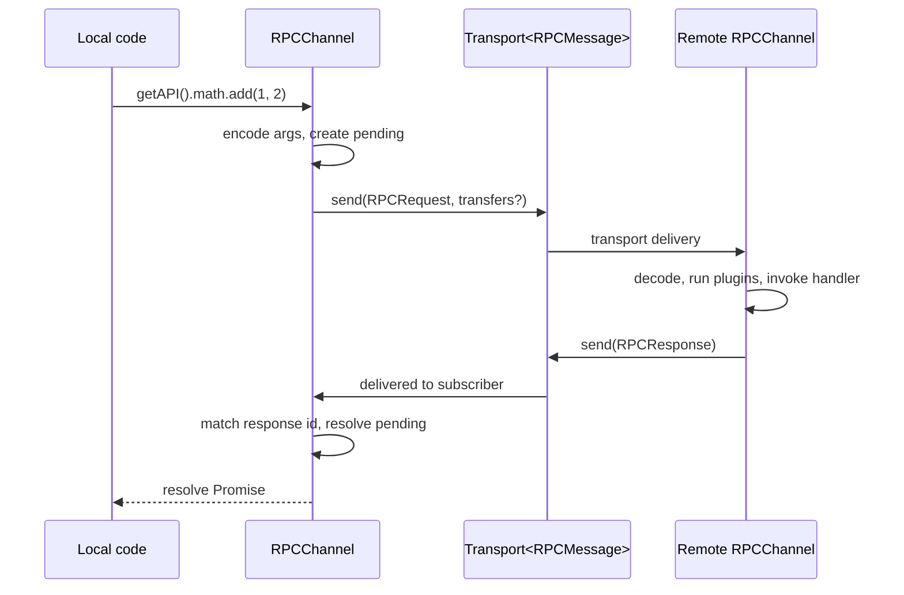

# System Overview

<cite>
**Referenced Files in This Document**
- [package.json](file://package.json)
- [packages/kkrpc/package.json](file://packages/kkrpc/package.json)
- [packages/kkrpc/src/core/index.ts](file://packages/kkrpc/src/core/index.ts)
- [packages/kkrpc/src/core/channel.ts](file://packages/kkrpc/src/core/channel.ts)
- [packages/kkrpc/src/core/protocol.ts](file://packages/kkrpc/src/core/protocol.ts)
- [packages/kkrpc/src/core/transport.ts](file://packages/kkrpc/src/core/transport.ts)
- [packages/kkrpc/src/entries/mod.ts](file://packages/kkrpc/src/entries/mod.ts)
- [packages/kkrpc/src/entries/browser-mod.ts](file://packages/kkrpc/src/entries/browser-mod.ts)
- [packages/kkrpc/src/entries/deno-mod.ts](file://packages/kkrpc/src/entries/deno-mod.ts)
- [packages/kkrpc/ARCHITECTURE.md](file://packages/kkrpc/ARCHITECTURE.md)
- [packages/kkrpc/BREAKING_MIGRATION.md](file://packages/kkrpc/BREAKING_MIGRATION.md)
</cite>

## Table of Contents

1. [Purpose](#purpose)
2. [Repository Shape](#repository-shape)
3. [Package Architecture](#package-architecture)
4. [Core Execution Model](#core-execution-model)
5. [Entry Point Selection](#entry-point-selection)
6. [Version History](#version-history)

## Purpose

kkrpc is a TypeScript-first RPC library for bidirectional communication across processes, workers, browser contexts, native shells, network sockets, message brokers, and desktop runtimes. The core package is published as `kkrpc` (v2.0.0) and targets Node.js, Deno, Bun, browser, Electron, Tauri, WebSocket, HTTP, Socket.IO, Kafka, RabbitMQ, Redis Streams, and NATS through a modular subpath export system.

The library has been rewritten for v2.0.0 with a **native transport architecture** that replaces the legacy adapter pattern. The new architecture separates core RPC logic (`src/core/`) from runtime transport factories (`src/transports/`), feature plugins (`src/features/`), and published entry points (`src/entries/`). This produces smaller browser bundles, enables tree-shaking, and simplifies maintenance.

**Section sources**

- [packages/kkrpc/package.json](file://packages/kkrpc/package.json#L2-L4)
- [packages/kkrpc/package.json](file://packages/kkrpc/package.json#L52-L397)
- [packages/kkrpc/ARCHITECTURE.md](file://packages/kkrpc/ARCHITECTURE.md#L1-L60)
- [packages/kkrpc/BREAKING_MIGRATION.md](file://packages/kkrpc/BREAKING_MIGRATION.md#L1-L30)

## Repository Shape

The repository is a pnpm workspace with the main library in `packages/kkrpc`, example applications in `examples/*`, the documentation site in `docs`, cross-language clients in `interop`, and AI skill documentation in `skills/`. Turbo coordinates build, development, test, lint, and type-check scripts from the workspace root.

**Diagram sources**

- [package.json](file://package.json#L4-L12)
- [package.json](file://package.json#L28-L32)
- [packages/kkrpc/package.json](file://packages/kkrpc/package.json#L38-L49)
- [packages/kkrpc/src/core/index.ts](file://packages/kkrpc/src/core/index.ts#L1-L107)

**Section sources**

- [package.json](file://package.json#L4-L12)
- [package.json](file://package.json#L24-L32)
- [packages/kkrpc/package.json](file://packages/kkrpc/package.json#L38-L49)

## Package Architecture

The published package exposes a modular set of subpath exports. Core types and the `RPCChannel` class live in the main `kkrpc` entry, while runtime-specific transports, features, and advanced channel variants are imported from separate subpaths:

**Diagram sources**

- [packages/kkrpc/package.json](file://packages/kkrpc/package.json#L52-L397)
- [packages/kkrpc/src/entries/mod.ts](file://packages/kkrpc/src/entries/mod.ts#L1-L17)

**Section sources**

- [packages/kkrpc/package.json](file://packages/kkrpc/package.json#L52-L397)
- [packages/kkrpc/src/entries/mod.ts](file://packages/kkrpc/src/entries/mod.ts#L1-L17)

## Core Execution Model

Every transport implements the `Transport<RPCMessage>` interface: a `send` method, a `subscribe` method that returns an unsubscribe callback, optional `capabilities` for feature negotiation, and an optional `close` hook. `RPCChannel` wraps a transport, exposes a local API via the `expose` option, and creates a typed proxy for the remote API via `getAPI()`.

**Diagram sources**

- [packages/kkrpc/src/core/transport.ts](file://packages/kkrpc/src/core/transport.ts#L37-L46)
- [packages/kkrpc/src/core/channel.ts](file://packages/kkrpc/src/core/channel.ts#L178-L224)
- [packages/kkrpc/src/core/channel.ts](file://packages/kkrpc/src/core/channel.ts#L250-L281)

**Section sources**

- [packages/kkrpc/src/core/channel.ts](file://packages/kkrpc/src/core/channel.ts#L178-L205)
- [packages/kkrpc/src/core/transport.ts](file://packages/kkrpc/src/core/transport.ts#L37-L46)
- [packages/kkrpc/src/core/transfer.ts](file://packages/kkrpc/src/core/transfer.ts#L1-L51)

## Entry Point Selection

The library offers stable subpath exports for every runtime and transport type. Each entry point is tree-shakeable and only pulls in its direct dependencies:

| Environment | Import Path | Transport Factory |
|---|---|---|
| Node.js | `kkrpc` | `nodeStdioTransport()` from `kkrpc/stdio` |
| Deno | `kkrpc/deno` | `denoStdioTransport()` from `kkrpc/stdio` |
| Bun | `kkrpc` | `bunStdioTransport()` from `kkrpc/stdio` |
| Browser (core) | `kkrpc/browser` | `webSocketClientTransport()` from `kkrpc/ws` |
| Web Worker | `kkrpc/worker` | `workerTransport()` / `workerSelfTransport()` |
| HTTP client | `kkrpc/http` | `httpClientTransport()` |
| WebSocket | `kkrpc/ws` | `webSocketTransport()` / `webSocketClientTransport()` |
| Hono WS | `kkrpc/ws/hono` | `honoWebSocketTransport()` |
| Elysia WS | `kkrpc/ws/elysia` | `elysiaWebSocketTransport()` |
| Socket.IO | `kkrpc/socketio` | `socketIoTransport()` |
| Electron | `kkrpc/electron` | `electronIpcTransport()` / `electronUtilityProcessTransport()` |
| Tauri | `kkrpc/tauri` | `tauriTransport()` |
| Chrome Ext | `kkrpc/chrome-extension` | `chromeExtensionTransport()` |
| iframe | `kkrpc/iframe` | `iframeTransport()` |
| Kafka | `kkrpc/kafka` | `kafkaTransport()` |
| RabbitMQ | `kkrpc/rabbitmq` | `rabbitMqTransport()` |
| Redis Streams | `kkrpc/redis-streams` | `redisStreamsTransport()` |
| NATS | `kkrpc/nats` | `natsTransport()` |

**Section sources**

- [packages/kkrpc/package.json](file://packages/kkrpc/package.json#L52-L397)
- [packages/kkrpc/src/entries/mod.ts](file://packages/kkrpc/src/entries/mod.ts#L1-L17)
- [packages/kkrpc/src/entries/browser-mod.ts](file://packages/kkrpc/src/entries/browser-mod.ts#L1-L20)
- [packages/kkrpc/src/entries/deno-mod.ts](file://packages/kkrpc/src/entries/deno-mod.ts#L1-L23)

## Version History

- **v2.0.0** — Native transport architecture rewrite. Removes legacy adapter system. Introduces `src/core/`, `src/transports/`, `src/features/`, `src/entries/` layout. Adds `kkrpc/remote-refs` (Comlink-style references), `kkrpc/streaming` (async iterable streaming), metadata propagation, plugin system, Transport/Platform/Codec composition primitives, bus envelope protocol, and browser bundle optimization.
- **v1.0.0** — First stable release with adapter-based architecture, WebSocket/HTTP/stdio/worker transports, validation, and middleware.
- **v0.x** — Experimental releases with evolving API surface.

**Section sources**

- [packages/kkrpc/ARCHITECTURE.md](file://packages/kkrpc/ARCHITECTURE.md#L1-L60)
- [packages/kkrpc/BREAKING_MIGRATION.md](file://packages/kkrpc/BREAKING_MIGRATION.md#L1-L30)
- [packages/kkrpc/package.json](file://packages/kkrpc/package.json#L3)
