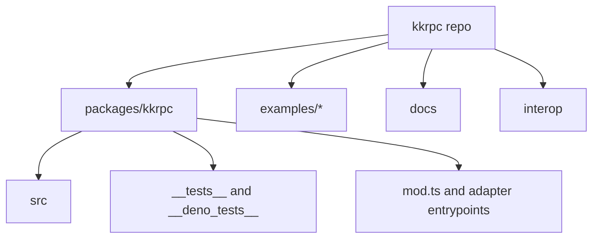
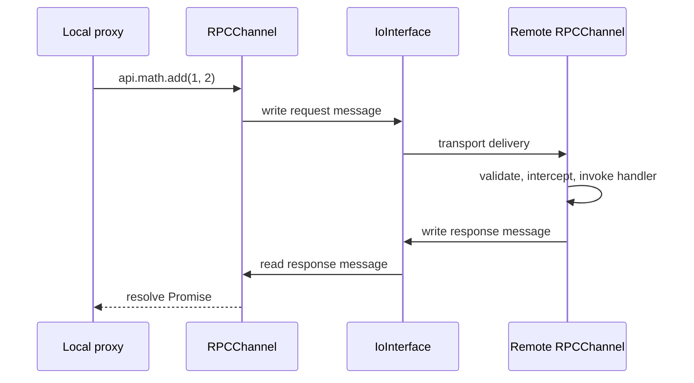

# System Overview

<cite>
**Referenced Files in This Document**
- [package.json](file://package.json)
- [packages/kkrpc/package.json](file://packages/kkrpc/package.json)
- [packages/kkrpc/mod.ts](file://packages/kkrpc/mod.ts)
- [packages/kkrpc/src/channel.ts](file://packages/kkrpc/src/channel.ts)
- [packages/kkrpc/src/interface.ts](file://packages/kkrpc/src/interface.ts)
</cite>

## Table of Contents

1. [Purpose](#purpose)
2. [Repository Shape](#repository-shape)
3. [Runtime Package Surface](#runtime-package-surface)
4. [Core Execution Model](#core-execution-model)

## Purpose

kkrpc is a TypeScript-first RPC library for bidirectional communication across processes,
workers, browser contexts, native shells, network sockets, and message brokers. The core package
is published as `kkrpc` and targets Node.js, Deno, Bun, browser, Electron, Tauri, WebSocket,
HTTP, Socket.IO, and several queue transports through separate entry points and optional peer
dependencies.

**Section sources**

- [packages/kkrpc/package.json](file://packages/kkrpc/package.json#L2-L4)
- [packages/kkrpc/package.json](file://packages/kkrpc/package.json#L48-L178)
- [packages/kkrpc/mod.ts](file://packages/kkrpc/mod.ts#L1-L26)

## Repository Shape

The repository is a pnpm workspace with the main library in `packages/kkrpc`, example
applications in `examples/*`, the documentation site in `docs`, and cross-language clients in
`interop`. Turbo coordinates build, development, test, lint, and type-check scripts from the
workspace root.

**Diagram sources**

- [package.json](file://package.json#L4-L12)
- [package.json](file://package.json#L28-L32)
- [packages/kkrpc/package.json](file://packages/kkrpc/package.json#L35-L44)

**Section sources**

- [package.json](file://package.json#L4-L12)
- [package.json](file://package.json#L24-L32)
- [packages/kkrpc/package.json](file://packages/kkrpc/package.json#L35-L44)

## Runtime Package Surface

The published package exposes the core module plus environment-specific adapter entry points.
Core exports include `RPCChannel`, transport interfaces, serialization, transfer helpers,
runtime validation, and middleware. Adapter-heavy integrations such as RabbitMQ, Kafka, Redis
Streams, NATS, and Socket.IO are split into subpath exports and backed by optional peer
dependencies so consumers only install the transports they use.

**Section sources**

- [packages/kkrpc/mod.ts](file://packages/kkrpc/mod.ts#L27-L45)
- [packages/kkrpc/package.json](file://packages/kkrpc/package.json#L48-L178)
- [packages/kkrpc/package.json](file://packages/kkrpc/package.json#L192-L238)

## Core Execution Model

Every transport implements `IoInterface`, a small contract of `read`, `write`, event listeners,
capability declarations, and optional teardown hooks. `RPCChannel` wraps an `IoInterface`, exposes
a local API, creates a proxy for the remote API, and routes decoded protocol messages to request,
response, callback, property, constructor, and streaming handlers.

**Diagram sources**

- [packages/kkrpc/src/interface.ts](file://packages/kkrpc/src/interface.ts#L29-L45)
- [packages/kkrpc/src/channel.ts](file://packages/kkrpc/src/channel.ts#L146-L174)
- [packages/kkrpc/src/channel.ts](file://packages/kkrpc/src/channel.ts#L272-L296)
- [packages/kkrpc/src/channel.ts](file://packages/kkrpc/src/channel.ts#L1092-L1137)

**Section sources**

- [packages/kkrpc/src/interface.ts](file://packages/kkrpc/src/interface.ts#L29-L45)
- [packages/kkrpc/src/channel.ts](file://packages/kkrpc/src/channel.ts#L146-L174)
- [packages/kkrpc/src/channel.ts](file://packages/kkrpc/src/channel.ts#L272-L347)
- [packages/kkrpc/src/channel.ts](file://packages/kkrpc/src/channel.ts#L1092-L1137)
