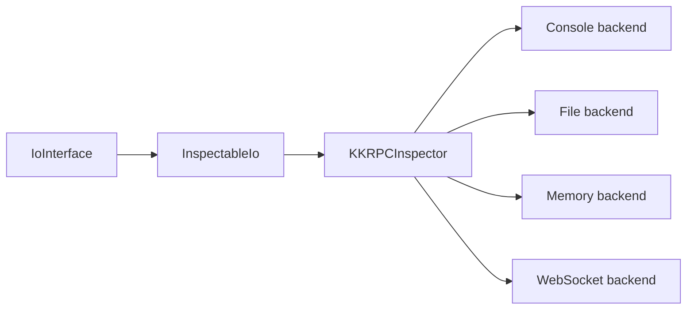

# Inspector and Build Tooling

<cite>
**Referenced Files in This Document**
- [packages/kkrpc/src/inspector/index.ts](file://packages/kkrpc/src/inspector/index.ts)
- [packages/kkrpc/src/inspector/types.ts](file://packages/kkrpc/src/inspector/types.ts)
- [packages/kkrpc/src/inspector/inspector.ts](file://packages/kkrpc/src/inspector/inspector.ts)
- [packages/kkrpc/src/inspector/inspectable-io.ts](file://packages/kkrpc/src/inspector/inspectable-io.ts)
- [package.json](file://package.json)
- [packages/kkrpc/package.json](file://packages/kkrpc/package.json)
- [packages/kkrpc/tsdown.config.ts](file://packages/kkrpc/tsdown.config.ts)
</cite>

## Table of Contents

1. [Traffic Inspector](#traffic-inspector)
2. [Inspector Data Model](#inspector-data-model)
3. [Build and Verification](#build-and-verification)
4. [Benchmarks](#benchmarks)

## Traffic Inspector

The inspector wraps an existing `IoInterface` with `InspectableIo`, decodes messages on reads and
writes, and sends inspection events to one or more backends. Built-in exports include console,
file, memory, and WebSocket backends.

**Diagram sources**

- [packages/kkrpc/src/inspector/index.ts](file://packages/kkrpc/src/inspector/index.ts#L1-L13)
- [packages/kkrpc/src/inspector/inspector.ts](file://packages/kkrpc/src/inspector/inspector.ts#L11-L90)
- [packages/kkrpc/src/inspector/inspectable-io.ts](file://packages/kkrpc/src/inspector/inspectable-io.ts#L10-L40)

**Section sources**

- [packages/kkrpc/src/inspector/index.ts](file://packages/kkrpc/src/inspector/index.ts#L1-L13)
- [packages/kkrpc/src/inspector/inspector.ts](file://packages/kkrpc/src/inspector/inspector.ts#L11-L90)
- [packages/kkrpc/src/inspector/inspectable-io.ts](file://packages/kkrpc/src/inspector/inspectable-io.ts#L29-L85)

## Inspector Data Model

Inspection events include timestamp, direction, session id, decoded protocol message, optional raw
size, and optional duration. Inspector options can filter messages, sanitize payloads, and track
latency by correlating outgoing requests with incoming responses or stream endings.

**Section sources**

- [packages/kkrpc/src/inspector/types.ts](file://packages/kkrpc/src/inspector/types.ts#L11-L27)
- [packages/kkrpc/src/inspector/types.ts](file://packages/kkrpc/src/inspector/types.ts#L29-L51)
- [packages/kkrpc/src/inspector/types.ts](file://packages/kkrpc/src/inspector/types.ts#L61-L77)
- [packages/kkrpc/src/inspector/inspectable-io.ts](file://packages/kkrpc/src/inspector/inspectable-io.ts#L95-L114)

## Build and Verification

The workspace uses pnpm and Turbo. The package build runs `tsdown`, emits ESM and CJS output with
declarations, generates Typedoc documentation, and verifies package exports after build and test.

**Section sources**

- [package.json](file://package.json#L4-L12)
- [package.json](file://package.json#L13-L27)
- [packages/kkrpc/package.json](file://packages/kkrpc/package.json#L35-L44)
- [packages/kkrpc/tsdown.config.ts](file://packages/kkrpc/tsdown.config.ts#L3-L35)

## Benchmarks

The benchmark journal records a Bun.build-based strategy for compiling TypeScript test scripts to
JavaScript without adding more runner dependencies, plus sample throughput findings across stdio
and WebSocket transports.

**Section sources**

- [.journal/2026-02-05.md](file://.journal/2026-02-05.md#L3-L39)
- [.journal/2026-02-05.md](file://.journal/2026-02-05.md#L41-L63)
- [.journal/2026-02-05.md](file://.journal/2026-02-05.md#L64-L92)
