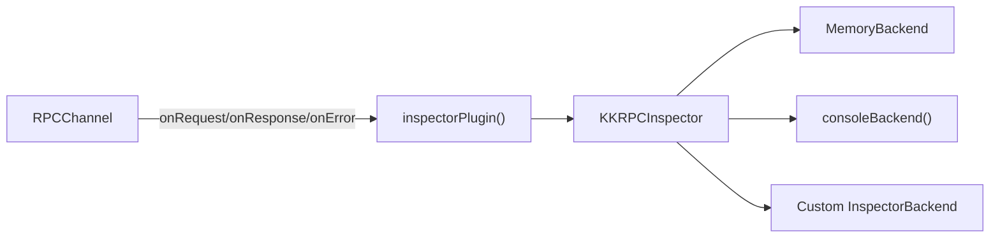

# Inspector and Build Tooling

<cite>
**Referenced Files in This Document**
- [packages/kkrpc/src/entries/inspector.ts](file://packages/kkrpc/src/entries/inspector.ts)
- [packages/kkrpc/src/core/plugins.ts](file://packages/kkrpc/src/core/plugins.ts)
- [packages/kkrpc/package.json](file://packages/kkrpc/package.json)
- [packages/kkrpc/tsdown.config.ts](file://packages/kkrpc/tsdown.config.ts)
- [packages/kkrpc/scripts/test.ts](file://packages/kkrpc/scripts/test.ts)
- [packages/kkrpc/scripts/prepare.ts](file://packages/kkrpc/scripts/prepare.ts)
- [packages/kkrpc/scripts/compare-browser-bundle-size.ts](file://packages/kkrpc/scripts/compare-browser-bundle-size.ts)
- [package.json](file://package.json)
</cite>

## Table of Contents

1. [RPC Traffic Inspector](#rpc-traffic-inspector)
2. [Inspector Plugin Architecture](#inspector-plugin-architecture)
3. [Memory Backend](#memory-backend)
4. [Build System](#build-system)
5. [Package Entry Points](#package-entry-points)
6. [Verification and Tests](#verification-and-tests)
7. [Browser Bundle Optimization](#browser-bundle-optimization)

## RPC Traffic Inspector

The inspector is an observability tool accessible through `kkrpc/inspector`. Unlike the v1.x adapter-based inspector (which wrapped `IoInterface` with `InspectableIo`), the v2.0.0 inspector is a **plugin-based** system that hooks into the `RPCPlugin` lifecycle.

```typescript
import { createInspector, MemoryBackend } from "kkrpc/inspector"

const backend = new MemoryBackend()
const inspector = createInspector({
  backends: [backend],
  options: { trackLatency: true }
})

expose(api, transport, { plugins: [inspector.plugin("server")] })
```

### InspectEvent

Every event carries a normalized shape:

```typescript
interface InspectEvent {
  timestamp: number       // Unix timestamp in milliseconds
  direction: "sent" | "received"
  sessionId: string       // Distinguishes endpoints
  message: RPCMessage     // The compact protocol message
  duration?: number       // Request latency when tracking enabled
}
```

**Section sources**

- [packages/kkrpc/src/entries/inspector.ts](file://packages/kkrpc/src/entries/inspector.ts#L1-L282)
- [packages/kkrpc/src/entries/inspector.ts](file://packages/kkrpc/src/entries/inspector.ts#L25-L37)
- [packages/kkrpc/src/entries/inspector.ts](file://packages/kkrpc/src/entries/inspector.ts#L131-L148)

## Inspector Plugin Architecture

The inspector connects to the channel through a lightweight `RPCPlugin`:



**Diagram sources**

- [packages/kkrpc/src/entries/inspector.ts](file://packages/kkrpc/src/entries/inspector.ts#L226-L239)
- [packages/kkrpc/src/entries/inspector.ts](file://packages/kkrpc/src/entries/inspector.ts#L39-L47)

The `KKRPCInspector` class serves dual duty:
1. As an **inspector backend factory** — Creates `RPCPlugin` instances via `plugin(sessionId)`
2. As a **backend itself** — Implements `InspectorBackend` and can be chained

Inspector options provide:
- **`filter`** — Predicate to drop events (e.g., filter by method path)
- **`sanitize`** — Transform or redact events before recording
- **`trackLatency`** — Track request/response latency by correlating request ids

Built-in backends:
- `MemoryBackend` — Stores events in an array for test assertions. Supports `query()` filtering and `clear()`.
- `consoleBackend(pretty?)` — Writes JSON events to `console.log`.

**Section sources**

- [packages/kkrpc/src/entries/inspector.ts](file://packages/kkrpc/src/entries/inspector.ts#L59-L114)
- [packages/kkrpc/src/entries/inspector.ts](file://packages/kkrpc/src/entries/inspector.ts#L117-L213)
- [packages/kkrpc/src/entries/inspector.ts](file://packages/kkrpc/src/entries/inspector.ts#L242-L249)

## Memory Backend

`MemoryBackend` is designed for test assertions:

```typescript
const backend = new MemoryBackend()
// ... run test ...
const events = backend.query({ sessionId: "server", direction: "received" })
expect(events).toHaveLength(1)
expect(events[0].message).toMatchObject({ t: "q", op: "call", p: ["ping"] })
```

It provides:
- `log(event)` — Store one event
- `query({ sessionId?, direction? })` — Filtered event retrieval
- `clear()` — Reset storage

**Section sources**

- [packages/kkrpc/src/entries/inspector.ts](file://packages/kkrpc/src/entries/inspector.ts#L91-L114)

## Build System

The package uses **tsdown** for building 28 entry points into `dist/`. The build configuration defines every subpath export from `package.json` as an ESM + CJS pair with TypeScript declarations.

```bash
pnpm --filter kkrpc build    # tsdown: 28 entries → dist/ (ESM + CJS, minified)
pnpm --filter kkrpc dev      # tsdown --watch for development
```

Key build scripts:

| Script | Command | Purpose |
|---|---|---|
| `prepare` | `bun run scripts/prepare.ts` | Generate Deno-compatible type declarations |
| `build` | `tsdown` | Bundle 28 entries to ESM + CJS |
| `dev` | `tsdown --watch` | Watch mode for development |
| `compare:browser-bundle-size` | `pnpm build && bun run scripts/compare-browser-bundle-size.ts` | Benchmark browser import size |

**Section sources**

- [packages/kkrpc/package.json](file://packages/kkrpc/package.json#L38-L49)
- [packages/kkrpc/scripts/prepare.ts](file://packages/kkrpc/scripts/prepare.ts)

## Package Entry Points

The package exports 28+ subpaths from `package.json`. Each subpath maps to a source file in `src/entries/`. The entry structure is hierarchical:

| Subpath | Entry File | Purpose |
|---|---|---|
| `.` | `src/entries/mod.ts` | Core RPCChannel, wrap, expose, types |
| `./browser` | `src/entries/browser-mod.ts` | Browser-safe core subset |
| `./deno` | `src/entries/deno-mod.ts` | Deno-friendly core |
| `./transport` | `src/entries/transport.ts` | Transport primitives |
| `./codecs` | `src/entries/codecs.ts` | Codec helpers |
| `./plugins` | `src/entries/plugins.ts` | Plugin type helpers |
| `./validation` | `src/entries/validation.ts` | Standard Schema validation |
| `./middleware` | `src/entries/middleware.ts` | Middleware interceptors |
| `./superjson` | `src/entries/superjson.ts` | SuperJSON codecs |
| `./remote-refs` | `src/entries/remote-refs.ts` | Comlink-style references |
| `./streaming` | `src/entries/streaming.ts` | Async iterable streaming |
| `./inspector` | `src/entries/inspector.ts` | Observability |
| `./relay` | `src/entries/relay.ts` | Transport relay |
| `./worker` | `src/entries/worker.ts` | Web Worker transport |
| `./stdio` | `src/entries/stdio.ts` | Stdio transports |
| `./ws` | `src/entries/ws.ts` | WebSocket transport |
| `./ws/hono` | `src/entries/ws-hono.ts` | Hono WebSocket adapter |
| `./ws/elysia` | `src/entries/ws-elysia.ts` | Elysia WebSocket adapter |
| `./http` | `src/entries/http.ts` | HTTP transport |
| `./iframe` | `src/entries/iframe.ts` | iframe transport |
| `./electron` | `src/entries/electron.ts` | Electron IPC transport |
| `./tauri` | `src/entries/tauri.ts` | Tauri transport |
| `./chrome-extension` | `src/entries/chrome-extension.ts` | Chrome Extension transport |
| `./socketio` | `src/entries/socketio.ts` | Socket.IO transport |
| `./kafka` | `src/entries/kafka.ts` | Kafka transport |
| `./rabbitmq` | `src/entries/rabbitmq.ts` | RabbitMQ transport |
| `./redis-streams` | `src/entries/redis-streams.ts` | Redis Streams transport |
| `./nats` | `src/entries/nats.ts` | NATS transport |

**Section sources**

- [packages/kkrpc/package.json](file://packages/kkrpc/package.json#L52-L397)
- [packages/kkrpc/src/entries/mod.ts](file://packages/kkrpc/src/entries/mod.ts#L1-L17)
- [packages/kkrpc/src/entries/browser-mod.ts](file://packages/kkrpc/src/entries/browser-mod.ts#L1-L20)

## Verification and Tests

The package uses a multi-runtime test strategy:

```bash
pnpm --filter kkrpc test           # Bun test suite (30+ test files)
pnpm --filter kkrpc test:deno      # Deno regression tests
pnpm --filter kkrpc check-types    # TypeScript type checking
```

Test suite coverage includes:
- Core channel functionality (`__tests__/core.test.ts`)
- Remote references (`__tests__/remote-refs.test.ts`)
- Streaming, bus envelopes, stdio, worker, Electron/Tauri, SuperJSON, metadata
- Browser bundle benchmarks (`__tests__/browser-bundle-benchmark-script.test.ts`)
- Package export verification (`__tests__/package-exports.test.ts`)
- Smoke tests via `verify-package-export` in `posttest`/`postbuild`

CI order: `build → check-types → test` (with MongoDB, Redis, RabbitMQ, Kafka, NATS via Docker Compose for integration tests).

**Section sources**

- [packages/kkrpc/package.json](file://packages/kkrpc/package.json#L38-L49)
- [packages/kkrpc/scripts/test.ts](file://packages/kkrpc/scripts/test.ts)

## Browser Bundle Optimization

The package includes a browser bundle size comparison script (`scripts/compare-browser-bundle-size.ts`) that benchmarks the import size of different kkrpc subpath combinations. This enables tracking of tree-shaking effectiveness across releases.

The core entry (`kkrpc`) is deliberately lean — it contains only the `RPCChannel` class, protocol types, plugin primitives, and transfer helpers. Optional features (`remote-refs`, `streaming`, `validation`, `middleware`) are in separate subpaths so browser applications pay only for what they import.

**Section sources**

- [packages/kkrpc/scripts/compare-browser-bundle-size.ts](file://packages/kkrpc/scripts/compare-browser-bundle-size.ts)
- [packages/kkrpc/src/entries/browser-mod.ts](file://packages/kkrpc/src/entries/browser-mod.ts#L1-L20)
