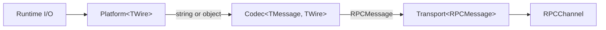

# Transport Adapters

<cite>
**Referenced Files in This Document**
- [packages/kkrpc/src/core/transport.ts](file://packages/kkrpc/src/core/transport.ts)
- [packages/kkrpc/src/core/codecs.ts](file://packages/kkrpc/src/core/codecs.ts)
- [packages/kkrpc/src/transports/stdio.ts](file://packages/kkrpc/src/transports/stdio.ts)
- [packages/kkrpc/src/transports/ws.ts](file://packages/kkrpc/src/transports/ws.ts)
- [packages/kkrpc/src/transports/http.ts](file://packages/kkrpc/src/transports/http.ts)
- [packages/kkrpc/src/transports/worker.ts](file://packages/kkrpc/src/transports/worker.ts)
- [packages/kkrpc/src/transports/iframe.ts](file://packages/kkrpc/src/transports/iframe.ts)
- [packages/kkrpc/src/transports/electron.ts](file://packages/kkrpc/src/transports/electron.ts)
- [packages/kkrpc/src/transports/kafka.ts](file://packages/kkrpc/src/transports/kafka.ts)
- [packages/kkrpc/src/transports/bus-envelope.ts](file://packages/kkrpc/src/transports/bus-envelope.ts)
- [packages/kkrpc/src/transports/ws-hono.ts](file://packages/kkrpc/src/transports/ws-hono.ts)
- [packages/kkrpc/src/transports/ws-elysia.ts](file://packages/kkrpc/src/transports/ws-elysia.ts)
- [packages/kkrpc/src/transports/ws.ts](file://packages/kkrpc/src/transports/ws.ts)
- [packages/kkrpc/src/transports/socketio.ts](file://packages/kkrpc/src/transports/socketio.ts)
- [packages/kkrpc/src/transports/tauri.ts](file://packages/kkrpc/src/transports/tauri.ts)
- [packages/kkrpc/package.json](file://packages/kkrpc/package.json)
</cite>

## Table of Contents

1. [Transport Contract](#transport-contract)
2. [Transport, Platform, and Codec Composition](#transport-platform-and-codec-composition)
3. [Transport Families](#transport-families)
4. [Capabilities](#capabilities)
5. [Bus Envelope Protocol](#bus-envelope-protocol)
6. [Packaging Strategy](#packaging-strategy)

## Transport Contract

Every transport implements the `Transport<TMessage>` interface:

```typescript
interface Transport<TMessage> {
	capabilities?: TransportCapabilities
	send(message: TMessage, transfers?: Transferable[]): void | Promise<void>
	subscribe(listener: (message: TMessage) => void): () => void
	close?(): void
}
```

This replaces the legacy `IoInterface` from the v1.x adapter architecture. The transport is now a direct consumer of protocol messages, not an intermediary adapter. Transport implementations are responsible for:

- Serializing/deserializing messages to/from wire format
- Queuing messages when the underlying transport is not yet open
- Managing listener subscriptions and cleanup
- Declaring capabilities for feature negotiation

**Section sources**

- [packages/kkrpc/src/core/transport.ts](file://packages/kkrpc/src/core/transport.ts#L36-L46)
- [packages/kkrpc/src/core/transport.ts](file://packages/kkrpc/src/core/transport.ts#L10-L20)

## Transport, Platform, and Codec Composition

Many transports are built through composition of a `Platform` and a `Codec`:



**Diagram sources**

- [packages/kkrpc/src/core/transport.ts](file://packages/kkrpc/src/core/transport.ts#L48-L68)
- [packages/kkrpc/src/core/transport.ts](file://packages/kkrpc/src/core/transport.ts#L90-L121)

### Platform

A `Platform<TWire>` wraps a runtime I/O primitive:

```typescript
interface Platform<TWire> {
	capabilities?: PlatformCapabilities
	send(wire: TWire, transfers?: Transferable[]): void | Promise<void>
	subscribe(listener: (wire: TWire) => void): () => void
	close?(): void
}
```

For example, `stdioPlatform()` wraps Node.js `readable`/`writable` streams and handles newline buffering. `WebSocket` wrapping is built directly into `webSocketTransport()` since WebSocket provides a complete message-oriented interface.

### Codec

A `Codec` translates between RPC messages and wire values:

```typescript
interface Codec<TMessage, TWire> {
	capabilities?: CodecCapabilities
	encode(message: TMessage): TWire
	decode(wire: TWire): TMessage
}
```

Built-in codecs cover all common needs: `objectCodec` (identity, transfer-safe), `jsonCodec` (plain JSON), `jsonLineCodec` (newline-framed), `superJsonCodec` (SuperJSON), and `superJsonLineCodec`.

### createTransport()

```typescript
const transport = createTransport({
	platform: stdioPlatform({ readable, writable }),
	codec: jsonLineCodec(),
	capabilities: { remoteRefs: true }
})
```

The function computes effective capabilities:

- `objectMode` from platform (or capability override)
- `transfer` = platform.transfer AND codec.transfer (both must opt in)
- `broadcast` / `remoteRefs` from capability overrides

**Section sources**

- [packages/kkrpc/src/core/transport.ts](file://packages/kkrpc/src/core/transport.ts#L48-L68)
- [packages/kkrpc/src/core/transport.ts](file://packages/kkrpc/src/core/transport.ts#L90-L121)
- [packages/kkrpc/src/core/codecs.ts](file://packages/kkrpc/src/core/codecs.ts#L1-L54)
- [packages/kkrpc/src/transports/stdio.ts](file://packages/kkrpc/src/transports/stdio.ts#L66-L106)

## Transport Families

### Stdio Transports (`kkrpc/stdio`)

Bidirectional JSON-line transports for process-to-process communication over stdin/stdout. Available for Node.js, Deno, and Bun with runtime-specific factory functions: `nodeStdioTransport()`, `denoStdioTransport()`, `bunStdioTransport()`.

Key characteristics:

- Newline-delimited JSON encoding
- No transferable support
- Bidirectional when paired processes wire stdin/stdout to each other
- Capabilities: `{ objectMode: false, transfer: false, remoteRefs: true }`

### WebSocket Transports (`kkrpc/ws`)

Full-duplex persistent connections supporting calls, server-initiated calls, and callback arguments. Available as:

- `webSocketTransport(socket)` — Wrap an existing WebSocket-like object
- `webSocketClientTransport({ url, protocols? })` — Create a client WebSocket
- `webSocketHonoTransport()` — Hono server adapter
- `webSocketElysiaTransport()` — Elysia server adapter

WebSocket transports queue messages sent before `open` and flush them when the connection is established. They support structural typing for DOM WebSocket, `ws` (Node), and Bun server sockets.

### Worker Transports (`kkrpc/worker`)

Bidirectional message-port-based transports for Web Workers and `MessagePort` channels:

- `workerTransport(port)` — Wrap a `MessagePort` or worker-like object
- `workerSelfTransport()` — Use `globalThis` as the transport endpoint

Supports transferable objects and structured clone.

### HTTP Transport (`kkrpc/http`)

Unary request-response transport. Supports client-initiated calls only — no callbacks, no server-initiated calls, no streaming. The HTTP transport is intentionally constrained:

- `httpClientTransport()` — Client-side HTTP transport
- `createHttpHandler()` — Server-side handler for framework integration

### iframe Transport (`kkrpc/iframe`)

Bidirectional `postMessage`-based transport for cross-origin iframe communication. Uses `MessageChannel` for response routing.

### Chrome Extension Transport (`kkrpc/chrome-extension`)

Bidirectional transport using `chrome.runtime.connect()` for messaging between extension contexts (popup, side panel, content script, background script).

### Electron Transport (`kkrpc/electron`)

Three transport variants for Electron IPC:

- `electronIpcTransport()` — Renderer ↔ main process via `ipcRenderer`/`ipcMain`
- `electronUtilityProcessTransport()` — Main ↔ utility process
- `electronUtilityProcessChildTransport()` — Utility process child side
- `createSecureIpcBridge()` — Channel-based secure IPC bridge

### Tauri Transport (`kkrpc/tauri`)

Bidirectional transport for Tauri sidecar or backend communication using stdin/stdout.

### Socket.IO Transport (`kkrpc/socketio`)

Bidirectional transport wrapping Socket.IO client/server connections.

### Message Bus Transports

These transports use a `BusEnvelope` for routing and filtering:

| Transport     | Import Path           | Message Broker |
| ------------- | --------------------- | -------------- |
| Kafka         | `kkrpc/kafka`         | Apache Kafka   |
| RabbitMQ      | `kkrpc/rabbitmq`      | RabbitMQ       |
| Redis Streams | `kkrpc/redis-streams` | Redis Streams  |
| NATS          | `kkrpc/nats`          | NATS           |

**Section sources**

- [packages/kkrpc/src/transports/stdio.ts](file://packages/kkrpc/src/transports/stdio.ts#L1-L160)
- [packages/kkrpc/src/transports/ws.ts](file://packages/kkrpc/src/transports/ws.ts#L1-L232)
- [packages/kkrpc/src/transports/worker.ts](file://packages/kkrpc/src/transports/worker.ts#L1-L72)
- [packages/kkrpc/src/transports/http.ts](file://packages/kkrpc/src/transports/http.ts#L1-L347)
- [packages/kkrpc/src/transports/iframe.ts](file://packages/kkrpc/src/transports/iframe.ts#L1-L305)
- [packages/kkrpc/src/transports/electron.ts](file://packages/kkrpc/src/transports/electron.ts#L1-L195)
- [packages/kkrpc/src/transports/chrome-extension.ts](file://packages/kkrpc/src/transports/chrome-extension.ts#L1-L75)
- [packages/kkrpc/package.json](file://packages/kkrpc/package.json#L52-L397)

## Capabilities

Capability declarations tell the channel what features the transport supports:

```typescript
interface TransportCapabilities {
	objectMode?: boolean // Can carry JS objects without serialization
	transfer?: boolean // Can forward transferables with messages
	broadcast?: boolean // May deliver messages to more than one peer
	remoteRefs?: boolean // Can carry bidirectional remote-reference requests
}
```

Capability usage in channel feature negotiation:

| Capability         | Enables                                           |
| ------------------ | ------------------------------------------------- |
| `transfer: true`   | Transferable forwarding via `transfer()`          |
| `remoteRefs: true` | Remote reference operations (`kkrpc/remote-refs`) |
| `objectMode: true` | Direct object messaging without string encoding   |
| `broadcast: true`  | Multi-peer message delivery semantics             |

**Section sources**

- [packages/kkrpc/src/core/transport.ts](file://packages/kkrpc/src/core/transport.ts#L10-L34)
- [packages/kkrpc/src/core/channel.ts](file://packages/kkrpc/src/core/channel.ts#L199-L204)
- [packages/kkrpc/src/core/remote-ref-channel.ts](file://packages/kkrpc/src/core/remote-ref-channel.ts#L136-L139)

## Bus Envelope Protocol

Message bus transports (Kafka, RabbitMQ, Redis Streams, NATS) wrap RPC messages in a `BusEnvelope` for routing:

```typescript
interface BusEnvelope {
	messageType: string // "request" | "response" | "callback"
	messageId: string // Unique message identifier
	routingKey?: string // Bus-specific routing key
	timestamp: number // Unix timestamp
	payload: unknown // The RPCMessage body
	headers?: Record<string, string> // Bus metadata headers
}
```

The bus envelope enables transport-specific filtering and routing without coupling the core protocol to broker semantics.

**Section sources**

- [packages/kkrpc/src/transports/bus-envelope.ts](file://packages/kkrpc/src/transports/bus-envelope.ts#L1-L125)

## Packaging Strategy

Transport-specific packages are optional peer dependencies rather than unconditional runtime dependencies. This keeps installs smaller and shifts responsibility for broker, Socket.IO, Tauri, Electron, and WebSocket server packages to consumers who import those transport subpaths.

The `package.json` exports map defines each transport subpath with ESM and CJS dual formats, types, and tree-shakeable entry points.

**Section sources**

- [packages/kkrpc/package.json](file://packages/kkrpc/package.json#L52-L397)
