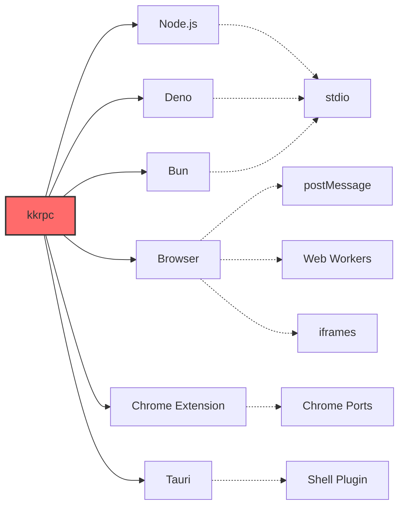

<div align="center">

# 🚀 kkrpc

## TypeScript-First RPC Library

[](https://www.npmjs.com/package/kkrpc)
[](https://jsr.io/@kunkun/kkrpc)
[](https://github.com/kunkunsh/kkrpc/blob/main/LICENSE)
[](https://www.npmjs.com/package/kkrpc)
[](https://github.com/kunkunsh/kkrpc)
[](https://kunkunsh.github.io/kkrpc/)
[](https://excalidraw.com/#json=xp6GbAJVAx3nU-h3PhaxW,oYBNvYmCRsQ2XR3MQo73Ug)

</div>

> This project was created for building extension system for a Tauri app ([kunkun](https://github.com/kunkunsh/kunkun)).
>
> It can potentially be used in other types of apps, so I open sourced it as a standalone package.

**Seamless bi-directional communication between processes, workers, and contexts**

Call remote functions as if they were local, with full TypeScript type safety and autocompletion support.

**Similar to Comlink but with bidirectional communication** and support for multiple environments - both client and server can expose functions for the other to call across Node.js, Deno, Bun, and browser environments.

[**Quick Start**](#-quick-start) • [**Documentation**](https://kunkunsh.github.io/kkrpc/) • [**Examples**](#-examples) • [**API Reference**](https://jsr.io/@kunkun/kkrpc/doc) • [**中文文档**](./README.zh.md)


<div align="center">


</div>

---

## 🌟 Why kkrpc?

kkrpc stands out in the crowded RPC landscape by offering **true cross-runtime compatibility** without sacrificing type safety or developer experience. Unlike tRPC (HTTP-only) or Comlink (browser-only), kkrpc enables seamless communication across Node.js, Deno, Bun, and browser environments.

## ✨ Features

<div align="center">

| Feature                     | Description                                                    |
| --------------------------- | -------------------------------------------------------------- |
| **🔄 Cross-runtime**        | Works seamlessly across Node.js, Deno, Bun, browsers, and more |
| **🛡️ Type-safe**            | Full TypeScript inference and IDE autocompletion support       |
| **↔️ Bidirectional**        | Both endpoints can expose and call APIs simultaneously         |
| **🏠 Property Access**      | Remote getters/setters with dot notation (`await api.prop`)    |
| **💥 Error Preservation**   | Complete error objects across RPC boundaries                   |
| **🌐 Multiple Transports**  | stdio, HTTP, WebSocket, postMessage, Chrome extensions         |
| **📞 Callback Support**     | Remote functions can accept callback functions                 |
| **🔗 Nested Calls**         | Deep method chaining like `api.math.operations.calculate()`    |
| **📦 Auto Serialization**   | Intelligent JSON/superjson detection                           |
| **⚡ Zero Config**          | No schema files or code generation required                    |
| **🚀 Transferable Objects** | Zero-copy transfers for large data (40-100x faster)            |

</div>

## 🌍 Supported Environments

<div align="center">



</div>

### 📡 Transport Protocols

| Transport            | Use Case                                          | Supported Runtimes                     |
| -------------------- | ------------------------------------------------- | -------------------------------------- |
| **stdio**            | Process-to-process communication                  | Node.js ↔ Deno ↔ Bun                 |
| **postMessage**      | Browser context communication                     | Browser ↔ Web Workers ↔ iframes      |
| **HTTP**             | Web API communication                             | All runtimes                           |
| **WebSocket**        | Real-time communication                           | All runtimes                           |
| **Hono WebSocket**   | High-performance WebSocket with Hono framework    | Node.js, Deno, Bun, Cloudflare Workers |
| **Socket.IO**        | Enhanced real-time with rooms/namespaces          | All runtimes                           |
| **Elysia WebSocket** | Modern TypeScript framework WebSocket integration | Bun, Node.js, Deno                     |
| **Chrome Extension** | Extension component communication                 | Chrome Extension contexts              |
| **RabbitMQ**         | Message queue communication                       | Node.js, Deno, Bun                   |
| **Redis Streams**    | Stream-based messaging with persistence           | Node.js, Deno, Bun                   |
| **Kafka**            | Distributed streaming platform                    | Node.js, Deno, Bun                   |

The core of **kkrpc** design is in `RPCChannel` and `IoInterface`.

- `RPCChannel` is the bidirectional RPC channel
- `LocalAPI` is the APIs to be exposed to the other side of the channel
- `RemoteAPI` is the APIs exposed by the other side of the channel, and callable on the local side
- `rpc.getAPI()` returns an object that is `RemoteAPI` typed, and is callable on the local side like a normal local function call.
- `IoInterface` is the interface for implementing the IO for different environments. The implementations are called adapters.
  - For example, for a Node process to communicate with a Deno process, we need `NodeIo` and `DenoIo` adapters which implements `IoInterface`. They share the same stdio pipe (`stdin/stdout`).
  - In web, we have `WorkerChildIO` and `WorkerParentIO` adapters for web worker, `IframeParentIO` and `IframeChildIO` adapters for iframe.

> In browser, import from `kkrpc/browser` instead of `kkrpc`, Deno adapter uses node:buffer which doesn't work in browser.

```ts
interface IoInterface {
	name: string
	read(): Promise<Buffer | Uint8Array | string | null> // Reads input
	write(data: string): Promise<void> // Writes output
}

class RPCChannel<
	LocalAPI extends Record<string, any>,
	RemoteAPI extends Record<string, any>,
	Io extends IoInterface = IoInterface
> {}
```

## Serialization

kkrpc supports two serialization formats for message transmission:

- `json`: Standard JSON serialization
- `superjson`: Enhanced JSON serialization with support for more data types like Date, Map, Set, BigInt, and Uint8Array (default since v0.2.0)

You can specify the serialization format when creating a new RPCChannel:

```ts
// Using default serialization (superjson)
const rpc = new RPCChannel(io, { expose: apiImplementation })

// Explicitly using superjson serialization (recommended for clarity)
const rpc = new RPCChannel(io, {
	expose: apiImplementation,
	serialization: { version: "superjson" }
})

// Using standard JSON serialization (for backward compatibility)
const rpc = new RPCChannel(io, {
	expose: apiImplementation,
	serialization: { version: "json" }
})
```

For backward compatibility, the receiving side will automatically detect the serialization format so older clients can communicate with newer servers and vice versa.

## 🚀 Quick Start

### Installation

<div align="center">

```bash
# npm
npm install kkrpc

# yarn
yarn add kkrpc

# pnpm
pnpm add kkrpc

# deno
import { RPCChannel } from "jsr:@kunkun/kkrpc"
```

</div>

### Basic Example

<div align="center">

```typescript
// server.ts
import { NodeIo, RPCChannel } from "kkrpc"

const api = {
	greet: (name: string) => `Hello, ${name}!`,
	add: (a: number, b: number) => a + b
}

const rpc = new RPCChannel(new NodeIo(process.stdin, process.stdout), {
	expose: api
})
```

```typescript
// client.ts
import { spawn } from "child_process"
import { NodeIo, RPCChannel } from "kkrpc"

const worker = spawn("deno", ["run", "server.ts"])
const rpc = new RPCChannel(new NodeIo(worker.stdout, worker.stdin))
const api = rpc.getAPI<typeof api>()

console.log(await api.greet("World")) // "Hello, World!"
console.log(await api.add(5, 3)) // 8
```

</div>

## 📚 Examples

Below are simple examples to get you started quickly.

### Stdio Example

```ts
import { NodeIo, RPCChannel } from "kkrpc"
import { apiMethods } from "./api.ts"

const stdio = new NodeIo(process.stdin, process.stdout)
const child = new RPCChannel(stdio, { expose: apiMethods })
```

```ts
import { spawn } from "child_process"

const worker = spawn("bun", ["scripts/node-api.ts"])
const io = new NodeIo(worker.stdout, worker.stdin)
const parent = new RPCChannel<{}, API>(io)
const api = parent.getAPI()

expect(await api.add(1, 2)).toBe(3)
```

### Property Access Example

kkrpc supports direct property access and mutation across RPC boundaries:

```ts
// Define API with properties
interface API {
	add(a: number, b: number): Promise<number>
	counter: number
	settings: {
		theme: string
		notifications: {
			enabled: boolean
		}
	}
}

const api = rpc.getAPI<API>()

// Property getters (using await for remote access)
const currentCount = await api.counter
const theme = await api.settings.theme
const notificationsEnabled = await api.settings.notifications.enabled

// Property setters (direct assignment)
api.counter = 42
api.settings.theme = "dark"
api.settings.notifications.enabled = true

// Verify changes
console.log(await api.counter) // 42
console.log(await api.settings.theme) // "dark"
```

### Enhanced Error Preservation

kkrpc preserves complete error information across RPC boundaries:

```ts
// Custom error class
class DatabaseError extends Error {
	constructor(
		message: string,
		public code: number,
		public query: string
	) {
		super(message)
		this.name = "DatabaseError"
	}
}

// API with error-throwing method
const apiImplementation = {
	async getUserById(id: string) {
		if (!id) {
			const error = new DatabaseError("Invalid user ID", 400, "SELECT * FROM users WHERE id = ?")
			error.timestamp = new Date().toISOString()
			error.requestId = generateRequestId()
			throw error
		}
		// ... normal logic
	}
}

// Error handling on client side
try {
	await api.getUserById("")
} catch (error) {
	// All error properties are preserved:
	console.log(error.name) // "DatabaseError"
	console.log(error.message) // "Invalid user ID"
	console.log(error.code) // 400
	console.log(error.query) // "SELECT * FROM users WHERE id = ?"
	console.log(error.stack) // Full stack trace
	console.log(error.timestamp) // ISO timestamp
	console.log(error.requestId) // Request ID
}
```

### Web Worker Example

```ts
import { RPCChannel, WorkerChildIO, type DestroyableIoInterface } from "kkrpc"

const worker = new Worker(new URL("./scripts/worker.ts", import.meta.url).href, { type: "module" })
const io = new WorkerChildIO(worker)
const rpc = new RPCChannel<API, API, DestroyableIoInterface>(io, { expose: apiMethods })
const api = rpc.getAPI()

expect(await api.add(1, 2)).toBe(3)
```

```ts
import { RPCChannel, WorkerParentIO, type DestroyableIoInterface } from "kkrpc"

const io: DestroyableIoInterface = new WorkerChildIO()
const rpc = new RPCChannel<API, API, DestroyableIoInterface>(io, { expose: apiMethods })
const api = rpc.getAPI()

const sum = await api.add(1, 2)
expect(sum).toBe(3)
```

### Transferable Objects Example

kkrpc supports zero-copy transfer of large data structures using browser's native transferable objects. This provides 40-100x performance improvement for large binary data transfers.

```ts
import { RPCChannel, transfer, WorkerParentIO } from "kkrpc/browser"

const worker = new Worker("worker.js")
const io = new WorkerParentIO(worker)
const rpc = new RPCChannel(io)
const api = rpc.getAPI<{
	processBuffer(buffer: ArrayBuffer): Promise<number>
	generateData(size: number): Promise<ArrayBuffer>
}>()

// Create a large buffer (10MB)
const buffer = new ArrayBuffer(10 * 1024 * 1024)
console.log("Before transfer:", buffer.byteLength) // 10485760

// Transfer buffer to worker (zero-copy)
const result = await api.processBuffer(transfer(buffer, [buffer]))
console.log("Worker processed:", result, "bytes")

// Buffer is now neutered (transferred ownership)
console.log("After transfer:", buffer.byteLength) // 0

// Get data back from worker (also transferred)
const newBuffer = await api.generateData(5 * 1024 * 1024)
console.log("Received from worker:", newBuffer.byteLength) // 5242880
```

### Hono WebSocket Example

Hono WebSocket adapter provides seamless integration with the Hono framework's high-performance WebSocket support.

#### `server.ts`

```ts
import { Hono } from "hono"
import { upgradeWebSocket, websocket } from "hono/bun"
import { createHonoWebSocketHandler } from "kkrpc"
import { apiMethods, type API } from "./api"

const app = new Hono()

app.get(
	"/ws",
	upgradeWebSocket(() => {
		return createHonoWebSocketHandler<API>({
			expose: apiMethods
		})
	})
)

const server = Bun.serve({
	port: 3000,
	fetch: app.fetch,
	websocket
})

console.log(`Server running on port ${server.port}`)
```

#### `client.ts`

```ts
import { RPCChannel, WebSocketClientIO } from "kkrpc"
import { apiMethods, type API } from "./api"

const clientIO = new WebSocketClientIO({
	url: "ws://localhost:3000/ws"
})

const clientRPC = new RPCChannel<API, API>(clientIO, {
	expose: apiMethods
})

const api = clientRPC.getAPI()

// Test basic RPC calls
console.log(await api.add(5, 3)) // 8
console.log(await api.echo("Hello from Hono!")) // "Hello from Hono!"

// Test nested API calls
console.log(await api.math.grade2.multiply(4, 6)) // 24

// Test property access
console.log(await api.counter) // 42
console.log(await api.nested.value) // "hello world"

clientIO.destroy()
```

**Hono WebSocket Features:**

- **High Performance**: Built on Hono's ultra-fast WebSocket implementation
- **Cross-runtime**: Works across Bun, Deno, Node.js, and Cloudflare Workers
- **Type-safe**: Full TypeScript support with Hono integration
- **Bidirectional**: Both client and server can expose APIs
- **Framework Integration**: Seamless integration with Hono's middleware ecosystem

**Learn more:** [Hono WebSocket Documentation](https://hono.dev/docs/helpers/websocket)

### Elysia WebSocket Example

Elysia WebSocket adapter provides seamless integration with the modern TypeScript-first Elysia framework and its uWebSocket-powered WebSocket support.

#### `server.ts`

```ts
import { Elysia } from "elysia"
import { ElysiaWebSocketServerIO, RPCChannel } from "kkrpc"
import { apiMethods, type API } from "./api"

// Extend API for Elysia-specific features
interface ElysiaAPI extends API {
	getConnectionInfo(): Promise<{
		remoteAddress: string | undefined
		query: Record<string, string>
		headers: Record<string, string>
	}>
}

const app = new Elysia()
	.ws("/rpc", {
		open(ws) {
			const io = new ElysiaWebSocketServerIO(ws)
			const elysiaApiMethods: ElysiaAPI = {
				...apiMethods,
				getConnectionInfo: async () => ({
					remoteAddress: io.getRemoteAddress(),
					query: io.getQuery(),
					headers: io.getHeaders()
				})
			}

			const rpc = new RPCChannel<ElysiaAPI, ElysiaAPI>(io, {
				expose: elysiaApiMethods
			})
		},
		message(ws, message) {
			ElysiaWebSocketServerIO.feedMessage(ws, message)
		}
	})
	.listen(3000)

console.log("Elysia server running on port 3000")
```

#### `client.ts`

```ts
import { ElysiaWebSocketClientIO, RPCChannel } from "kkrpc"
import { apiMethods, type API } from "./api"

const clientIO = new ElysiaWebSocketClientIO("ws://localhost:3000/rpc")
const clientRPC = new RPCChannel<API, any>(clientIO, {
	expose: apiMethods
})

const api = clientRPC.getAPI()

// Test basic RPC calls
console.log(await api.add(5, 3)) // 8
console.log(await api.echo("Hello from Elysia!")) // "Hello from Elysia!"

// Test nested API calls
console.log(await api.math.grade1.add(10, 20)) // 30
console.log(await api.math.grade3.divide(20, 4)) // 5

// Test Elysia-specific features
const connInfo = await api.getConnectionInfo()
console.log("Connected from:", connInfo.remoteAddress)
console.log("Query params:", connInfo.query)
console.log("Headers:", connInfo.headers)

clientIO.destroy()
```

**Elysia WebSocket Features:**

- **Modern Framework**: Built on Elysia's TypeScript-first design
- **Ultra-fast**: Powered by uWebSocket for maximum performance
- **Rich Metadata**: Access to connection info, query params, and headers
- **Type-safe**: Full TypeScript inference and autocompletion
- **Runtime Flexible**: Works across Bun, Node.js, and Deno
- **Developer Experience**: Clean API with factory functions

**Learn more:** [Elysia WebSocket Documentation](https://elysiajs.com/patterns/websocket)

**Key Benefits:**

- **Zero-copy performance**: No serialization/deserialization overhead
- **Memory efficient**: Ownership transfers without copying
- **Automatic fallback**: Graceful degradation for non-transferable transports
- **Type-safe**: Full TypeScript support

**Supported Transferable Types:**

- `ArrayBuffer` - Binary data buffers
- `MessagePort` - Communication channels
- `ImageBitmap` - Decoded image data
- `OffscreenCanvas` - Off-screen canvas rendering
- `ReadableStream`/`WritableStream` - Streaming data
- And more... [See MDN](https://developer.mozilla.org/en-US/docs/Web/API/Web_Workers_API/Transferable_objects)

### HTTP Example

Codesandbox: https://codesandbox.io/p/live/4a349334-0b04-4352-89f9-cf1955553ae7

#### `api.ts`

Define API type and implementation.

```ts
export type API = {
	echo: (message: string) => Promise<string>
	add: (a: number, b: number) => Promise<number>
}

export const api: API = {
	echo: (message) => {
		return Promise.resolve(message)
	},
	add: (a, b) => {
		return Promise.resolve(a + b)
	}
}
```

#### `server.ts`

Server only requires a one-time setup, then it won't need to be touched again.
All the API implementation is in `api.ts`.

```ts
import { HTTPServerIO, RPCChannel } from "kkrpc"
import { api, type API } from "./api"

const serverIO = new HTTPServerIO()
const serverRPC = new RPCChannel<API, API>(serverIO, { expose: api })

const server = Bun.serve({
	port: 3000,
	async fetch(req) {
		const url = new URL(req.url)
		if (url.pathname === "/rpc") {
			const res = await serverIO.handleRequest(await req.text())
			return new Response(res, {
				headers: { "Content-Type": "application/json" }
			})
		}
		return new Response("Not found", { status: 404 })
	}
})
console.log(`Start server on port: ${server.port}`)
```

#### `client.ts`

```ts
import { HTTPClientIO, RPCChannel } from "kkrpc"
import { api, type API } from "./api"

const clientIO = new HTTPClientIO({
	url: "http://localhost:3000/rpc"
})
const clientRPC = new RPCChannel<{}, API>(clientIO, { expose: api })
const clientAPI = clientRPC.getAPI()

const echoResponse = await clientAPI.echo("hello")
console.log("echoResponse", echoResponse)

const sum = await clientAPI.add(2, 3)
console.log("Sum: ", sum)
```

### Chrome Extension Example

For Chrome extensions, use the dedicated `ChromePortIO` adapter for reliable, port-based communication.

#### `background.ts`

```ts
import { ChromePortIO, RPCChannel } from "kkrpc/chrome-extension"
import type { BackgroundAPI, ContentAPI } from "./types"

const backgroundAPI: BackgroundAPI = {
	async getExtensionVersion() {
		return chrome.runtime.getManifest().version
	}
}

chrome.runtime.onConnect.addListener((port) => {
	if (port.name === "content-to-background") {
		const io = new ChromePortIO(port)
		const rpc = new RPCChannel(io, { expose: backgroundAPI })
		// Handle disconnect
		port.onDisconnect.addListener(() => io.destroy())
	}
})
```

#### `content.ts`

```ts
import { ChromePortIO, RPCChannel } from "kkrpc/chrome-extension"
import type { BackgroundAPI, ContentAPI } from "./types"

const contentAPI: ContentAPI = {
	async getPageTitle() {
		return document.title
	}
}

const port = chrome.runtime.connect({ name: "content-to-background" })
const io = new ChromePortIO(port)
const rpc = new RPCChannel<ContentAPI, BackgroundAPI>(io, { expose: contentAPI })

const backgroundAPI = rpc.getAPI()

// Example call
backgroundAPI.getExtensionVersion().then((version) => {
	console.log("Extension version:", version)
})
```

**Chrome Extension Features:**

- **Port-based**: Uses `chrome.runtime.Port` for stable, long-lived connections.
- **Bidirectional**: Both sides can expose and call APIs.
- **Type-safe**: Full TypeScript support for your APIs.
- **Reliable**: Handles connection lifecycle and cleanup.

### RabbitMQ Example

RabbitMQ adapter provides reliable message queue communication with support for topic exchanges and durable messaging.

#### `producer.ts`

```ts
import { RabbitMQIO, RPCChannel } from "kkrpc"
import { apiMethods, type API } from "./api"

const rabbitmqIO = new RabbitMQIO({
  url: "amqp://localhost",
  exchange: "kkrpc-exchange",
  exchangeType: "topic",
  durable: true
})

const producerRPC = new RPCChannel<API, API>(rabbitmqIO, {
  expose: apiMethods
})

const api = producerRPC.getAPI()

// Test basic RPC calls
console.log(await api.add(5, 3)) // 8
console.log(await api.echo("Hello from RabbitMQ!")) // "Hello from RabbitMQ!"

rabbitmqIO.destroy()
```

#### `consumer.ts`

```ts
import { RabbitMQIO, RPCChannel } from "kkrpc"
import { apiMethods, type API } from "./api"

const rabbitmqIO = new RabbitMQIO({
  url: "amqp://localhost",
  exchange: "kkrpc-exchange",
  exchangeType: "topic",
  durable: true,
  sessionId: "consumer-session"
})

const consumerRPC = new RPCChannel<API, API>(rabbitmqIO, {
  expose: apiMethods
})

const api = consumerRPC.getAPI()

// Process messages from producer
console.log(await api.add(10, 20)) // 30
console.log(await api.echo("Hello from consumer!")) // "Hello from consumer!"

rabbitmqIO.destroy()
```

**RabbitMQ Features:**

- **Topic Exchange**: Flexible routing with wildcard patterns
- **Durable Messaging**: Messages survive broker restarts
- **Load Balancing**: Multiple consumers can share workload
- **Reliable Delivery**: Acknowledgments and redelivery support
- **Session Management**: Unique sessions prevent message conflicts

### Redis Streams Example

Redis Streams adapter provides high-performance stream-based messaging with persistence and consumer group support.

#### `publisher.ts`

```ts
import { RedisStreamsIO, RPCChannel } from "kkrpc"
import { apiMethods, type API } from "./api"

const redisIO = new RedisStreamsIO({
  url: "redis://localhost:6379",
  stream: "kkrpc-stream",
  maxLen: 10000, // Keep only last 10k messages
  maxQueueSize: 1000
})

const publisherRPC = new RPCChannel<API, API>(redisIO, {
  expose: apiMethods
})

const api = publisherRPC.getAPI()

// Test basic RPC calls
console.log(await api.add(7, 8)) // 15
console.log(await api.echo("Hello from Redis Streams!")) // "Hello from Redis Streams!"

// Get stream information
const streamInfo = await redisIO.getStreamInfo()
console.log("Stream length:", streamInfo.length)

redisIO.destroy()
```

#### `subscriber.ts`

```ts
import { RedisStreamsIO, RPCChannel } from "kkrpc"
import { apiMethods, type API } from "./api"

// Using consumer group for load balancing
const redisIO = new RedisStreamsIO({
  url: "redis://localhost:6379",
  stream: "kkrpc-stream",
  consumerGroup: "kkrpc-group",
  consumerName: "worker-1",
  useConsumerGroup: true, // Enable load balancing
  maxQueueSize: 1000
})

const subscriberRPC = new RPCChannel<API, API>(redisIO, {
  expose: apiMethods
})

const api = subscriberRPC.getAPI()

// Process messages with load balancing
console.log(await api.multiply(4, 6)) // 24
console.log(await api.echo("Hello from subscriber!")) // "Hello from subscriber!"

redisIO.destroy()
```

**Redis Streams Features:**

- **Two Modes**: Pub/Sub (all consumers) or Consumer Groups (load balancing)
- **Persistence**: Messages stored in Redis with configurable retention
- **Memory Protection**: Queue size limits prevent memory issues
- **Consumer Groups**: Load balancing with message acknowledgment
- **Stream Management**: Built-in tools for monitoring and trimming streams

### Kafka Example

Kafka adapter provides distributed streaming with high throughput and fault tolerance for large-scale systems.

#### `producer.ts`

```ts
import { KafkaIO, RPCChannel } from "kkrpc"
import { apiMethods, type API } from "./api"

const kafkaIO = new KafkaIO({
  brokers: ["localhost:9092"],
  topic: "kkrpc-topic",
  clientId: "kkrpc-producer",
  numPartitions: 3,
  replicationFactor: 1,
  maxQueueSize: 1000
})

const producerRPC = new RPCChannel<API, API>(kafkaIO, {
  expose: apiMethods
})

const api = producerRPC.getAPI()

// Test basic RPC calls
console.log(await api.add(12, 18)) // 30
console.log(await api.echo("Hello from Kafka!")) // "Hello from Kafka!"

console.log("Topic:", kafkaIO.getTopic())
console.log("Session ID:", kafkaIO.getSessionId())

kafkaIO.destroy()
```

#### `consumer.ts`

```ts
import { KafkaIO, RPCChannel } from "kkrpc"
import { apiMethods, type API } from "./api"

const kafkaIO = new KafkaIO({
  brokers: ["localhost:9092"],
  topic: "kkrpc-topic",
  clientId: "kkrpc-consumer",
  groupId: "kkrpc-consumer-group",
  fromBeginning: false, // Only read new messages
  maxQueueSize: 1000
})

const consumerRPC = new RPCChannel<API, API>(kafkaIO, {
  expose: apiMethods
})

const api = consumerRPC.getAPI()

// Process messages from Kafka
console.log(await api.divide(100, 4)) // 25
console.log(await api.echo("Hello from Kafka consumer!")) // "Hello from Kafka consumer!"

console.log("Topic:", kafkaIO.getTopic())
console.log("Group ID:", kafkaIO.getGroupId())

kafkaIO.destroy()
```

**Kafka Features:**

- **Distributed**: Built-in replication and partitioning
- **High Throughput**: Optimized for high-volume message streaming
- **Fault Tolerant**: Replication and automatic failover
- **Scalable**: Horizontal scaling with partitions
- **Persistent**: Durable message storage with configurable retention
- **Consumer Groups**: Load balancing across consumer instances

### Tauri Example

Call functions in bun/node/deno processes from Tauri app with JS/TS.

It allows you to call any JS/TS code in Deno/Bun/Node processes from Tauri app, just like using Electron.

Seamless integration with Tauri's official shell plugin and [unlocked shellx plugin](https://github.com/HuakunShen/tauri-plugin-shellx).

```ts
import { RPCChannel, TauriShellStdio } from "kkrpc/browser"
import { Child, Command } from "@tauri-apps/plugin-shell"

const localAPIImplementation = {
	add: (a: number, b: number) => Promise.resolve(a + b)
}

async function spawnCmd(runtime: "deno" | "bun" | "node") {
	let cmd: Command<string>
	let process = Child | null = null

	if (runtime === "deno") {
		cmd = Command.create("deno", ["run", "-A", scriptPath])
		process = await cmd.spawn()
	} else if (runtime === "bun") {
		cmd = Command.create("bun", [scriptPath])
		process = await cmd.spawn()
	} else if (runtime === "node") {
		cmd = Command.create("node", [scriptPath])
		process = await cmd.spawn()
	} else {
		throw new Error(`Invalid runtime: ${runtime}, pick either deno or bun`)
	}

	// monitor stdout/stderr/close/error for debugging and error handling
	cmd.stdout.on("data", (data) => {
		console.log("stdout", data)
	})
	cmd.stderr.on("data", (data) => {
		console.warn("stderr", data)
	})
	cmd.on("close", (code) => {
		console.log("close", code)
	})
	cmd.on("error", (err) => {
		console.error("error", err)
	})

	const stdio = new TauriShellStdio(cmd.stdout, process)
	const stdioRPC = new RPCChannel<typeof localAPIImplementation, RemoteAPI>(stdio, {
		expose: localAPIImplementation
	})

	const api = stdioRPC.getAPI();
	await api
		.add(1, 2)
		.then((result) => {
			console.log("result", result)
		})
		.catch((err) => {
			console.error(err)
		})

	process?.kill()
}
```

I provided a sample tauri app in `examples/tauri-demo`.


## 🆚 Comparison with Alternatives

<div align="center">

| Feature                  | kkrpc                                                    | tRPC                           | Comlink                        |
| ------------------------ | -------------------------------------------------------- | ------------------------------ | ------------------------------ |
| **Cross-runtime**        | ✅ Node.js, Deno, Bun, Browser                           | ❌ Node.js/Browser only        | ❌ Browser only                |
| **Bidirectional**        | ✅ Both sides can call APIs                              | ❌ Client calls server only    | ✅ Both sides can call APIs    |
| **Type Safety**          | ✅ Full TypeScript support                               | ✅ Full TypeScript support     | ✅ TypeScript support          |
| **Transport Layers**     | ✅ stdio, HTTP, WebSocket, postMessage, Chrome Extension | ❌ HTTP only                   | ❌ postMessage only            |
| **Error Preservation**   | ✅ Complete error objects                                | ⚠️ Limited error serialization | ⚠️ Limited error serialization |
| **Property Access**      | ✅ Remote getters/setters                                | ❌ Methods only                | ❌ Methods only                |
| **Zero Config**          | ✅ No code generation                                    | ✅ No code generation          | ✅ No code generation          |
| **Callbacks**            | ✅ Function parameters                                   | ❌ No callbacks                | ✅ Function parameters         |
| **Transferable Objects** | ✅ Zero-copy transfers (40-100x faster)                  | ❌ Not supported               | ✅ Basic support               |

</div>

### When to choose kkrpc

- **Cross-process communication**: Need to communicate between different runtimes (Node.js ↔ Deno, Browser ↔ Node.js, etc.)
- **Extension systems**: Building plugin architectures or extension systems
- **Tauri applications**: Communicating between Tauri frontend and backend processes
- **Chrome extensions**: Complex communication between content scripts, background pages, and popups
- **Multi-worker architectures**: Coordinating multiple web workers with different responsibilities
- **Desktop applications**: Electron/Tauri apps with multiple processes

### When to choose tRPC

- **REST API replacement**: Building type-safe APIs for web applications
- **HTTP-only communication**: When you only need HTTP-based communication
- **React/Next.js integration**: When you need tight integration with React ecosystem
- **Database-driven APIs**: When building traditional client-server applications

### When to choose Comlink

- **Browser-only applications**: Simple web worker communication in browsers
- **Lightweight needs**: When you only need basic postMessage abstraction
- **No cross-runtime requirements**: When all your code runs in browsers
- **Simple worker patterns**: When you don't need advanced features like property access

## 🔍 Keywords & SEO

**Primary Keywords**: RPC, TypeScript, Remote Procedure Call, Type-safe, Bidirectional, Cross-runtime

**Secondary Keywords**: Node.js, Deno, Bun, Browser, Web Worker, Chrome Extension, Tauri, IPC, Inter-process Communication

**Use Cases**: Extension system, Plugin architecture, Microservices, Worker communication, Cross-context communication

## 📦 Package Information

<div align="center">

| Platform     | Package         | Link                                                                                                                                                |
| ------------ | --------------- | --------------------------------------------------------------------------------------------------------------------------------------------------- |
| **NPM**      | `kkrpc`         | [](https://www.npmjs.com/package/kkrpc)                                |
| **JSR**      | `@kunkun/kkrpc` | [](https://jsr.io/@kunkun/kkrpc)                             |
| **GitHub**   | Repository      | [](https://github.com/kunkunsh/kkrpc)                       |
| **Docs**     | Typedoc         | [](https://kunkunsh.github.io/kkrpc/)                      |
| **Examples** | Code Samples    | [](https://github.com/kunkunsh/kkrpc/tree/main/examples) |

</div>

## 🤝 Contributing

<div align="center">

**Contributions are welcome!** 🎉

Please feel free to submit a Pull Request. For major changes, please open an issue first to discuss what you would like to change.

[](https://github.com/kunkunsh/kkrpc/issues)
[](https://github.com/kunkunsh/kkrpc/pulls)

</div>

## 📄 License

<div align="center">

[](https://github.com/kunkunsh/kkrpc/blob/main/LICENSE)

MIT © [kunkunsh](https://github.com/kunkunsh)

</div>

---

<div align="center">

**⭐ Star this repo if it helped you!**

Made with ❤️ by the kkrpc team

</div>
