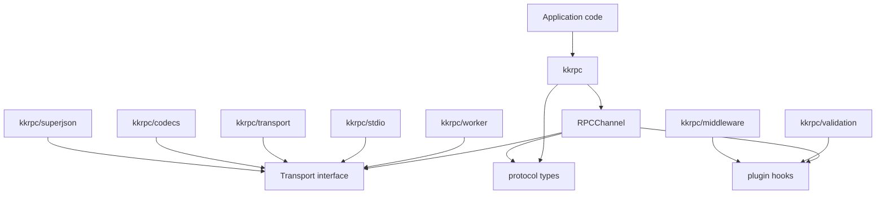
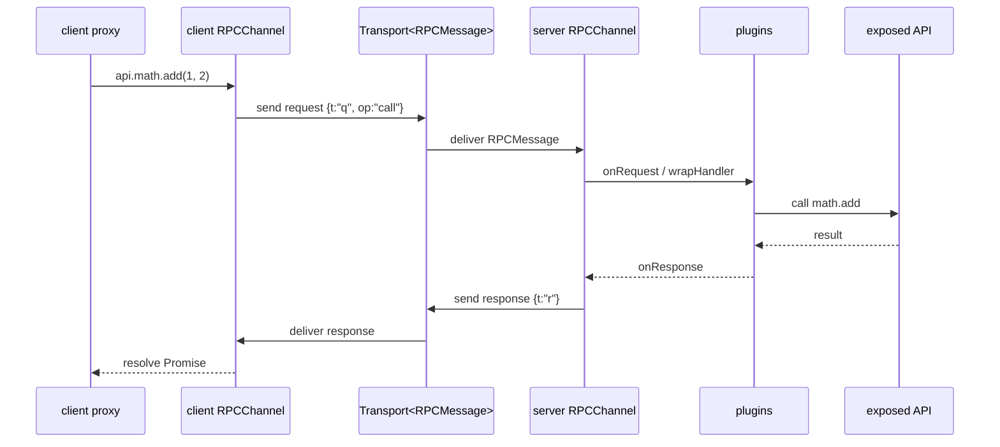
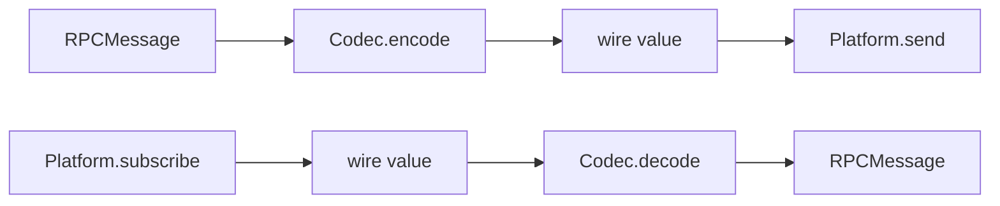

# kkrpc Architecture

The stable `kkrpc` entry is the small, modular RPC runtime for browser and cross-runtime work. It keeps the core channel independent from transports, serialization formats, validation, middleware, and runtime-specific adapters so applications can import only the pieces they use.

## Goals

- Keep `kkrpc` small enough for browser bundles.
- Make transports explicit and testable through a narrow `Transport<RPCMessage>` interface.
- Move optional features into separate package exports so bundlers can tree-shake them.
- Preserve ergonomic `wrap()` and `expose()` APIs for common use.
- Keep optional peers and runtime-specific transports behind subpath exports.

## Module Graph



The important property is what does not happen: `kkrpc` does not import validation, middleware, SuperJSON, stdio, worker transport, or optional peers. Those modules import the core, not the other way around.

## Runtime Call Flow



`RPCChannel` owns request IDs, proxy creation, pending promises, callbacks, transfer markers, error serialization, and plugin execution. It does not know whether the message travels through a Worker, stdio, WebSocket, or an in-memory test transport.

## Core Concepts

### `RPCMessage`

`src/core/protocol.ts` defines the wire-level message union:

- Request: `{ t: "q", id, op, p, a?, v? }`
- Response: `{ t: "r", id, v?, e? }`
- Callback: `{ t: "cb", id, a }`
- Stream request: `{ t: "sq", id, sid, op, n?, v? }`
- Stream response: `{ t: "sr", id, sid, d?, v?, e? }`

The short keys reduce serialized size for string transports and make the protocol stable across codecs.

### `Transport<TMessage>`

`Transport` is the channel boundary:

```ts
interface Transport<TMessage> {
	capabilities?: { objectMode?: boolean; transfer?: boolean; broadcast?: boolean }
	send(message: TMessage, transfers?: Transferable[]): void | Promise<void>
	subscribe(listener: (message: TMessage) => void): () => void
	close?(): void
}
```

Transports push messages to subscribers instead of exposing a blocking read loop, which makes browser and event-source transports easier to model.

### `Platform` + `Codec`

`createTransport()` combines a low-level platform and codec:



This split keeps transport plumbing separate from serialization. For example, stdio uses a string platform plus `jsonLineCodec()`, while Worker can use object-mode messages directly.

## Tree-Shaking Design

Each optional feature has a separate package export and source entry:

| Public import      | Source entry                 | Pulls in                                         |
| ------------------ | ---------------------------- | ------------------------------------------------ |
| `kkrpc`            | `src/entries/mod.ts`         | channel, protocol, transport types, plugin types |
| `kkrpc/browser`    | `src/entries/browser-mod.ts` | browser-safe core re-export                      |
| `kkrpc/transport`  | `src/entries/transport.ts`   | `createTransport`, platform/codec interfaces     |
| `kkrpc/codecs`     | `src/entries/codecs.ts`      | JSON/object codecs                               |
| `kkrpc/worker`     | `src/entries/worker.ts`      | Worker transport only                            |
| `kkrpc/stdio`      | `src/entries/stdio.ts`       | stdio platform + JSON-line codec                 |
| `kkrpc/validation` | `src/entries/validation.ts`  | Standard Schema validation plugin                |
| `kkrpc/middleware` | `src/entries/middleware.ts`  | interceptor middleware plugin                    |
| `kkrpc/superjson`  | `src/entries/superjson.ts`   | SuperJSON codecs                                 |

The dependency direction is one-way: feature entries import core; core never imports feature entries. This is the tree-shaking boundary. A user importing only `kkrpc` should not pay for SuperJSON, validation libraries, middleware helpers, stdio, Worker-specific code, or optional peer transports.

## Bundle Size Measurement

Use the existing benchmark command from the package root:

```bash
pnpm --filter kkrpc compare:browser-bundle-size
```

The benchmark script builds small browser samples for these entries:

- `kkrpc`
- `kkrpc/browser`
- `kkrpc/worker`
- `kkrpc/validation`
- `kkrpc/middleware`
- `kkrpc/superjson`

These numbers are benchmark artifacts, not API guarantees. They can move as minifiers, package versions, and source comments change.

When reviewing bundle size, compare both Brotli and gzip. Brotli is usually the better proxy for production browser delivery.

## Current Test Coverage

The native tests cover:

- Core proxy calls, properties, callbacks, errors, transfer fallback, and destroy behavior.
- Transport/codec composition.
- Worker transport.
- stdio platform and JSON-line transport.
- Plugin hook order and mutation.
- Validation input/output checks and validation error metadata.
- Middleware order, state sharing, blocking, and double-`next()` guards.
- SuperJSON codecs.
- Native transports for HTTP, WebSocket, framework adapters, iframe, Chrome extension, Electron, Tauri, RabbitMQ, Redis Streams, Kafka, and NATS.
