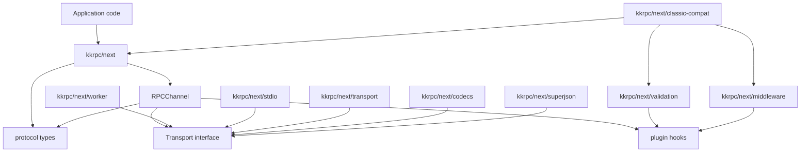
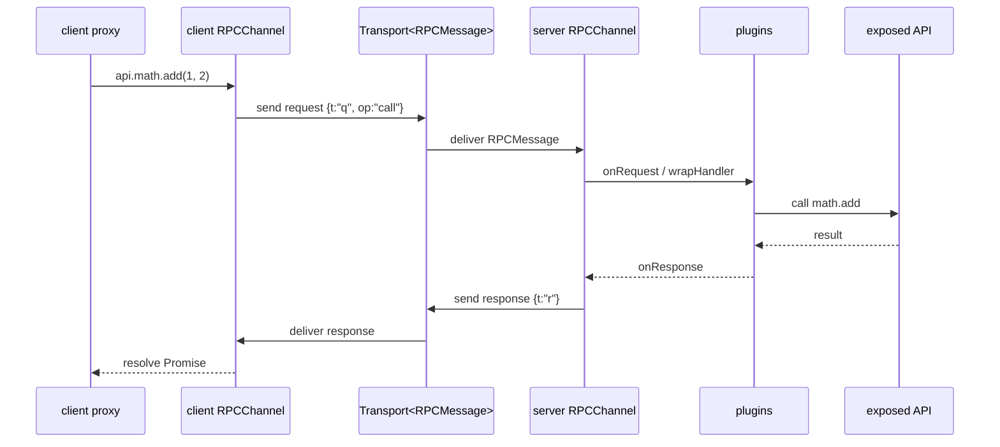
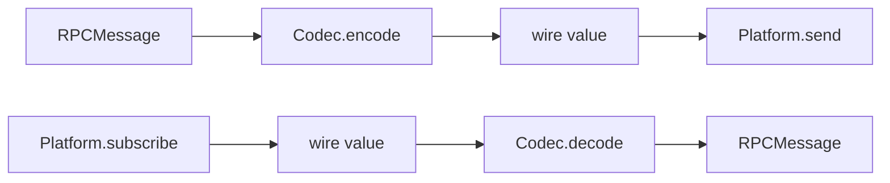

# kkrpc/next Architecture

`kkrpc/next` is the small, modular RPC runtime intended to become the reviewable foundation for future browser and cross-runtime work. It keeps the core channel independent from transports, serialization formats, validation, middleware, and migration helpers so applications can import only the pieces they use.

The current classic package entry still exists and still powers the existing adapters. The `next` entry is a parallel architecture, not a drop-in replacement for every classic adapter yet.

## Goals

- Keep `kkrpc/next` small enough for browser bundles.
- Make transports explicit and testable through a narrow `Transport<RPCMessage>` interface.
- Move optional features into separate package exports so bundlers can tree-shake them.
- Preserve ergonomic `wrap()` and `expose()` APIs for common use.
- Provide a `classic-compat` facade for migration ergonomics without importing classic internals.

## Module Graph



The important property is what does not happen: `kkrpc/next` does not import validation, middleware, SuperJSON, stdio, worker transport, or classic compatibility. Those modules import the core, not the other way around.

## Runtime Call Flow



`RPCChannel` owns request IDs, proxy creation, pending promises, callbacks, transfer markers, error serialization, and plugin execution. It does not know whether the message travels through a Worker, stdio, WebSocket, or an in-memory test transport.

## Core Concepts

### `RPCMessage`

`src/next/protocol.ts` defines the wire-level message union:

- Request: `{ t: "q", id, op, p, a?, v? }`
- Response: `{ t: "r", id, v?, e? }`
- Callback: `{ t: "cb", id, a }`

The short keys reduce serialized size for string transports and make the protocol stable across codecs.

### `Transport<TMessage>`

`Transport` is the channel boundary:

```ts
interface Transport<TMessage> {
  capabilities?: { objectMode?: boolean; transfer?: boolean; broadcast?: boolean }
  send(message: TMessage, transfers?: Transferable[]): void | Promise<void>
  subscribe(listener: (message: TMessage) => void): () => void
  close?(): void
}
```

Transports are intentionally smaller than the classic `IoInterface`. They push messages to subscribers instead of exposing a blocking `read()` loop, which makes browser and event-source transports easier to model.

### `Platform` + `Codec`

`createTransport()` combines a low-level platform and codec:



This split keeps transport plumbing separate from serialization. For example, stdio uses a string platform plus `jsonLineCodec()`, while Worker can use object-mode messages directly.

## Tree-Shaking Design

Each optional feature has a separate package export and source entry:

| Public import | Source entry | Pulls in |
| --- | --- | --- |
| `kkrpc/next` | `next.ts` | channel, protocol, transport types, plugin types |
| `kkrpc/next/transport` | `next-transport.ts` | `createTransport`, platform/codec interfaces |
| `kkrpc/next/codecs` | `next-codecs.ts` | JSON/object codecs |
| `kkrpc/next/worker` | `next-worker.ts` | Worker transport only |
| `kkrpc/next/stdio` | `next-stdio.ts` | stdio platform + JSON-line codec |
| `kkrpc/next/validation` | `next-validation.ts` | Standard Schema validation plugin |
| `kkrpc/next/middleware` | `next-middleware.ts` | interceptor middleware plugin |
| `kkrpc/next/superjson` | `next-superjson.ts` | SuperJSON codecs |
| `kkrpc/next/classic-compat` | `next-classic-compat.ts` | validation + middleware composition facade |

The dependency direction is one-way: feature entries import core; core never imports feature entries. This is the tree-shaking boundary. A user importing only `kkrpc/next` should not pay for SuperJSON, validation libraries, middleware helpers, stdio, or Worker-specific code.

## Bundle Size Measurement

Use the existing benchmark command from the package root:

```bash
pnpm --filter kkrpc compare:browser-bundle-size
```

The benchmark script builds small browser samples for these entries:

- `kkrpc/next`
- `kkrpc/next/worker`
- `kkrpc/next/validation`
- `kkrpc/next/middleware`
- `kkrpc/next/superjson`
- `kkrpc/next/classic-compat`
- `kkrpc/browser-mini`
- `comctx`

Latest measured output from `pnpm --filter kkrpc compare:browser-bundle-size` in this workspace:

| Bundle | Raw minified | Gzip | Brotli | Modules |
| --- | ---: | ---: | ---: | ---: |
| `kkrpc/browser` | 31.46 KB | 9.64 KB | 8.55 KB | 24 |
| `kkrpc/browser-lite` | 20.59 KB | 6.01 KB | 5.32 KB | 8 |
| `kkrpc/next` | 5.26 KB | 2.08 KB | 1.85 KB | 5 |
| `kkrpc/next/worker` | 5.64 KB | 2.23 KB | 1.98 KB | 6 |
| `kkrpc/next/validation` | 1.38 KB | 0.67 KB | 0.57 KB | 4 |
| `kkrpc/next/middleware` | 0.43 KB | 0.30 KB | 0.26 KB | 3 |
| `kkrpc/next/superjson` | 10.99 KB | 3.96 KB | 3.58 KB | 15 |
| `kkrpc/next/classic-compat` | 1.87 KB | 0.91 KB | 0.80 KB | 8 |
| `kkrpc/browser-mini` | 4.32 KB | 1.79 KB | 1.60 KB | 3 |
| `kkrpc-lite direct` | 20.38 KB | 5.83 KB | 5.12 KB | 10 |
| `comctx` | 4.72 KB | 1.93 KB | 1.70 KB | 8 |

On this run, `kkrpc/next` is slightly larger than `comctx` by about 0.15 KB Brotli and 0.15 KB gzip, while staying much smaller than `kkrpc/browser` and `kkrpc/browser-lite`. The main win is that optional features are measured and imported independently: middleware adds only a tiny helper entry, validation stays separate, and SuperJSON cost is isolated to `kkrpc/next/superjson` instead of being pulled into the core.

These numbers are benchmark artifacts, not API guarantees. They can move as minifiers, package versions, source comments, and the local `references/comctx` checkout change.

When reviewing bundle size, compare both Brotli and gzip. Brotli is usually the better proxy for production browser delivery.

## Classic Compatibility

`kkrpc/next/classic-compat` is a migration facade for code that wants classic-style options:

```ts
const api = wrapCompat<MyAPI>(transport, {
  validators,
  interceptors,
  plugins
})
```

It does three things:

- Converts `validators` into `validationPlugin()`.
- Converts `interceptors` into `middlewarePlugin()`.
- Preserves explicitly supplied plugins after the generated plugins.

It does not convert old `IoInterface` adapters into `Transport<RPCMessage>`. Classic adapters such as `RabbitMQIO`, `RedisStreamsIO`, `NatsIO`, and `KafkaIO` still use the classic `RPCChannel` today. To use those systems with `kkrpc/next`, we need either new next transports or explicit adapter bridges.

## Current Test Coverage

The current vNext-specific tests cover:

- Core proxy calls, properties, callbacks, errors, transfer fallback, and destroy behavior.
- Transport/codec composition.
- Worker transport.
- stdio platform and JSON-line transport.
- Plugin hook order and mutation.
- Validation input/output checks and validation error metadata.
- Middleware order, state sharing, blocking, and double-`next()` guards.
- SuperJSON codecs.
- Classic compatibility facade composition.

Classic MQ tests still cover the classic adapters, not `kkrpc/next` transports.

## Remaining Migration Work

Before `kkrpc/next` can be treated as the replacement path for all examples, we still need:

- A coverage matrix mapping classic behavior tests to vNext equivalents.
- vNext examples for the public docs and `examples/` directory.
- vNext transport implementations or bridges for RabbitMQ, Redis Streams, NATS, Kafka, HTTP, WebSocket, and framework adapters.
- A migration guide that explains when to use `wrap()`, `expose()`, `RPCChannel`, and `classic-compat`.
- A release decision on whether `kkrpc/next` is experimental, beta, or stable.
