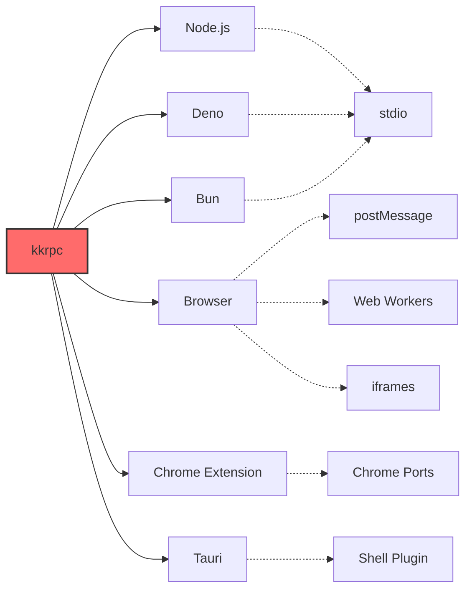

<div align="center">

# 🚀 kkrpc

## TypeScript-First RPC Library

[](https://deepwiki.com/kunkunsh/kkrpc)
[![zread](https://img.shields.io/badge/Ask_Zread-_.svg?style=for-the-badge&color=00b0aa&labelColor=000000&logo=data%3Aimage%2Fsvg%2Bxml%3Bbase64%2CPHN2ZyB3aWR0aD0iMTYiIGhlaWdodD0iMTYiIHZpZXdCb3g9IjAgMCAxNiAxNiIgZmlsbD0ibm9uZSIgeG1sbnM9Imh0dHA6Ly93d3cudzMub3JnLzIwMDAvc3ZnIj4KPHBhdGggZD0iTTQuOTYxNTYgMS42MDAxSDIuMjQxNTZDMS44ODgxIDEuNjAwMSAxLjYwMTU2IDEuODg2NjQgMS42MDE1NiAyLjI0MDFWNC45NjAxQzEuNjAxNTYgNS4zMTM1NiAxLjg4ODEgNS42MDAxIDIuMjQxNTYgNS42MDAxSDQuOTYxNTZDNS4zMTUwMiA1LjYwMDEgNS42MDE1NiA1LjMxMzU2IDUuNjAxNTYgNC45NjAxVjIuMjQwMUM1LjYwMTU2IDEuODg2NjQgNS4zMTUwMiAxLjYwMDEgNC45NjE1NiAxLjYwMDFaIiBmaWxsPSIjZmZmIi8%2BCjxwYXRoIGQ9Ik00Ljk2MTU2IDEwLjM5OTlIMi4yNDE1NkMxLjg4ODEgMTAuMzk5OSAxLjYwMTU2IDEwLjY4NjQgMS42MDE1NiAxMS4wMzk5VjEzLjc1OTlDMS42MDE1NiAxNC4xMTM0IDEuODg4MSAxNC4zOTk5IDIuMjQxNTYgMTQuMzk5OUg0Ljk2MTU2QzUuMzE1MDIgMTQuMzk5OSA1LjYwMTU2IDE0LjExMzQgNS42MDE1NiAxMy43NTk5VjExLjAzOTlDNS42MDE1NiAxMC42ODY0IDUuMzE1MDIgMTAuMzk5OSA0Ljk2MTU2IDEwLjM5OTlaIiBmaWxsPSIjZmZmIi8%2BCjxwYXRoIGQ9Ik0xMy43NTg0IDEuNjAwMUgxMS4wMzg0QzEwLjY4NSAxLjYwMDEgMTAuMzk4NCAxLjg4NjY0IDEwLjM5ODQgMi4yNDAxVjQuOTYwMUMxMC4zOTg0IDUuMzEzNTYgMTAuNjg1IDUuNjAwMSAxMS4wMzg0IDUuNjAwMUgxMy43NTg0QzE0LjExMTkgNS42MDAxIDE0LjM5ODQgNS4zMTM1NiAxNC4zOTg0IDQuOTYwMVYyLjI0MDFDMTQuMzk4NCAxLjg4NjY0IDE0LjExMTkgMS42MDAxIDEzLjc1ODQgMS42MDAxWiIgZmlsbD0iI2ZmZiIvPgo8cGF0aCBkPSJNNCAxMkwxMiA0TDQgMTJaIiBmaWxsPSIjZmZmIi8%2BCjxwYXRoIGQ9Ik00IDEyTDEyIDQiIHN0cm9rZT0iI2ZmZiIgc3Ryb2tlLXdpZHRoPSIxLjUiIHN0cm9rZS1saW5lY2FwPSJyb3VuZCIvPgo8L3N2Zz4K&logoColor=ffffff)](https://zread.ai/kunkunsh/kkrpc)
[](https://www.npmjs.com/package/kkrpc)
[](https://jsr.io/@kunkun/kkrpc)
[](https://github.com/kunkunsh/kkrpc/blob/main/LICENSE)
[](https://www.npmjs.com/package/kkrpc)
[](https://github.com/kunkunsh/kkrpc)
[](https://kunkunsh.github.io/kkrpc/)
[](https://excalidraw.com/#json=xp6GbAJVAx3nU-h3PhaxW,oYBNvYmCRsQ2XR3MQo73Ug)
[](https://docs.kkrpc.kunkun.sh/llms.txt)

</div>

> This project was created for building extension system for a Tauri app ([kunkun](https://github.com/kunkunsh/kunkun)).
>
> It can potentially be used in other types of apps, so I open sourced it as a standalone package.

**Seamless bi-directional communication between processes, workers, and contexts**

Call remote functions as if they were local, with full TypeScript type safety and autocompletion support.

**Similar to Comlink but with bidirectional communication** and support for multiple environments - both client and server can expose functions for the other to call across Node.js, Deno, Bun, and browser environments.

[**Quick Start**](#-quick-start) • [**Documentation**](https://kunkunsh.github.io/kkrpc/) • [**Examples**](#-examples) • [**API Reference**](https://jsr.io/@kunkun/kkrpc/doc) • [**LLM Docs**](https://docs.kkrpc.kunkun.sh/llms.txt) • [**中文文档**](./README.zh.md)

## 🤖 AI Support

Working with kkrpc in your AI-powered editor? Add these skills to your Claude Code configuration to get intelligent assistance:

```bash
# Copy kkrpc skills to your global Claude Code skills folder
cp -r skills/kkrpc ~/.claude/skills/
cp -r skills/interop ~/.claude/skills/
```

This provides your AI assistant with:

- **kkrpc skill**: How to use kkrpc in TypeScript projects
- **interop skill**: How to implement kkrpc clients/servers in other languages (Go, Python, Rust, Swift)

See [`skills/`](./skills/) directory for details.

<div align="center">


</div>

---

## 🌟 Why kkrpc?

kkrpc stands out in the crowded RPC landscape by offering **true cross-runtime compatibility** without sacrificing type safety or developer experience. Unlike tRPC (HTTP-only) or Comlink (browser-only), kkrpc enables seamless communication across Node.js, Deno, Bun, and browser environments.

## ✨ Features

<div align="center">

| Feature                     | Description                                                    |
| --------------------------- | -------------------------------------------------------------- |
| **🔄 Cross-runtime**        | Works seamlessly across Node.js, Deno, Bun, browsers, and more |
| **🛡️ Type-safe**            | Full TypeScript inference and IDE autocompletion support       |
| **↔️ Bidirectional**        | Both endpoints can expose and call APIs simultaneously         |
| **🏠 Property Access**      | Remote getters/setters with dot notation (`await api.prop`)    |
| **💥 Error Preservation**   | Complete error objects across RPC boundaries                   |
| **🌐 Multiple Transports**  | stdio, HTTP, WebSocket, postMessage, Chrome extensions         |
| **📞 Callback Support**     | Remote functions can accept callback functions                 |
| **🔗 Nested Calls**         | Deep method chaining like `api.math.operations.calculate()`    |
| **📦 Auto Serialization**   | Intelligent JSON/superjson detection                           |
| **⚡ Zero Config**          | No schema files or code generation required                    |
| **🔒 Data Validation**      | Optional runtime validation with Zod, Valibot, ArkType, etc.   |
| **🔌 Middleware**           | Interceptor chain for logging, auth, timing, and more          |
| **⏱️ Request Timeout**      | Auto-reject pending calls after a configurable deadline         |
| **🔁 Streaming**            | Return `AsyncIterable` from methods, consume with `for await`  |
| **🚀 Transferable Objects** | Zero-copy transfers for large data (40-100x faster)            |

</div>

## 🌍 Supported Environments

<div align="center">



</div>

### 📡 Transport Protocols

| Transport            | Use Case                                              | Supported Runtimes                     |
| -------------------- | ----------------------------------------------------- | -------------------------------------- |
| **stdio**            | Process-to-process communication                      | Node.js ↔ Deno ↔ Bun                 |
| **postMessage**      | Browser context communication                         | Browser ↔ Web Workers ↔ iframes      |
| **HTTP**             | Web API communication                                 | All runtimes                           |
| **WebSocket**        | Real-time communication                               | All runtimes                           |
| **Hono WebSocket**   | High-performance WebSocket with Hono framework        | Node.js, Deno, Bun, Cloudflare Workers |
| **Socket.IO**        | Enhanced real-time with rooms/namespaces              | All runtimes                           |
| **Elysia WebSocket** | Modern TypeScript framework WebSocket integration     | Bun, Node.js, Deno                     |
| **Chrome Extension** | Extension component communication                     | Chrome Extension contexts              |
| **RabbitMQ**         | Message queue communication                           | Node.js, Deno, Bun                     |
| **Redis Streams**    | Stream-based messaging with persistence               | Node.js, Deno, Bun                     |
| **Kafka**            | Distributed streaming platform                        | Node.js, Deno, Bun                     |
| **NATS**             | High-performance messaging system                     | Node.js, Deno, Bun                     |
| **Electron**         | Desktop app IPC (Renderer ↔ Main ↔ Utility Process) | Electron                               |

The core of **kkrpc** design is in `RPCChannel` and `IoInterface`.

- `RPCChannel` is the bidirectional RPC channel
- `LocalAPI` is the APIs to be exposed to the other side of the channel
- `RemoteAPI` is the APIs exposed by the other side of the channel, and callable on the local side
- `rpc.getAPI()` returns an object that is `RemoteAPI` typed, and is callable on the local side like a normal local function call.
- `IoInterface` is the interface for implementing the IO for different environments. The implementations are called adapters.
  - For example, for a Node process to communicate with a Deno process, we need `NodeIo` and `DenoIo` adapters which implements `IoInterface`. They share the same stdio pipe (`stdin/stdout`).
  - In web, we have `WorkerChildIO` and `WorkerParentIO` adapters for web worker, `IframeParentIO` and `IframeChildIO` adapters for iframe.

> In browser, import from `kkrpc/browser` instead of `kkrpc`, Deno adapter uses node:buffer which doesn't work in browser.

```ts
interface IoInterface {
	name: string
	read(): Promise<Buffer | Uint8Array | string | null> // Reads input
	write(data: string): Promise<void> // Writes output
}

class RPCChannel<
	LocalAPI extends Record<string, any>,
	RemoteAPI extends Record<string, any>,
	Io extends IoInterface = IoInterface
> {}
```

## Serialization

kkrpc supports two serialization formats for message transmission:

- `json`: Standard JSON serialization
- `superjson`: Enhanced JSON serialization with support for more data types like Date, Map, Set, BigInt, and Uint8Array (default since v0.2.0)

You can specify the serialization format when creating a new RPCChannel:

```ts
// Using default serialization (superjson)
const rpc = new RPCChannel(io, { expose: apiImplementation })

// Explicitly using superjson serialization (recommended for clarity)
const rpc = new RPCChannel(io, {
	expose: apiImplementation,
	serialization: { version: "superjson" }
})

// Using standard JSON serialization (for backward compatibility)
const rpc = new RPCChannel(io, {
	expose: apiImplementation,
	serialization: { version: "json" }
})
```

For backward compatibility, the receiving side will automatically detect the serialization format so older clients can communicate with newer servers and vice versa.

## Data Validation

kkrpc supports optional runtime validation of RPC inputs and outputs using any [Standard Schema](https://standardschema.dev)-compatible library (Zod, Valibot, ArkType, etc.). Validation is fully opt-in — without it, kkrpc behaves exactly as before.

There are two approaches:

### Type-first (add validators to existing code)

Define your API as usual, then add a `validators` map that mirrors the API shape:

```ts
import { RPCChannel, type RPCValidators } from "kkrpc"
import { z } from "zod"

type MathAPI = {
	add(a: number, b: number): Promise<number>
	divide(a: number, b: number): Promise<number>
}

const api: MathAPI = {
	add: async (a, b) => a + b,
	divide: async (a, b) => a / b
}

const validators: RPCValidators<MathAPI> = {
	add: {
		input: z.tuple([z.number(), z.number()]),
		output: z.number()
	},
	divide: {
		input: z.tuple([z.number(), z.number().refine((n) => n !== 0, "Divisor cannot be zero")]),
		output: z.number()
	}
}

new RPCChannel(io, { expose: api, validators })
```

### Schema-first (types inferred from schemas)

Use `defineMethod` and `defineAPI` to define your API with schemas — types are inferred automatically:

```ts
import { defineAPI, defineMethod, extractValidators, RPCChannel, type InferAPI } from "kkrpc"
import { z } from "zod"

const api = defineAPI({
	add: defineMethod(
		{ input: z.tuple([z.number(), z.number()]), output: z.number() },
		async (a, b) => a + b // a, b are typed as number
	),
	greet: defineMethod(
		{ input: z.tuple([z.string()]), output: z.string() },
		async (name) => `Hello, ${name}!`
	)
})

type MyAPI = InferAPI<typeof api>

new RPCChannel(io, { expose: api, validators: extractValidators(api) })
```

### Validation errors

When validation fails, the caller receives an `RPCValidationError` with structured issue details:

```ts
import { isRPCValidationError } from "kkrpc"

try {
	await api.add("not", "numbers") // wrong types
} catch (error) {
	if (isRPCValidationError(error)) {
		error.phase // "input" or "output"
		error.method // "add"
		error.issues // [{ message: "Expected number, received string", path: [0] }]
	}
}
```

Validators support nested APIs (`math.divide`), custom refinements (`.email()`, `.min(1)`, `.refine()`), and output validation. Since kkrpc is bidirectional, both sides can independently validate their own exposed API.

## Middleware / Interceptors

kkrpc supports an optional interceptor chain that wraps handler invocation on the receiving side. Interceptors use the standard onion model (like Koa or tRPC) — each interceptor calls `next()` to proceed, and can inspect args, transform return values, measure timing, or throw to abort.

```ts
import { RPCChannel, type RPCInterceptor } from "kkrpc"

const logger: RPCInterceptor = async (ctx, next) => {
	console.log(`→ ${ctx.method}`, ctx.args)
	const result = await next()
	console.log(`← ${ctx.method}`, result)
	return result
}

const auth: RPCInterceptor = async (ctx, next) => {
	if (ctx.method.startsWith("admin.")) throw new Error("Unauthorized")
	return next()
}

new RPCChannel(io, {
	expose: api,
	interceptors: [logger, auth]
})
```

Interceptors run **after** input validation and **before** output validation, so they always see clean, validated data. Each interceptor receives a `ctx` object with `method`, `args`, and a shared `state` bag for passing data between interceptors. When no interceptors are configured, there is zero overhead.

## Request Timeout

kkrpc supports optional request timeouts to prevent pending calls from hanging forever if the remote side crashes or the transport drops:

```ts
import { RPCChannel, isRPCTimeoutError } from "kkrpc"

const rpc = new RPCChannel(io, {
	expose: api,
	timeout: 5000 // 5 second timeout for all outgoing calls
})

try {
	await api.slowOperation()
} catch (error) {
	if (isRPCTimeoutError(error)) {
		console.log(error.method)    // "slowOperation"
		console.log(error.timeoutMs) // 5000
	}
}
```

When `destroy()` is called, all pending requests are immediately rejected with `"RPC channel destroyed"`. The default is `0` (no timeout).

## Streaming / AsyncIterable

kkrpc supports first-class streaming via `AsyncIterable`. If an RPC method returns an `AsyncIterable` (e.g. an async generator), the values are streamed chunk-by-chunk to the consumer, who can read them with `for await...of`:

```ts
// Server: return an async generator
const api = {
	async *countdown(from: number) {
		for (let i = from; i >= 0; i--) {
			yield i
		}
	},
	async *watchFiles(path: string) {
		const watcher = fs.watch(path)
		try {
			for await (const event of watcher) {
				yield event
			}
		} finally {
			watcher.close()
		}
	}
}

new RPCChannel(io, { expose: api })
```

```ts
// Client: consume with for-await-of
const api = rpc.getAPI()

const values: number[] = []
for await (const n of await api.countdown(5)) {
	values.push(n)
}
// values = [5, 4, 3, 2, 1, 0]

// Consumer cancellation: break stops the producer
for await (const event of await api.watchFiles("/tmp")) {
	console.log(event)
	if (shouldStop) break // sends cancel signal to producer
}
```

Streaming works alongside regular methods, interceptors, and validation. Producer errors propagate to the consumer, and `break` sends a cancel signal back to stop production. When `destroy()` is called, all active streams are cleaned up.

## 🚀 Quick Start

### Installation

```bash
# npm
npm install kkrpc

# yarn
yarn add kkrpc

# pnpm
pnpm add kkrpc

# deno
import { RPCChannel } from "jsr:@kunkun/kkrpc"
```

### Basic Example

```typescript
// server.ts
import { NodeIo, RPCChannel } from "kkrpc"

const api = {
	greet: (name: string) => `Hello, ${name}!`,
	add: (a: number, b: number) => a + b
}

const rpc = new RPCChannel(new NodeIo(process.stdin, process.stdout), {
	expose: api
})
```

```typescript
// client.ts
import { spawn } from "child_process"
import { NodeIo, RPCChannel } from "kkrpc"

const worker = spawn("deno", ["run", "server.ts"])
const rpc = new RPCChannel(new NodeIo(worker.stdout, worker.stdin))
const api = rpc.getAPI<typeof api>()

console.log(await api.greet("World")) // "Hello, World!"
console.log(await api.add(5, 3)) // 8
```

## 📚 Examples

Below are simple examples to get you started quickly.

### Stdio Example

```ts
import { NodeIo, RPCChannel } from "kkrpc"
import { apiMethods } from "./api.ts"

const stdio = new NodeIo(process.stdin, process.stdout)
const child = new RPCChannel(stdio, { expose: apiMethods })
```

```ts
import { spawn } from "child_process"

const worker = spawn("bun", ["scripts/node-api.ts"])
const io = new NodeIo(worker.stdout, worker.stdin)
const parent = new RPCChannel<{}, API>(io)
const api = parent.getAPI()

expect(await api.add(1, 2)).toBe(3)
```

### Property Access Example

kkrpc supports direct property access and mutation across RPC boundaries:

```ts
// Define API with properties
interface API {
	add(a: number, b: number): Promise<number>
	counter: number
	settings: {
		theme: string
		notifications: {
			enabled: boolean
		}
	}
}

const api = rpc.getAPI<API>()

// Property getters (using await for remote access)
const currentCount = await api.counter
const theme = await api.settings.theme
const notificationsEnabled = await api.settings.notifications.enabled

// Property setters (direct assignment)
api.counter = 42
api.settings.theme = "dark"
api.settings.notifications.enabled = true

// Verify changes
console.log(await api.counter) // 42
console.log(await api.settings.theme) // "dark"
```

### Validation Example (Type-first)

Add runtime validation to an existing API using the `validators` option:

```ts
// api.ts
import type { RPCValidators } from "kkrpc"
import { z } from "zod"

export type API = {
	add(a: number, b: number): Promise<number>
	createUser(user: {
		name: string
		email: string
	}): Promise<{ id: string; name: string; email: string }>
}

export const api: API = {
	add: async (a, b) => a + b,
	createUser: async (user) => ({ id: crypto.randomUUID(), ...user })
}

export const validators: RPCValidators<API> = {
	add: {
		input: z.tuple([z.number(), z.number()]),
		output: z.number()
	},
	createUser: {
		input: z.tuple([z.object({ name: z.string().min(1), email: z.string().email() })]),
		output: z.object({ id: z.string(), name: z.string(), email: z.string() })
	}
}
```

```ts
// server.ts
import { RPCChannel, WebSocketServerIO } from "kkrpc"
import { api, validators, type API } from "./api"

wss.on("connection", (ws) => {
	const io = new WebSocketServerIO(ws)
	new RPCChannel<API, API>(io, { expose: api, validators })
})
```

```ts
// client.ts
import { isRPCValidationError, RPCChannel, WebSocketClientIO } from "kkrpc"
import type { API } from "./api"

const io = new WebSocketClientIO({ url: "ws://localhost:3000" })
const rpc = new RPCChannel<{}, API>(io)
const api = rpc.getAPI()

// Valid calls work as usual
console.log(await api.add(1, 2)) // 3

// Invalid calls throw RPCValidationError
try {
	await api.createUser({ name: "", email: "not-an-email" })
} catch (error) {
	if (isRPCValidationError(error)) {
		console.log(error.phase) // "input"
		console.log(error.issues) // validation issues from Zod
	}
}
```

### Validation Example (Schema-first)

Define your API with schemas — types are inferred automatically, no separate type definition needed:

```ts
// api.ts
import { defineAPI, defineMethod, extractValidators, type InferAPI } from "kkrpc"
import { z } from "zod"

export const api = defineAPI({
	add: defineMethod(
		{ input: z.tuple([z.number(), z.number()]), output: z.number() },
		async (a, b) => a + b
	),
	greet: defineMethod(
		{ input: z.tuple([z.string()]), output: z.string() },
		async (name) => `Hello, ${name}!`
	),
	math: {
		divide: defineMethod(
			{
				input: z.tuple([z.number(), z.number().refine((n) => n !== 0, "Cannot divide by zero")]),
				output: z.number()
			},
			async (a, b) => a / b
		)
	}
})

export type API = InferAPI<typeof api>
export const validators = extractValidators(api)
```

```ts
// server.ts
import { RPCChannel, WebSocketServerIO } from "kkrpc"
import { api, validators } from "./api"

wss.on("connection", (ws) => {
	const io = new WebSocketServerIO(ws)
	new RPCChannel(io, { expose: api, validators })
})
```

```ts
// client.ts
import { isRPCValidationError, RPCChannel, WebSocketClientIO } from "kkrpc"
import type { API } from "./api"

const io = new WebSocketClientIO({ url: "ws://localhost:3000" })
const rpc = new RPCChannel<{}, API>(io)
const api = rpc.getAPI()

console.log(await api.greet("World")) // "Hello, World!"
console.log(await api.math.divide(10, 2)) // 5

try {
	await api.math.divide(10, 0)
} catch (error) {
	if (isRPCValidationError(error)) {
		console.log(error.method) // "math.divide"
		console.log(error.issues[0].message) // "Cannot divide by zero"
	}
}
```

### Enhanced Error Preservation

kkrpc preserves complete error information across RPC boundaries:

```ts
// Custom error class
class DatabaseError extends Error {
	constructor(
		message: string,
		public code: number,
		public query: string
	) {
		super(message)
		this.name = "DatabaseError"
	}
}

// API with error-throwing method
const apiImplementation = {
	async getUserById(id: string) {
		if (!id) {
			const error = new DatabaseError("Invalid user ID", 400, "SELECT * FROM users WHERE id = ?")
			error.timestamp = new Date().toISOString()
			error.requestId = generateRequestId()
			throw error
		}
		// ... normal logic
	}
}

// Error handling on client side
try {
	await api.getUserById("")
} catch (error) {
	// All error properties are preserved:
	console.log(error.name) // "DatabaseError"
	console.log(error.message) // "Invalid user ID"
	console.log(error.code) // 400
	console.log(error.query) // "SELECT * FROM users WHERE id = ?"
	console.log(error.stack) // Full stack trace
	console.log(error.timestamp) // ISO timestamp
	console.log(error.requestId) // Request ID
}
```

### Web Worker Example

```ts
import { RPCChannel, WorkerChildIO, type DestroyableIoInterface } from "kkrpc"

const worker = new Worker(new URL("./scripts/worker.ts", import.meta.url).href, { type: "module" })
const io = new WorkerChildIO(worker)
const rpc = new RPCChannel<API, API, DestroyableIoInterface>(io, { expose: apiMethods })
const api = rpc.getAPI()

expect(await api.add(1, 2)).toBe(3)
```

```ts
import { RPCChannel, WorkerParentIO, type DestroyableIoInterface } from "kkrpc"

const io: DestroyableIoInterface = new WorkerChildIO()
const rpc = new RPCChannel<API, API, DestroyableIoInterface>(io, { expose: apiMethods })
const api = rpc.getAPI()

const sum = await api.add(1, 2)
expect(sum).toBe(3)
```

### Transferable Objects Example

kkrpc supports zero-copy transfer of large data structures using browser's native transferable objects. This provides 40-100x performance improvement for large binary data transfers.

```ts
import { RPCChannel, transfer, WorkerParentIO } from "kkrpc/browser"

const worker = new Worker("worker.js")
const io = new WorkerParentIO(worker)
const rpc = new RPCChannel(io)
const api = rpc.getAPI<{
	processBuffer(buffer: ArrayBuffer): Promise<number>
	generateData(size: number): Promise<ArrayBuffer>
}>()

// Create a large buffer (10MB)
const buffer = new ArrayBuffer(10 * 1024 * 1024)
console.log("Before transfer:", buffer.byteLength) // 10485760

// Transfer buffer to worker (zero-copy)
const result = await api.processBuffer(transfer(buffer, [buffer]))
console.log("Worker processed:", result, "bytes")

// Buffer is now neutered (transferred ownership)
console.log("After transfer:", buffer.byteLength) // 0

// Get data back from worker (also transferred)
const newBuffer = await api.generateData(5 * 1024 * 1024)
console.log("Received from worker:", newBuffer.byteLength) // 5242880
```

### Hono WebSocket Example

Hono WebSocket adapter provides seamless integration with the Hono framework's high-performance WebSocket support.

#### `server.ts`

```ts
import { Hono } from "hono"
import { upgradeWebSocket, websocket } from "hono/bun"
import { createHonoWebSocketHandler } from "kkrpc"
import { apiMethods, type API } from "./api"

const app = new Hono()

app.get(
	"/ws",
	upgradeWebSocket(() => {
		return createHonoWebSocketHandler<API>({
			expose: apiMethods
		})
	})
)

const server = Bun.serve({
	port: 3000,
	fetch: app.fetch,
	websocket
})

console.log(`Server running on port ${server.port}`)
```

#### `client.ts`

```ts
import { RPCChannel, WebSocketClientIO } from "kkrpc"
import { apiMethods, type API } from "./api"

const clientIO = new WebSocketClientIO({
	url: "ws://localhost:3000/ws"
})

const clientRPC = new RPCChannel<API, API>(clientIO, {
	expose: apiMethods
})

const api = clientRPC.getAPI()

// Test basic RPC calls
console.log(await api.add(5, 3)) // 8
console.log(await api.echo("Hello from Hono!")) // "Hello from Hono!"

// Test nested API calls
console.log(await api.math.grade2.multiply(4, 6)) // 24

// Test property access
console.log(await api.counter) // 42
console.log(await api.nested.value) // "hello world"

clientIO.destroy()
```

**Hono WebSocket Features:**

- **High Performance**: Built on Hono's ultra-fast WebSocket implementation
- **Cross-runtime**: Works across Bun, Deno, Node.js, and Cloudflare Workers
- **Type-safe**: Full TypeScript support with Hono integration
- **Bidirectional**: Both client and server can expose APIs
- **Framework Integration**: Seamless integration with Hono's middleware ecosystem

**Learn more:** [Hono WebSocket Documentation](https://hono.dev/docs/helpers/websocket)

### Elysia WebSocket Example

Elysia WebSocket adapter provides seamless integration with the modern TypeScript-first Elysia framework and its uWebSocket-powered WebSocket support.

#### `server.ts`

```ts
import { Elysia } from "elysia"
import { ElysiaWebSocketServerIO, RPCChannel } from "kkrpc"
import { apiMethods, type API } from "./api"

// Extend API for Elysia-specific features
interface ElysiaAPI extends API {
	getConnectionInfo(): Promise<{
		remoteAddress: string | undefined
		query: Record<string, string>
		headers: Record<string, string>
	}>
}

const app = new Elysia()
	.ws("/rpc", {
		open(ws) {
			const io = new ElysiaWebSocketServerIO(ws)
			const elysiaApiMethods: ElysiaAPI = {
				...apiMethods,
				getConnectionInfo: async () => ({
					remoteAddress: io.getRemoteAddress(),
					query: io.getQuery(),
					headers: io.getHeaders()
				})
			}

			const rpc = new RPCChannel<ElysiaAPI, ElysiaAPI>(io, {
				expose: elysiaApiMethods
			})
		},
		message(ws, message) {
			ElysiaWebSocketServerIO.feedMessage(ws, message)
		}
	})
	.listen(3000)

console.log("Elysia server running on port 3000")
```

#### `client.ts`

```ts
import { ElysiaWebSocketClientIO, RPCChannel } from "kkrpc"
import { apiMethods, type API } from "./api"

const clientIO = new ElysiaWebSocketClientIO("ws://localhost:3000/rpc")
const clientRPC = new RPCChannel<API, any>(clientIO, {
	expose: apiMethods
})

const api = clientRPC.getAPI()

// Test basic RPC calls
console.log(await api.add(5, 3)) // 8
console.log(await api.echo("Hello from Elysia!")) // "Hello from Elysia!"

// Test nested API calls
console.log(await api.math.grade1.add(10, 20)) // 30
console.log(await api.math.grade3.divide(20, 4)) // 5

// Test Elysia-specific features
const connInfo = await api.getConnectionInfo()
console.log("Connected from:", connInfo.remoteAddress)
console.log("Query params:", connInfo.query)
console.log("Headers:", connInfo.headers)

clientIO.destroy()
```

**Elysia WebSocket Features:**

- **Modern Framework**: Built on Elysia's TypeScript-first design
- **Ultra-fast**: Powered by uWebSocket for maximum performance
- **Rich Metadata**: Access to connection info, query params, and headers
- **Type-safe**: Full TypeScript inference and autocompletion
- **Runtime Flexible**: Works across Bun, Node.js, and Deno
- **Developer Experience**: Clean API with factory functions

**Learn more:** [Elysia WebSocket Documentation](https://elysiajs.com/patterns/websocket)

**Key Benefits:**

- **Zero-copy performance**: No serialization/deserialization overhead
- **Memory efficient**: Ownership transfers without copying
- **Automatic fallback**: Graceful degradation for non-transferable transports
- **Type-safe**: Full TypeScript support

**Supported Transferable Types:**

- `ArrayBuffer` - Binary data buffers
- `MessagePort` - Communication channels
- `ImageBitmap` - Decoded image data
- `OffscreenCanvas` - Off-screen canvas rendering
- `ReadableStream`/`WritableStream` - Streaming data
- And more... [See MDN](https://developer.mozilla.org/en-US/docs/Web/API/Web_Workers_API/Transferable_objects)

### HTTP Example

Codesandbox: https://codesandbox.io/p/live/4a349334-0b04-4352-89f9-cf1955553ae7

#### `api.ts`

Define API type and implementation.

```ts
export type API = {
	echo: (message: string) => Promise<string>
	add: (a: number, b: number) => Promise<number>
}

export const api: API = {
	echo: (message) => {
		return Promise.resolve(message)
	},
	add: (a, b) => {
		return Promise.resolve(a + b)
	}
}
```

#### `server.ts`

Server only requires a one-time setup, then it won't need to be touched again.
All the API implementation is in `api.ts`.

```ts
import { HTTPServerIO, RPCChannel } from "kkrpc"
import { api, type API } from "./api"

const serverIO = new HTTPServerIO()
const serverRPC = new RPCChannel<API, API>(serverIO, { expose: api })

const server = Bun.serve({
	port: 3000,
	async fetch(req) {
		const url = new URL(req.url)
		if (url.pathname === "/rpc") {
			const res = await serverIO.handleRequest(await req.text())
			return new Response(res, {
				headers: { "Content-Type": "application/json" }
			})
		}
		return new Response("Not found", { status: 404 })
	}
})
console.log(`Start server on port: ${server.port}`)
```

#### `client.ts`

```ts
import { HTTPClientIO, RPCChannel } from "kkrpc"
import { api, type API } from "./api"

const clientIO = new HTTPClientIO({
	url: "http://localhost:3000/rpc"
})
const clientRPC = new RPCChannel<{}, API>(clientIO, { expose: api })
const clientAPI = clientRPC.getAPI()

const echoResponse = await clientAPI.echo("hello")
console.log("echoResponse", echoResponse)

const sum = await clientAPI.add(2, 3)
console.log("Sum: ", sum)
```

### Chrome Extension Example

For Chrome extensions, use the dedicated `ChromePortIO` adapter for reliable, port-based communication.

#### `background.ts`

```ts
import { ChromePortIO, RPCChannel } from "kkrpc/chrome-extension"
import type { BackgroundAPI, ContentAPI } from "./types"

const backgroundAPI: BackgroundAPI = {
	async getExtensionVersion() {
		return chrome.runtime.getManifest().version
	}
}

chrome.runtime.onConnect.addListener((port) => {
	if (port.name === "content-to-background") {
		const io = new ChromePortIO(port)
		const rpc = new RPCChannel(io, { expose: backgroundAPI })
		// Handle disconnect
		port.onDisconnect.addListener(() => io.destroy())
	}
})
```

#### `content.ts`

```ts
import { ChromePortIO, RPCChannel } from "kkrpc/chrome-extension"
import type { BackgroundAPI, ContentAPI } from "./types"

const contentAPI: ContentAPI = {
	async getPageTitle() {
		return document.title
	}
}

const port = chrome.runtime.connect({ name: "content-to-background" })
const io = new ChromePortIO(port)
const rpc = new RPCChannel<ContentAPI, BackgroundAPI>(io, { expose: contentAPI })

const backgroundAPI = rpc.getAPI()

// Example call
backgroundAPI.getExtensionVersion().then((version) => {
	console.log("Extension version:", version)
})
```

**Chrome Extension Features:**

- **Port-based**: Uses `chrome.runtime.Port` for stable, long-lived connections.
- **Bidirectional**: Both sides can expose and call APIs.
- **Type-safe**: Full TypeScript support for your APIs.
- **Reliable**: Handles connection lifecycle and cleanup.

### RabbitMQ Example

RabbitMQ adapter provides reliable message queue communication with support for topic exchanges and durable messaging.

#### `producer.ts`

```ts
import { RabbitMQIO, RPCChannel } from "kkrpc"
import { apiMethods, type API } from "./api"

const rabbitmqIO = new RabbitMQIO({
	url: "amqp://localhost",
	exchange: "kkrpc-exchange",
	exchangeType: "topic",
	durable: true
})

const producerRPC = new RPCChannel<API, API>(rabbitmqIO, {
	expose: apiMethods
})

const api = producerRPC.getAPI()

// Test basic RPC calls
console.log(await api.add(5, 3)) // 8
console.log(await api.echo("Hello from RabbitMQ!")) // "Hello from RabbitMQ!"

rabbitmqIO.destroy()
```

#### `consumer.ts`

```ts
import { RabbitMQIO, RPCChannel } from "kkrpc"
import { apiMethods, type API } from "./api"

const rabbitmqIO = new RabbitMQIO({
	url: "amqp://localhost",
	exchange: "kkrpc-exchange",
	exchangeType: "topic",
	durable: true,
	sessionId: "consumer-session"
})

const consumerRPC = new RPCChannel<API, API>(rabbitmqIO, {
	expose: apiMethods
})

const api = consumerRPC.getAPI()

// Process messages from producer
console.log(await api.add(10, 20)) // 30
console.log(await api.echo("Hello from consumer!")) // "Hello from consumer!"

rabbitmqIO.destroy()
```

**RabbitMQ Features:**

- **Topic Exchange**: Flexible routing with wildcard patterns
- **Durable Messaging**: Messages survive broker restarts
- **Load Balancing**: Multiple consumers can share workload
- **Reliable Delivery**: Acknowledgments and redelivery support
- **Session Management**: Unique sessions prevent message conflicts

### Redis Streams Example

Redis Streams adapter provides high-performance stream-based messaging with persistence and consumer group support.

#### `publisher.ts`

```ts
import { RedisStreamsIO, RPCChannel } from "kkrpc"
import { apiMethods, type API } from "./api"

const redisIO = new RedisStreamsIO({
	url: "redis://localhost:6379",
	stream: "kkrpc-stream",
	maxLen: 10000, // Keep only last 10k messages
	maxQueueSize: 1000
})

const publisherRPC = new RPCChannel<API, API>(redisIO, {
	expose: apiMethods
})

const api = publisherRPC.getAPI()

// Test basic RPC calls
console.log(await api.add(7, 8)) // 15
console.log(await api.echo("Hello from Redis Streams!")) // "Hello from Redis Streams!"

// Get stream information
const streamInfo = await redisIO.getStreamInfo()
console.log("Stream length:", streamInfo.length)

redisIO.destroy()
```

#### `subscriber.ts`

```ts
import { RedisStreamsIO, RPCChannel } from "kkrpc"
import { apiMethods, type API } from "./api"

// Using consumer group for load balancing
const redisIO = new RedisStreamsIO({
	url: "redis://localhost:6379",
	stream: "kkrpc-stream",
	consumerGroup: "kkrpc-group",
	consumerName: "worker-1",
	useConsumerGroup: true, // Enable load balancing
	maxQueueSize: 1000
})

const subscriberRPC = new RPCChannel<API, API>(redisIO, {
	expose: apiMethods
})

const api = subscriberRPC.getAPI()

// Process messages with load balancing
console.log(await api.multiply(4, 6)) // 24
console.log(await api.echo("Hello from subscriber!")) // "Hello from subscriber!"

redisIO.destroy()
```

**Redis Streams Features:**

- **Two Modes**: Pub/Sub (all consumers) or Consumer Groups (load balancing)
- **Persistence**: Messages stored in Redis with configurable retention
- **Memory Protection**: Queue size limits prevent memory issues
- **Consumer Groups**: Load balancing with message acknowledgment
- **Stream Management**: Built-in tools for monitoring and trimming streams

### Kafka Example

Kafka adapter provides distributed streaming with high throughput and fault tolerance for large-scale systems.

#### `producer.ts`

```ts
import { KafkaIO, RPCChannel } from "kkrpc"
import { apiMethods, type API } from "./api"

const kafkaIO = new KafkaIO({
	brokers: ["localhost:9092"],
	topic: "kkrpc-topic",
	clientId: "kkrpc-producer",
	numPartitions: 3,
	replicationFactor: 1,
	maxQueueSize: 1000
})

const producerRPC = new RPCChannel<API, API>(kafkaIO, {
	expose: apiMethods
})

const api = producerRPC.getAPI()

// Test basic RPC calls
console.log(await api.add(12, 18)) // 30
console.log(await api.echo("Hello from Kafka!")) // "Hello from Kafka!"

console.log("Topic:", kafkaIO.getTopic())
console.log("Session ID:", kafkaIO.getSessionId())

kafkaIO.destroy()
```

#### `consumer.ts`

```ts
import { KafkaIO, RPCChannel } from "kkrpc"
import { apiMethods, type API } from "./api"

const kafkaIO = new KafkaIO({
	brokers: ["localhost:9092"],
	topic: "kkrpc-topic",
	clientId: "kkrpc-consumer",
	groupId: "kkrpc-consumer-group",
	fromBeginning: false, // Only read new messages
	maxQueueSize: 1000
})

const consumerRPC = new RPCChannel<API, API>(kafkaIO, {
	expose: apiMethods
})

const api = consumerRPC.getAPI()

// Process messages from Kafka
console.log(await api.divide(100, 4)) // 25
console.log(await api.echo("Hello from Kafka consumer!")) // "Hello from Kafka consumer!"

console.log("Topic:", kafkaIO.getTopic())
console.log("Group ID:", kafkaIO.getGroupId())

kafkaIO.destroy()
```

**Kafka Features:**

- **Distributed**: Built-in replication and partitioning
- **High Throughput**: Optimized for high-volume message streaming
- **Fault Tolerant**: Replication and automatic failover
- **Scalable**: Horizontal scaling with partitions
- **Persistent**: Durable message storage with configurable retention
- **Consumer Groups**: Load balancing across consumer instances

### NATS Example

NATS adapter provides high-performance messaging with publish/subscribe patterns and optional queue groups for load balancing.

#### `publisher.ts`

```ts
import { NatsIO, RPCChannel } from "kkrpc"
import { apiMethods, type API } from "./api"

const natsIO = new NatsIO({
	servers: "nats://localhost:4222",
	subject: "kkrpc-messages",
	queueGroup: "kkrpc-group" // Optional: enables load balancing
})

const publisherRPC = new RPCChannel<API, API>(natsIO, {
	expose: apiMethods
})

const api = publisherRPC.getAPI()

// Test basic RPC calls
console.log(await api.add(5, 3)) // 8
console.log(await api.echo("Hello from NATS!")) // "Hello from NATS!"

console.log("Subject:", natsIO.getSubject())
console.log("Session ID:", natsIO.getSessionId())

natsIO.destroy()
```

#### `subscriber.ts`

```ts
import { NatsIO, RPCChannel } from "kkrpc"
import { apiMethods, type API } from "./api"

const natsIO = new NatsIO({
	servers: "nats://localhost:4222",
	subject: "kkrpc-messages",
	queueGroup: "kkrpc-group", // Optional: enables load balancing
	sessionId: "subscriber-session"
})

const subscriberRPC = new RPCChannel<API, API>(natsIO, {
	expose: apiMethods
})

const api = subscriberRPC.getAPI()

// Process messages from publisher
console.log(await api.add(10, 20)) // 30
console.log(await api.echo("Hello from subscriber!")) // "Hello from subscriber!"

natsIO.destroy()
```

**NATS Features:**

- **High Performance**: Ultra-low latency messaging system
- **Subject-Based**: Flexible subject hierarchy for routing
- **Queue Groups**: Optional load balancing across subscribers
- **Simple Model**: Pub/Sub with request/reply support
- **Cross-Platform**: Works across Node.js, Deno, and Bun
- **No Schema Required**: Dynamic message routing without upfront configuration

### Tauri Example

Call functions in bun/node/deno processes from Tauri app with JS/TS.

It allows you to call any JS/TS code in Deno/Bun/Node processes from Tauri app, just like using Electron.

Seamless integration with Tauri's official shell plugin and [unlocked shellx plugin](https://github.com/HuakunShen/tauri-plugin-shellx).

```ts
import { RPCChannel, TauriShellStdio } from "kkrpc/browser"
import { Child, Command } from "@tauri-apps/plugin-shell"

const localAPIImplementation = {
	add: (a: number, b: number) => Promise.resolve(a + b)
}

async function spawnCmd(runtime: "deno" | "bun" | "node") {
	let cmd: Command<string>
	let process = Child | null = null

	if (runtime === "deno") {
		cmd = Command.create("deno", ["run", "-A", scriptPath])
		process = await cmd.spawn()
	} else if (runtime === "bun") {
		cmd = Command.create("bun", [scriptPath])
		process = await cmd.spawn()
	} else if (runtime === "node") {
		cmd = Command.create("node", [scriptPath])
		process = await cmd.spawn()
	} else {
		throw new Error(`Invalid runtime: ${runtime}, pick either deno or bun`)
	}

	// monitor stdout/stderr/close/error for debugging and error handling
	cmd.stdout.on("data", (data) => {
		console.log("stdout", data)
	})
	cmd.stderr.on("data", (data) => {
		console.warn("stderr", data)
	})
	cmd.on("close", (code) => {
		console.log("close", code)
	})
	cmd.on("error", (err) => {
		console.error("error", err)
	})

	const stdio = new TauriShellStdio(cmd.stdout, process)
	const stdioRPC = new RPCChannel<typeof localAPIImplementation, RemoteAPI>(stdio, {
		expose: localAPIImplementation
	})

	const api = stdioRPC.getAPI();
	await api
		.add(1, 2)
		.then((result) => {
			console.log("result", result)
		})
		.catch((err) => {
			console.error(err)
		})

	process?.kill()
}
```

I provided a sample tauri app in `examples/tauri-demo`.


### Electron Example

Electron adapter provides type-safe bidirectional RPC communication between Renderer process, Main process, and Utility Process.

There are two sets of adapters for Electron:

1. **Renderer ↔ Main IPC**: `ElectronIpcMainIO` (Main side) + `ElectronIpcRendererIO` (Renderer side)
2. **Main ↔ Utility Process**: `ElectronUtilityProcessIO` (Main side) + `ElectronUtilityProcessChildIO` (Utility Process side)

#### Preload Script Setup

Use `createSecureIpcBridge` to create a secured `ipcRenderer` with channel whitelisting:

```ts title="preload.ts"
import { contextBridge, ipcRenderer } from "electron"
import { createSecureIpcBridge } from "kkrpc/electron-ipc"

const securedIpcRenderer = createSecureIpcBridge({
	ipcRenderer,
	channelPrefix: "kkrpc-"
})

contextBridge.exposeInMainWorld("electron", {
	ipcRenderer: securedIpcRenderer
})
```

This automatically whitelists only channels starting with `"kkrpc-"`. You can also whitelist specific channels:

```ts title="preload.ts"
import { contextBridge, ipcRenderer } from "electron"
import { createSecureIpcBridge } from "kkrpc/electron-ipc"

const securedIpcRenderer = createSecureIpcBridge({
	ipcRenderer,
	allowedChannels: ["kkrpc-ipc", "kkrpc-worker-relay"]
})

contextBridge.exposeInMainWorld("electron", {
	ipcRenderer: securedIpcRenderer
})
```

This approach avoids direct Electron dependencies in kkrpc, making it compatible with any Electron version.

#### Main Process

```ts title="main.ts"
import { app, BrowserWindow, ipcMain, utilityProcess } from "electron"
import { ElectronUtilityProcessIO, RPCChannel } from "kkrpc/electron"
import { ElectronIpcMainIO } from "kkrpc/electron-ipc"

interface MainAPI {
	showNotification(message: string): Promise<void>
	getAppVersion(): Promise<string>
}

interface WorkerAPI {
	add(a: number, b: number): Promise<number>
	multiply(a: number, b: number): Promise<number>
}

const mainAPI: MainAPI = {
	showNotification: async (message: string) => {
		console.log(`[Main] Notification: ${message}`)
	},
	getAppVersion: async () => app.getVersion()
}

// 1. Setup Renderer ↔ Main IPC
const win = new BrowserWindow({
	webPreferences: {
		preload: path.join(__dirname, "preload.js"),
		contextIsolation: true,
		nodeIntegration: false
	}
})

const ipcIO = new ElectronIpcMainIO(ipcMain, win.webContents)
const ipcRPC = new RPCChannel<MainAPI, object>(ipcIO, { expose: mainAPI })

// 2. Setup Main ↔ Utility Process
const workerPath = path.join(__dirname, "./worker.js")
const workerProcess = utilityProcess.fork(workerPath)
const workerIO = new ElectronUtilityProcessIO(workerProcess)
const workerRPC = new RPCChannel<MainAPI, WorkerAPI>(workerIO, { expose: mainAPI })
const workerAPI = workerRPC.getAPI()

// Now you can call worker methods from main
const result = await workerAPI.add(2, 3) // 5
```

#### Renderer Process

```ts title="renderer.ts"
import { ElectronIpcRendererIO, RPCChannel } from "kkrpc/electron-ipc"

interface MainAPI {
	showNotification(message: string): Promise<void>
	getAppVersion(): Promise<string>
}

const ipcIO = new ElectronIpcRendererIO()
const ipcRPC = new RPCChannel<object, MainAPI>(ipcIO, { expose: {} })
const mainAPI = ipcRPC.getAPI()

// Call main process methods from renderer
await mainAPI.showNotification("Hello from renderer!")
const version = await mainAPI.getAppVersion()
```

#### Utility Process (Worker)

```ts title="worker.ts"
import { ElectronUtilityProcessChildIO, RPCChannel } from "kkrpc/electron"

interface MainAPI {
	showNotification(message: string): Promise<void>
}

const io = new ElectronUtilityProcessChildIO()

const workerMethods = {
	add: async (a: number, b: number) => a + b,
	multiply: async (a: number, b: number) => a * b
}

const rpc = new RPCChannel<typeof workerMethods, MainAPI>(io, {
	expose: workerMethods
})

const mainAPI = rpc.getAPI()

// Call back to main process
await mainAPI.showNotification("Hello from worker!")
```

**Electron Features:**

- **Type-safe IPC**: Full TypeScript support across Renderer ↔ Main ↔ Utility Process
- **Bidirectional**: All processes can expose and call APIs
- **Secure**: Works with `contextIsolation: true` (recommended)
- **Multiple Patterns**: Supports both IPC and Utility Process communication
- **Nested API Support**: Full support for nested method calls like `api.math.add()`

**Learn more:** [Electron Documentation](https://www.electronjs.org/docs/latest/)

### Relay Example

The `createRelay` function creates a transparent bidirectional relay between two IoInterfaces. This is useful when you want to connect two different transport layers without the intermediary process knowing the API details.

A common use case is connecting a Renderer process to an external Node.js process through Electron's Main process:

```
Renderer (IPC) → Main (relay) → External Node Process (stdio)
```

With relay, Main acts as a transparent byte pipe - it forwards messages without parsing them.

#### Main Process (with relay)

```ts title="main.ts"
import { spawn } from "child_process"
import { createRelay, NodeIo } from "kkrpc"
import { ElectronIpcMainIO } from "kkrpc/electron-ipc"

// Spawn external Node.js process
const worker = spawn("node", ["./worker.js"])

// Create relay: IPC channel "worker-relay" <-> stdio
const relay = createRelay(
	new ElectronIpcMainIO(ipcMain, webContents, "worker-relay"),
	new NodeIo(worker.stdout, worker.stdin)
)

// Cleanup when done
app.on("window-all-closed", () => {
	relay.destroy()
	worker.kill()
})
```

#### Renderer Process

```ts title="renderer.ts"
import { ElectronIpcRendererIO, RPCChannel } from "kkrpc/electron-ipc"

// Connect via the relay channel (not the default "kkrpc-ipc" channel)
const io = new ElectronIpcRendererIO("worker-relay")
const rpc = new RPCChannel<{}, WorkerAPI>(io)
const workerAPI = rpc.getAPI()

// Calls go directly to the external worker process
const result = await workerAPI.calculate(42)
```

#### External Worker Process

```ts title="worker.ts"
import { NodeIo, RPCChannel } from "kkrpc"

const io = new NodeIo(process.stdin, process.stdout)
const rpc = new RPCChannel<WorkerAPI, {}>(io, {
	expose: {
		calculate: async (n: number) => n * 2
	}
})
```

**Relay Scenarios:**

| Scenario                        | From                    | Through                | To       | Use Case                               |
| ------------------------------- | ----------------------- | ---------------------- | -------- | -------------------------------------- |
| **Renderer → External Process** | `ElectronIpcRendererIO` | Main (`createRelay`)   | `NodeIo` | Call external Node.js/Bun/Deno scripts |
| **Browser → Server Process**    | `WebSocketClientIO`     | Server (`createRelay`) | `NodeIo` | Browser to shell process via WebSocket |
| **Worker → External Process**   | `WorkerChildIO`         | Main (`createRelay`)   | `NodeIo` | Web Worker to external script          |

**Benefits:**

- **Transparent**: Intermediary doesn't need to know the API
- **Clean separation**: Main doesn't expose worker methods
- **Multiple channels**: Can create multiple relays on different IPC channels
- **Composable**: Can chain relays through multiple processes

## 📊 Benchmarks

kkrpc includes comprehensive benchmarks to measure throughput and data transfer performance across different transports and runtimes.

### Running Benchmarks

```bash
# Run all benchmarks
bun test __tests__/stdio-benchmark.test.ts
bun test __tests__/websocket-benchmark.test.ts
bun test __tests__/stdio-large-data-benchmark.test.ts
bun test __tests__/websocket-large-data-benchmark.test.ts

# Or run all tests including benchmarks
bun test
```

### Benchmark Design

The benchmarks are designed to measure two key aspects of RPC performance:

1. **Call Throughput** (`stdio-benchmark.test.ts`, `websocket-benchmark.test.ts`)

   - **Sequential Operations**: Measures latency per call when making blocking calls one after another
   - **Concurrent Operations**: Measures throughput when making many calls in parallel using `Promise.all`
   - **Batch Operations**: Tests batching multiple operations into a single RPC call
   - **Latency Distribution**: Pings the server 1,000 times to calculate min/avg/p99/max latency

2. **Data Transfer Throughput** (`stdio-large-data-benchmark.test.ts`, `websocket-large-data-benchmark.test.ts`)
   - **Upload**: Client sends large data payloads to the server
   - **Download**: Server generates and sends large data to the client
   - **Echo**: Bidirectional transfer (client sends, server echoes back)
   - Tests various payload sizes: 1KB, 10KB, 100KB, 1MB, 10MB

### Benchmark Results

Results from running on a MacBook Pro (Apple Silicon):

#### Stdio Adapter (Process-to-Process)

| Runtime     | Operation       | Calls/sec         | Latency (avg) |
| ----------- | --------------- | ----------------- | ------------- |
| **Bun**     | Sequential Echo | 22,234            | 0.046ms       |
| **Bun**     | Concurrent Echo | 151,069           | -             |
| **Bun**     | Batch (100 ops) | 453,042 effective | -             |
| **Node.js** | Sequential Echo | 23,985            | 0.038ms       |
| **Node.js** | Concurrent Echo | 145,516           | -             |
| **Deno**    | Sequential Echo | 20,028            | 0.047ms       |
| **Deno**    | Concurrent Echo | 123,079           | -             |

#### Stdio Large Data Transfer

| Runtime     | Operation    | 1MB Payload | 10MB Payload |
| ----------- | ------------ | ----------- | ------------ |
| **Bun**     | Upload       | ~1,010 MB/s | ~658 MB/s    |
| **Bun**     | Download     | ~134 MB/s   | ~132 MB/s    |
| **Bun**     | Echo (100KB) | ~1,132 MB/s | -            |
| **Node.js** | Upload       | ~382 MB/s   | ~92 MB/s     |
| **Node.js** | Download     | ~75 MB/s    | ~30 MB/s     |
| **Deno**    | Upload       | ~358 MB/s   | ~91 MB/s     |
| **Deno**    | Download     | ~74 MB/s    | ~33 MB/s     |

#### WebSocket Adapter

| Operation       | Calls/sec         | Latency (avg) |
| --------------- | ----------------- | ------------- |
| Sequential Echo | 22,314            | 0.040ms       |
| Concurrent Echo | 74,954            | -             |
| Batch (100 ops) | 483,318 effective | -             |

#### WebSocket Large Data Transfer

| Operation    | 1MB Payload | 10MB Payload |
| ------------ | ----------- | ------------ |
| Upload       | ~577 MB/s   | ~927 MB/s    |
| Download     | ~137 MB/s   | ~149 MB/s    |
| Echo (100KB) | ~799 MB/s   | -            |

### Key Findings

- **Bun** consistently outperforms Node.js and Deno for stdio communication, especially for large data transfers
- **Stdio** is significantly faster than WebSocket for local process communication (2-3x higher throughput)
- **Concurrent operations** achieve 6-7x higher throughput than sequential operations
- **Batching** is highly effective - 100 operations per batch achieves 400K+ effective calls/sec
- **Upload** is faster than download due to JSON serialization overhead on the response path
- **WebSocket** performance is excellent for network communication, nearly matching stdio for small payloads

## 🆚 Comparison with Alternatives

<div align="center">

| Feature                  | kkrpc                                                              | tRPC                           | Comlink                        |
| ------------------------ | ------------------------------------------------------------------ | ------------------------------ | ------------------------------ |
| **Cross-runtime**        | ✅ Node.js, Deno, Bun, Browser                                     | ❌ Node.js/Browser only        | ❌ Browser only                |
| **Bidirectional**        | ✅ Both sides can call APIs                                        | ❌ Client calls server only    | ✅ Both sides can call APIs    |
| **Type Safety**          | ✅ Full TypeScript support                                         | ✅ Full TypeScript support     | ✅ TypeScript support          |
| **Transport Layers**     | ✅ stdio, HTTP, WebSocket, postMessage, Chrome Extension, Electron | ❌ HTTP only                   | ❌ postMessage only            |
| **Error Preservation**   | ✅ Complete error objects                                          | ⚠️ Limited error serialization | ⚠️ Limited error serialization |
| **Property Access**      | ✅ Remote getters/setters                                          | ❌ Methods only                | ❌ Methods only                |
| **Zero Config**          | ✅ No code generation                                              | ✅ No code generation          | ✅ No code generation          |
| **Callbacks**            | ✅ Function parameters                                             | ❌ No callbacks                | ✅ Function parameters         |
| **Data Validation**      | ✅ Optional, any Standard Schema library                           | ✅ Built-in Zod support        | ❌ Not supported               |
| **Middleware**           | ✅ Interceptor chain (onion model)                                 | ✅ `.use()` middleware          | ❌ Not supported               |
| **Request Timeout**      | ✅ Per-channel timeout + destroy cleanup                           | ❌ Not built-in                | ❌ Not supported               |
| **Streaming**            | ✅ AsyncIterable with cancel + error propagation                   | ✅ SSE subscriptions           | ❌ Not supported               |
| **Transferable Objects** | ✅ Zero-copy transfers (40-100x faster)                            | ❌ Not supported               | ✅ Basic support               |

</div>

### When to choose kkrpc

- **Cross-process communication**: Need to communicate between different runtimes (Node.js ↔ Deno, Browser ↔ Node.js, etc.)
- **Extension systems**: Building plugin architectures or extension systems
- **Tauri applications**: Communicating between Tauri frontend and backend processes
- **Chrome extensions**: Complex communication between content scripts, background pages, and popups
- **Multi-worker architectures**: Coordinating multiple web workers with different responsibilities
- **Desktop applications**: Electron/Tauri apps with multiple processes

### When to choose tRPC

- **REST API replacement**: Building type-safe APIs for web applications
- **HTTP-only communication**: When you only need HTTP-based communication
- **React/Next.js integration**: When you need tight integration with React ecosystem
- **Database-driven APIs**: When building traditional client-server applications

### When to choose Comlink

- **Browser-only applications**: Simple web worker communication in browsers
- **Lightweight needs**: When you only need basic postMessage abstraction
- **No cross-runtime requirements**: When all your code runs in browsers
- **Simple worker patterns**: When you don't need advanced features like property access

## 🔍 Keywords & SEO

**Primary Keywords**: RPC, TypeScript, Remote Procedure Call, Type-safe, Bidirectional, Cross-runtime

**Secondary Keywords**: Node.js, Deno, Bun, Browser, Web Worker, Chrome Extension, Tauri, IPC, Inter-process Communication

**Use Cases**: Extension system, Plugin architecture, Microservices, Worker communication, Cross-context communication

## 📦 Package Information

<div align="center">

| Platform     | Package         | Link                                                                                                                                                |
| ------------ | --------------- | --------------------------------------------------------------------------------------------------------------------------------------------------- |
| **NPM**      | `kkrpc`         | [](https://www.npmjs.com/package/kkrpc)                                |
| **JSR**      | `@kunkun/kkrpc` | [](https://jsr.io/@kunkun/kkrpc)                             |
| **GitHub**   | Repository      | [](https://github.com/kunkunsh/kkrpc)                       |
| **Docs**     | Typedoc         | [](https://kunkunsh.github.io/kkrpc/)                      |
| **Examples** | Code Samples    | [](https://github.com/kunkunsh/kkrpc/tree/main/examples) |

</div>

## 🤝 Contributing

<div align="center">

**Contributions are welcome!** 🎉

Please feel free to submit a Pull Request. For major changes, please open an issue first to discuss what you would like to change.

[](https://github.com/kunkunsh/kkrpc/issues)
[](https://github.com/kunkunsh/kkrpc/pulls)

</div>

## 📄 License

<div align="center">

[](https://github.com/kunkunsh/kkrpc/blob/main/LICENSE)

MIT © [kunkunsh](https://github.com/kunkunsh)

</div>

---

<div align="center">

**⭐ Star this repo if it helped you!**

Made with ❤️ by the kkrpc team

</div>
