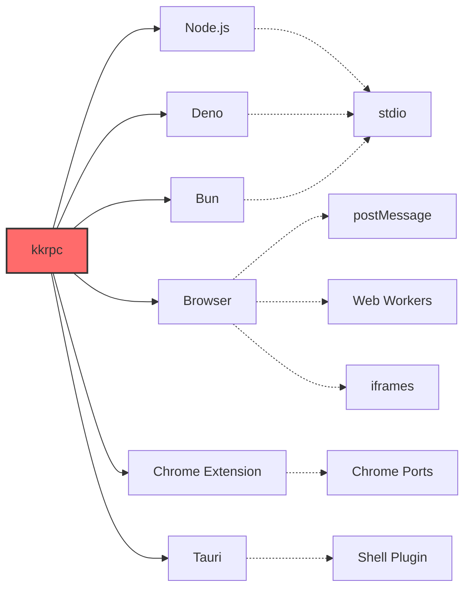

<div align="center">

# 🚀 kkrpc

## TypeScript 优先的 RPC 库

[](https://deepwiki.com/kunkunsh/kkrpc)
[![zread](https://img.shields.io/badge/Ask_Zread-_.svg?style=for-the-badge&color=00b0aa&labelColor=000000&logo=data%3Aimage%2Fsvg%2Bxml%3Bbase64%2CPHN2ZyB3aWR0aD0iMTYiIGhlaWdodD0iMTYiIHZpZXdCb3g9IjAgMCAxNiAxNiIgZmlsbD0ibm9uZSIgeG1sbnM9Imh0dHA6Ly93d3cudzMub3JnLzIwMDAvc3ZnIj4KPHBhdGggZD0iTTQuOTYxNTYgMS42MDAxSDIuMjQxNTZDMS44ODgxIDEuNjAwMSAxLjYwMTU2IDEuODg2NjQgMS42MDE1NiAyLjI0MDFWNC45NjAxQzEuNjAxNTYgNS4zMTM1NiAxLjg4ODEgNS42MDAxIDIuMjQxNTYgNS42MDAxSDQuOTYxNTZDNS4zMTUwMiA1LjYwMDEgNS42MDE1NiA1LjMxMzU2IDUuNjAxNTYgNC45NjAxVjIuMjQwMUM1LjYwMTU2IDEuODg2NjQgNS4zMTUwMiAxLjYwMDEgNC45NjE1NiAxLjYwMDFaIiBmaWxsPSIjZmZmIi8%2BCjxwYXRoIGQ9Ik00Ljk2MTU2IDEwLjM5OTlIMi4yNDE1NkMxLjg4ODEgMTAuMzk5OSAxLjYwMTU2IDEwLjY4NjQgMS42MDE1NiAxMS4wMzk5VjEzLjc1OTlDMS42MDE1NiAxNC4xMTM0IDEuODg4MSAxNC4zOTk5IDIuMjQxNTYgMTQuMzk5OUg0Ljk2MTU2QzUuMzE1MDIgMTQuMzk5OSA1LjYwMTU2IDE0LjExMzQgNS42MDE1NiAxMy43NTk5VjExLjAzOTlDNS42MDE1NiAxMC42ODY0IDUuMzE1MDIgMTAuMzk5OSA0Ljk2MTU2IDEwLjM5OTlaIiBmaWxsPSIjZmZmIi8%2BCjxwYXRoIGQ9Ik0xMy43NTg0IDEuNjAwMUgxMS4wMzg0QzEwLjY4NSAxLjYwMDEgMTAuMzk4NCAxLjg4NjY0IDEwLjM5ODQgMi4yNDAxVjQuOTYwMUMxMC4zOTg0IDUuMzEzNTYgMTAuNjg1IDUuNjAwMSAxMS4wMzg0IDUuNjAwMUgxMy43NTg0QzE0LjExMTkgNS42MDAxIDE0LjM5ODQgNS4zMTM1NiAxNC4zOTg0IDQuOTYwMVYyLjI0MDFDMTQuMzk4NCAxLjg4NjY0IDE0LjExMTkgMS42MDAxIDEzLjc1ODQgMS42MDAxWiIgZmlsbD0iI2ZmZiIvPgo8cGF0aCBkPSJNNCAxMkwxMiA0TDQgMTJaIiBmaWxsPSIjZmZmIi8%2BCjxwYXRoIGQ9Ik00IDEyTDEyIDQiIHN0cm9rZT0iI2ZmZiIgc3Ryb2tlLXdpZHRoPSIxLjUiIHN0cm9rZS1saW5lY2FwPSJyb3VuZCIvPgo8L3N2Zz4K&logoColor=ffffff)](https://zread.ai/kunkunsh/kkrpc)
[](https://www.npmjs.com/package/kkrpc)
[](https://jsr.io/@kunkun/kkrpc)
[](https://github.com/kunkunsh/kkrpc/blob/main/LICENSE)
[](https://www.npmjs.com/package/kkrpc)
[](https://github.com/kunkunsh/kkrpc)
[](https://kunkunsh.github.io/kkrpc/)
[](https://excalidraw.com/#json=xp6GbAJVAx3nU-h3PhaxW,oYBNvYmCRsQ2XR3MQo73Ug)
[](https://docs.kkrpc.kunkun.sh/llms.txt)

</div>

> 本项目最初是为 Tauri 应用 ([kunkun](https://github.com/kunkunsh/kunkun)) 构建扩展系统而创建的。
>
> 它也可以用于其他类型的应用，所以我将其作为独立包开源。

**进程、worker 和上下文之间的无缝双向通信**

像调用本地函数一样调用远程函数，具有完整的 TypeScript 类型安全和自动补全支持。

**类似于 Comlink 但支持双向通信**，并支持多种环境 - 客户端和服务器都可以在 Node.js、Deno、Bun 和浏览器环境中暴露函数供对方调用。

[**快速开始**](#-快速开始) • [**文档**](https://kunkunsh.github.io/kkrpc/) • [**示例**](#-示例) • [**API 参考**](https://jsr.io/@kunkun/kkrpc/doc) • [**LLM 文档**](https://docs.kkrpc.kunkun.sh/llms.txt)

<div align="center">


</div>

---

## 🌟 为什么选择 kkrpc？

在拥挤的 RPC 领域中，kkrpc 通过提供**真正的跨运行时兼容性**而脱颖而出，同时不牺牲类型安全或开发体验。与 tRPC（仅 HTTP）或 Comlink（仅浏览器）不同，kkrpc 支持 Node.js、Deno、Bun 和浏览器环境之间的无缝通信。

## ✨ 特性

<div align="center">

| 特性                | 描述                                                  |
| ------------------- | ----------------------------------------------------- |
| **🔄 跨运行时**     | 在 Node.js、Deno、Bun、浏览器等环境中无缝工作         |
| **🛡️ 类型安全**     | 完整的 TypeScript 推断和 IDE 自动补全支持             |
| **↔️ 双向**         | 两个端点可以同时暴露和调用 API                        |
| **🏠 属性访问**     | 使用点表示法进行远程 getter/setter (`await api.prop`) |
| **💥 错误保留**     | 跨 RPC 边界保留完整错误对象                           |
| **🌐 多种传输协议** | stdio、HTTP、WebSocket、postMessage、Chrome 扩展      |
| **📞 回调支持**     | 远程函数可以接受回调函数                              |
| **🔗 嵌套调用**     | 深度方法链如 `api.math.operations.calculate()`        |
| **📦 自动序列化**   | 智能的 JSON/superjson 检测                            |
| **⚡ 零配置**       | 无需架构文件或代码生成                                |
| **🔒 数据验证**     | 使用 Zod、Valibot、ArkType 等进行可选运行时验证       |
| **🚀 可传输对象**   | 大数据的零拷贝传输（快 40-100 倍）                    |

</div>

## 🌍 支持的环境

<div align="center">



</div>

### 📡 传输协议

| 传输协议             | 使用场景                                            | 支持的运行时                           |
| -------------------- | --------------------------------------------------- | -------------------------------------- |
| **stdio**            | 进程间通信                                          | Node.js ↔ Deno ↔ Bun                 |
| **postMessage**      | 浏览器上下文通信                                    | Browser ↔ Web Workers ↔ iframes      |
| **HTTP**             | Web API 通信                                        | 所有运行时                             |
| **WebSocket**        | 实时通信                                            | 所有运行时                             |
| **Hono WebSocket**   | 与 Hono 框架的高性能 WebSocket                      | Node.js, Deno, Bun, Cloudflare Workers |
| **Socket.IO**        | 增强的实时通信，支持房间/命名空间                   | 所有运行时                             |
| **Elysia WebSocket** | 与现代 TypeScript 优先 Elysia 框架的 WebSocket 集成 | Bun, Node.js, Deno                     |
| **Chrome Extension** | 扩展组件通信                                        | Chrome Extension 上下文                |
| **RabbitMQ**         | 消息队列通信                                        | Node.js, Deno, Bun                     |
| **Redis Streams**    | 具有持久性的流式消息传递                            | Node.js, Deno, Bun                     |
| **Kafka**            | 分布式流处理平台                                    | Node.js, Deno, Bun                     |
| **NATS**             | 高性能消息系统                                      | Node.js, Deno, Bun                     |
| **Electron**         | 桌面应用 IPC（渲染进程 ↔ 主进程 ↔ 实用进程）      | Electron                               |

**kkrpc** 设计的核心在于 `RPCChannel` 和 `IoInterface`。

- `RPCChannel` 是双向 RPC 通道
- `LocalAPI` 是要暴露给通道另一端的 API
- `RemoteAPI` 是通道另一端暴露的 API，可在本地调用
- `rpc.getAPI()` 返回一个 `RemoteAPI` 类型的对象，可以在本地像普通本地函数调用一样调用
- `IoInterface` 是为不同环境实现 IO 的接口。实现被称为适配器。
  - 例如，对于 Node 进程与 Deno 进程通信，我们需要实现 `IoInterface` 的 `NodeIo` 和 `DenoIo` 适配器。它们共享相同的 stdio 管道 (`stdin/stdout`)。
  - 在 Web 中，我们有用于 web worker 的 `WorkerChildIO` 和 `WorkerParentIO` 适配器，用于 iframe 的 `IframeParentIO` 和 `IframeChildIO` 适配器。

> 在浏览器中，从 `kkrpc/browser` 而不是 `kkrpc` 导入，Deno 适配器使用 node:buffer，在浏览器中不工作。

```ts
interface IoInterface {
	name: string
	read(): Promise<Buffer | Uint8Array | string | null> // 读取输入
	write(data: string): Promise<void> // 写入输出
}

class RPCChannel<
	LocalAPI extends Record<string, any>,
	RemoteAPI extends Record<string, any>,
	Io extends IoInterface = IoInterface
> {}
```

## 序列化

kkrpc 支持两种消息传输序列化格式：

- `json`: 标准 JSON 序列化
- `superjson`: 增强的 JSON 序列化，支持更多数据类型，如 Date、Map、Set、BigInt 和 Uint8Array（自 v0.2.0 起默认）

您可以在创建新的 RPCChannel 时指定序列化格式：

```ts
// 使用默认序列化（superjson）
const rpc = new RPCChannel(io, { expose: apiImplementation })

// 明确使用 superjson 序列化（为了清晰推荐）
const rpc = new RPCChannel(io, {
	expose: apiImplementation,
	serialization: { version: "superjson" }
})

// 使用标准 JSON 序列化（为了向后兼容）
const rpc = new RPCChannel(io, {
	expose: apiImplementation,
	serialization: { version: "json" }
})
```

为了向后兼容，接收方将自动检测序列化格式，因此旧客户端可以与新服务器通信，反之亦然。

## 数据验证

kkrpc 支持使用任何兼容 [Standard Schema](https://standardschema.dev) 的库（Zod、Valibot、ArkType 等）对 RPC 输入和输出进行可选的运行时验证。验证是完全可选的——没有它，kkrpc 的行为与之前完全相同。

有两种方法：

### 类型优先（向现有代码添加验证器）

照常定义您的 API，然后添加一个镜像 API 形状的 `validators` 映射：

```ts
import { RPCChannel, type RPCValidators } from "kkrpc"
import { z } from "zod"

type MathAPI = {
	add(a: number, b: number): Promise<number>
	divide(a: number, b: number): Promise<number>
}

const api: MathAPI = {
	add: async (a, b) => a + b,
	divide: async (a, b) => a / b
}

const validators: RPCValidators<MathAPI> = {
	add: {
		input: z.tuple([z.number(), z.number()]),
		output: z.number()
	},
	divide: {
		input: z.tuple([z.number(), z.number().refine((n) => n !== 0, "除数不能为零")]),
		output: z.number()
	}
}

new RPCChannel(io, { expose: api, validators })
```

### 模式优先（从模式推断类型）

使用 `defineMethod` 和 `defineAPI` 用模式定义您的 API —— 类型会自动推断：

```ts
import { defineAPI, defineMethod, extractValidators, RPCChannel, type InferAPI } from "kkrpc"
import { z } from "zod"

const api = defineAPI({
	add: defineMethod(
		{ input: z.tuple([z.number(), z.number()]), output: z.number() },
		async (a, b) => a + b // a, b 被类型化为 number
	),
	greet: defineMethod(
		{ input: z.tuple([z.string()]), output: z.string() },
		async (name) => `Hello, ${name}!`
	)
})

type MyAPI = InferAPI<typeof api>

new RPCChannel(io, { expose: api, validators: extractValidators(api) })
```

### 验证错误

当验证失败时，调用者会收到一个带有结构化问题详细信息的 `RPCValidationError`：

```ts
import { isRPCValidationError } from "kkrpc"

try {
	await api.add("not", "numbers") // 错误类型
} catch (error) {
	if (isRPCValidationError(error)) {
		error.phase // "input" 或 "output"
		error.method // "add"
		error.issues // [{ message: "Expected number, received string", path: [0] }]
	}
}
```

验证器支持嵌套 API（`math.divide`）、自定义细化（`.email()`、`.min(1)`、`.refine()`）和输出验证。由于 kkrpc 是双向的，两边都可以独立验证自己暴露的 API。

## 🚀 快速开始

### 安装

```bash
# npm
npm install kkrpc

# yarn
yarn add kkrpc

# pnpm
pnpm add kkrpc

# deno
import { RPCChannel } from "jsr:@kunkun/kkrpc"
```

### 基本示例

```typescript
// server.ts
import { NodeIo, RPCChannel } from "kkrpc"

const api = {
	greet: (name: string) => `Hello, ${name}!`,
	add: (a: number, b: number) => a + b
}

const rpc = new RPCChannel(new NodeIo(process.stdin, process.stdout), {
	expose: api
})
```

```typescript
// client.ts
import { spawn } from "child_process"
import { NodeIo, RPCChannel } from "kkrpc"

const worker = spawn("deno", ["run", "server.ts"])
const rpc = new RPCChannel(new NodeIo(worker.stdout, worker.stdin))
const api = rpc.getAPI<typeof api>()

console.log(await api.greet("World")) // "Hello, World!"
console.log(await api.add(5, 3)) // 8
```

## 📚 示例

以下是一些让您快速开始的简单示例。

### Stdio 示例

```ts
import { NodeIo, RPCChannel } from "kkrpc"
import { apiMethods } from "./api.ts"

const stdio = new NodeIo(process.stdin, process.stdout)
const child = new RPCChannel(stdio, { expose: apiMethods })
```

```ts
import { spawn } from "child_process"

const worker = spawn("bun", ["scripts/node-api.ts"])
const io = new NodeIo(worker.stdout, worker.stdin)
const parent = new RPCChannel<{}, API>(io)
const api = parent.getAPI()

expect(await api.add(1, 2)).toBe(3)
```

### 属性访问示例

kkrpc 支持跨 RPC 边界的直接属性访问和变异：

```ts
// 定义带有属性的 API
interface API {
	add(a: number, b: number): Promise<number>
	counter: number
	settings: {
		theme: string
		notifications: {
			enabled: boolean
		}
	}
}

const api = rpc.getAPI<API>()

// 属性 getter（使用 await 进行远程访问）
const currentCount = await api.counter
const theme = await api.settings.theme
const notificationsEnabled = await api.settings.notifications.enabled

// 属性 setter（直接赋值）
api.counter = 42
api.settings.theme = "dark"
api.settings.notifications.enabled = true

// 验证更改
console.log(await api.counter) // 42
console.log(await api.settings.theme) // "dark"
```

### 验证示例（类型优先）

使用 `validators` 选项向现有 API 添加运行时验证：

```ts
// api.ts
import type { RPCValidators } from "kkrpc"
import { z } from "zod"

export type API = {
	add(a: number, b: number): Promise<number>
	createUser(user: {
		name: string
		email: string
	}): Promise<{ id: string; name: string; email: string }>
}

export const api: API = {
	add: async (a, b) => a + b,
	createUser: async (user) => ({ id: crypto.randomUUID(), ...user })
}

export const validators: RPCValidators<API> = {
	add: {
		input: z.tuple([z.number(), z.number()]),
		output: z.number()
	},
	createUser: {
		input: z.tuple([z.object({ name: z.string().min(1), email: z.string().email() })]),
		output: z.object({ id: z.string(), name: z.string(), email: z.string() })
	}
}
```

```ts
// server.ts
import { RPCChannel, WebSocketServerIO } from "kkrpc"
import { api, validators, type API } from "./api"

wss.on("connection", (ws) => {
	const io = new WebSocketServerIO(ws)
	new RPCChannel<API, API>(io, { expose: api, validators })
})
```

```ts
// client.ts
import { isRPCValidationError, RPCChannel, WebSocketClientIO } from "kkrpc"
import type { API } from "./api"

const io = new WebSocketClientIO({ url: "ws://localhost:3000" })
const rpc = new RPCChannel<{}, API>(io)
const api = rpc.getAPI()

// 有效调用正常工作
console.log(await api.add(1, 2)) // 3

// 无效调用抛出 RPCValidationError
try {
	await api.createUser({ name: "", email: "not-an-email" })
} catch (error) {
	if (isRPCValidationError(error)) {
		console.log(error.phase) // "input"
		console.log(error.issues) // 来自 Zod 的验证问题
	}
}
```

### 验证示例（模式优先）

用模式定义您的 API —— 类型会自动推断，无需单独的类型定义：

```ts
// api.ts
import { defineAPI, defineMethod, extractValidators, type InferAPI } from "kkrpc"
import { z } from "zod"

export const api = defineAPI({
	add: defineMethod(
		{ input: z.tuple([z.number(), z.number()]), output: z.number() },
		async (a, b) => a + b
	),
	greet: defineMethod(
		{ input: z.tuple([z.string()]), output: z.string() },
		async (name) => `Hello, ${name}!`
	),
	math: {
		divide: defineMethod(
			{
				input: z.tuple([z.number(), z.number().refine((n) => n !== 0, "不能除以零")]),
				output: z.number()
			},
			async (a, b) => a / b
		)
	}
})

export type API = InferAPI<typeof api>
export const validators = extractValidators(api)
```

```ts
// server.ts
import { RPCChannel, WebSocketServerIO } from "kkrpc"
import { api, validators } from "./api"

wss.on("connection", (ws) => {
	const io = new WebSocketServerIO(ws)
	new RPCChannel(io, { expose: api, validators })
})
```

```ts
// client.ts
import { isRPCValidationError, RPCChannel, WebSocketClientIO } from "kkrpc"
import type { API } from "./api"

const io = new WebSocketClientIO({ url: "ws://localhost:3000" })
const rpc = new RPCChannel<{}, API>(io)
const api = rpc.getAPI()

console.log(await api.greet("World")) // "Hello, World!"
console.log(await api.math.divide(10, 2)) // 5

try {
	await api.math.divide(10, 0)
} catch (error) {
	if (isRPCValidationError(error)) {
		console.log(error.method) // "math.divide"
		console.log(error.issues[0].message) // "不能除以零"
	}
}
```

### 增强的错误保留

kkrpc 跨 RPC 边界保留完整的错误信息：

```ts
// 自定义错误类
class DatabaseError extends Error {
	constructor(
		message: string,
		public code: number,
		public query: string
	) {
		super(message)
		this.name = "DatabaseError"
	}
}

// 具有抛出错误方法的 API
const apiImplementation = {
	async getUserById(id: string) {
		if (!id) {
			const error = new DatabaseError("Invalid user ID", 400, "SELECT * FROM users WHERE id = ?")
			error.timestamp = new Date().toISOString()
			error.requestId = generateRequestId()
			throw error
		}
		// ... 正常逻辑
	}
}

// 客户端错误处理
try {
	await api.getUserById("")
} catch (error) {
	// 所有错误属性都被保留：
	console.log(error.name) // "DatabaseError"
	console.log(error.message) // "Invalid user ID"
	console.log(error.code) // 400
	console.log(error.query) // "SELECT * FROM users WHERE id = ?"
	console.log(error.stack) // 完整堆栈跟踪
	console.log(error.timestamp) // ISO 时间戳
	console.log(error.requestId) // 请求 ID
}
```

### Web Worker 示例

```ts
import { RPCChannel, WorkerChildIO, type DestroyableIoInterface } from "kkrpc"

const worker = new Worker(new URL("./scripts/worker.ts", import.meta.url).href, { type: "module" })
const io = new WorkerChildIO(worker)
const rpc = new RPCChannel<API, API, DestroyableIoInterface>(io, { expose: apiMethods })
const api = rpc.getAPI()

expect(await api.add(1, 2)).toBe(3)
```

```ts
import { RPCChannel, WorkerParentIO, type DestroyableIoInterface } from "kkrpc"

const io: DestroyableIoInterface = new WorkerChildIO()
const rpc = new RPCChannel<API, API, DestroyableIoInterface>(io, { expose: apiMethods })
const api = rpc.getAPI()

const sum = await api.add(1, 2)
expect(sum).toBe(3)
```

### 可传输对象示例

kkrpc 支持使用浏览器原生可传输对象进行大型数据结构的零拷贝传输。这为大型二进制数据传输提供了 40-100 倍的性能提升。

```ts
import { RPCChannel, transfer, WorkerParentIO } from "kkrpc/browser"

const worker = new Worker("worker.js")
const io = new WorkerParentIO(worker)
const rpc = new RPCChannel(io)
const api = rpc.getAPI<{
	processBuffer(buffer: ArrayBuffer): Promise<number>
	generateData(size: number): Promise<ArrayBuffer>
}>()

// 创建大缓冲区（10MB）
const buffer = new ArrayBuffer(10 * 1024 * 1024)
console.log("传输前:", buffer.byteLength) // 10485760

// 将缓冲区传输给 worker（零拷贝）
const result = await api.processBuffer(transfer(buffer, [buffer]))
console.log("Worker 处理了:", result, "字节")

// 缓冲区现在被置空（传输了所有权）
console.log("传输后:", buffer.byteLength) // 0

// 从 worker 获取数据（也是传输的）
const newBuffer = await api.generateData(5 * 1024 * 1024)
console.log("从 worker 接收:", newBuffer.byteLength) // 5242880
```

### Hono WebSocket 示例

Hono WebSocket 适配器提供与 Hono 框架高性能 WebSocket 支持的无缝集成。

#### `server.ts`

```ts
import { Hono } from "hono"
import { upgradeWebSocket, websocket } from "hono/bun"
import { createHonoWebSocketHandler } from "kkrpc"
import { apiMethods, type API } from "./api"

const app = new Hono()

app.get(
	"/ws",
	upgradeWebSocket(() => {
		return createHonoWebSocketHandler<API>({
			expose: apiMethods
		})
	})
)

const server = Bun.serve({
	port: 3000,
	fetch: app.fetch,
	websocket
})

console.log(`服务器运行在端口 ${server.port}`)
```

#### `client.ts`

```ts
import { RPCChannel, WebSocketClientIO } from "kkrpc"
import { apiMethods, type API } from "./api"

const clientIO = new WebSocketClientIO({
	url: "ws://localhost:3000/ws"
})

const clientRPC = new RPCChannel<API, API>(clientIO, {
	expose: apiMethods
})

const api = clientRPC.getAPI()

// 测试基本 RPC 调用
console.log(await api.add(5, 3)) // 8
console.log(await api.echo("Hello from Hono!")) // "Hello from Hono!"

// 测试嵌套 API 调用
console.log(await api.math.grade2.multiply(4, 6)) // 24

// 测试属性访问
console.log(await api.counter) // 42
console.log(await api.nested.value) // "hello world"

clientIO.destroy()
```

**Hono WebSocket 特性：**

- **高性能**: 基于 Hono 的超快 WebSocket 实现
- **跨运行时**: 在 Bun、Deno、Node.js 和 Cloudflare Workers 上工作
- **类型安全**: 完整的 TypeScript 支持和 Hono 集成
- **双向**: 客户端和服务器都可以暴露 API
- **框架集成**: 与 Hono 中间件生态系统的无缝集成

**了解更多**: [Hono WebSocket 文档](https://hono.dev/docs/helpers/websocket)

### Elysia WebSocket 示例

Elysia WebSocket 适配器提供与现代 TypeScript 优先的 Elysia 框架及其 uWebSocket 驱动的 WebSocket 支持的无缝集成。

#### `server.ts`

```ts
import { Elysia } from "elysia"
import { ElysiaWebSocketServerIO, RPCChannel } from "kkrpc"
import { apiMethods, type API } from "./api"

// 为 Elysia 特定功能扩展 API
interface ElysiaAPI extends API {
	getConnectionInfo(): Promise<{
		remoteAddress: string | undefined
		query: Record<string, string>
		headers: Record<string, string>
	}>
}

const app = new Elysia()
	.ws("/rpc", {
		open(ws) {
			const io = new ElysiaWebSocketServerIO(ws)
			const elysiaApiMethods: ElysiaAPI = {
				...apiMethods,
				getConnectionInfo: async () => ({
					remoteAddress: io.getRemoteAddress(),
					query: io.getQuery(),
					headers: io.getHeaders()
				})
			}

			const rpc = new RPCChannel<ElysiaAPI, ElysiaAPI>(io, {
				expose: elysiaApiMethods
			})
		},
		message(ws, message) {
			ElysiaWebSocketServerIO.feedMessage(ws, message)
		}
	})
	.listen(3000)

console.log("Elysia 服务器运行在端口 3000")
```

#### `client.ts`

```ts
import { ElysiaWebSocketClientIO, RPCChannel } from "kkrpc"
import { apiMethods, type API } from "./api"

const clientIO = new ElysiaWebSocketClientIO("ws://localhost:3000/rpc")
const clientRPC = new RPCChannel<API, any>(clientIO, {
	expose: apiMethods
})

const api = clientRPC.getAPI()

// 测试基本 RPC 调用
console.log(await api.add(5, 3)) // 8
console.log(await api.echo("Hello from Elysia!")) // "Hello from Elysia!"

// 测试嵌套 API 调用
console.log(await api.math.grade1.add(10, 20)) // 30
console.log(await api.math.grade3.divide(20, 4)) // 5

// 测试 Elysia 特定功能
const connInfo = await api.getConnectionInfo()
console.log("连接自:", connInfo.remoteAddress)
console.log("查询参数:", connInfo.query)
console.log("请求头:", connInfo.headers)

clientIO.destroy()
```

**Elysia WebSocket 特性：**

- **现代框架**: 基于 Elysia 的 TypeScript 优先设计
- **超快**: 由 uWebSocket 驱动以获得最大性能
- **丰富元数据**: 访问连接信息、查询参数和请求头
- **类型安全**: 完整的 TypeScript 推断和自动补全
- **运行时灵活**: 在 Bun、Node.js 和 Deno 上工作
- **开发体验**: 具有工厂函数的简洁 API

**了解更多**: [Elysia WebSocket 文档](https://elysiajs.com/patterns/websocket)

**关键优势：**

- **零拷贝性能**: 无序列化/反序列化开销
- **内存高效**: 所有权传输无需复制
- **自动回退**: 对不可传输传输的优雅降级
- **类型安全**: 完整的 TypeScript 支持

**支持的可传输类型：**

- `ArrayBuffer` - 二进制数据缓冲区
- `MessagePort` - 通信通道
- `ImageBitmap` - 解码的图像数据
- `OffscreenCanvas` - 屏幕外画布渲染
- `ReadableStream`/`WritableStream` - 流数据
- 更多... [参见 MDN](https://developer.mozilla.org/en-US/docs/Web/API/Web_Workers_API/Transferable_objects)

### HTTP 示例

Codesandbox: https://codesandbox.io/p/live/4a349334-0b04-4352-89f9-cf1955553ae7

#### `api.ts`

定义 API 类型和实现。

```ts
export type API = {
	echo: (message: string) => Promise<string>
	add: (a: number, b: number) => Promise<number>
}

export const api: API = {
	echo: (message) => {
		return Promise.resolve(message)
	},
	add: (a, b) => {
		return Promise.resolve(a + b)
	}
}
```

#### `server.ts`

服务器只需要一次设置，然后就不需要再动它了。
所有的 API 实现都在 `api.ts` 中。

```ts
import { HTTPServerIO, RPCChannel } from "kkrpc"
import { api, type API } from "./api"

const serverIO = new HTTPServerIO()
const serverRPC = new RPCChannel<API, API>(serverIO, { expose: api })

const server = Bun.serve({
	port: 3000,
	async fetch(req) {
		const url = new URL(req.url)
		if (url.pathname === "/rpc") {
			const res = await serverIO.handleRequest(await req.text())
			return new Response(res, {
				headers: { "Content-Type": "application/json" }
			})
		}
		return new Response("Not found", { status: 404 })
	}
})
console.log(`服务器启动在端口: ${server.port}`)
```

#### `client.ts`

```ts
import { HTTPClientIO, RPCChannel } from "kkrpc"
import { api, type API } from "./api"

const clientIO = new HTTPClientIO({
	url: "http://localhost:3000/rpc"
})
const clientRPC = new RPCChannel<{}, API>(clientIO, { expose: api })
const clientAPI = clientRPC.getAPI()

const echoResponse = await clientAPI.echo("hello")
console.log("echoResponse", echoResponse)

const sum = await clientAPI.add(2, 3)
console.log("总和: ", sum)
```

### Chrome 扩展示例

对于 Chrome 扩展，使用专用的 `ChromePortIO` 适配器进行可靠的基于端口的通信。

#### `background.ts`

```ts
import { ChromePortIO, RPCChannel } from "kkrpc/chrome-extension"
import type { BackgroundAPI, ContentAPI } from "./types"

const backgroundAPI: BackgroundAPI = {
	async getExtensionVersion() {
		return chrome.runtime.getManifest().version
	}
}

chrome.runtime.onConnect.addListener((port) => {
	if (port.name === "content-to-background") {
		const io = new ChromePortIO(port)
		const rpc = new RPCChannel(io, { expose: backgroundAPI })
		// 处理断开连接
		port.onDisconnect.addListener(() => io.destroy())
	}
})
```

#### `content.ts`

```ts
import { ChromePortIO, RPCChannel } from "kkrpc/chrome-extension"
import type { BackgroundAPI, ContentAPI } from "./types"

const contentAPI: ContentAPI = {
	async getPageTitle() {
		return document.title
	}
}

const port = chrome.runtime.connect({ name: "content-to-background" })
const io = new ChromePortIO(port)
const rpc = new RPCChannel<ContentAPI, BackgroundAPI>(io, { expose: contentAPI })

const backgroundAPI = rpc.getAPI()

// 示例调用
backgroundAPI.getExtensionVersion().then((version) => {
	console.log("扩展版本:", version)
})
```

**Chrome 扩展特性：**

- **基于端口**: 使用 `chrome.runtime.Port` 进行稳定的长期连接。
- **双向**: 两边都可以暴露和调用 API。
- **类型安全**: 完整的 TypeScript API 支持。
- **可靠**: 处理连接生命周期和清理。

### RabbitMQ 示例

RabbitMQ 适配器提供可靠的消息队列通信，支持主题交换和持久化消息传递。

#### `producer.ts`

```ts
import { RabbitMQIO, RPCChannel } from "kkrpc"
import { apiMethods, type API } from "./api"

const rabbitmqIO = new RabbitMQIO({
	url: "amqp://localhost",
	exchange: "kkrpc-exchange",
	exchangeType: "topic",
	durable: true
})

const producerRPC = new RPCChannel<API, API>(rabbitmqIO, {
	expose: apiMethods
})

const api = producerRPC.getAPI()

// 测试基本 RPC 调用
console.log(await api.add(5, 3)) // 8
console.log(await api.echo("Hello from RabbitMQ!")) // "Hello from RabbitMQ!"

rabbitmqIO.destroy()
```

#### `consumer.ts`

```ts
import { RabbitMQIO, RPCChannel } from "kkrpc"
import { apiMethods, type API } from "./api"

const rabbitmqIO = new RabbitMQIO({
	url: "amqp://localhost",
	exchange: "kkrpc-exchange",
	exchangeType: "topic",
	durable: true,
	sessionId: "consumer-session"
})

const consumerRPC = new RPCChannel<API, API>(rabbitmqIO, {
	expose: apiMethods
})

const api = consumerRPC.getAPI()

// 处理来自生产者的消息
console.log(await api.add(10, 20)) // 30
console.log(await api.echo("Hello from consumer!")) // "Hello from consumer!"

rabbitmqIO.destroy()
```

**RabbitMQ 特性：**

- **主题交换**: 具有通配符模式的灵活路由
- **持久化消息**: 消息在代理重启后仍然存在
- **负载均衡**: 多个消费者可以共享工作负载
- **可靠传递**: 确认和重新传递支持
- **会话管理**: 唯一会话防止消息冲突

### Redis Streams 示例

Redis Streams 适配器提供高性能的基于流的消息传递，具有持久性和消费者组支持。

#### `publisher.ts`

```ts
import { RedisStreamsIO, RPCChannel } from "kkrpc"
import { apiMethods, type API } from "./api"

const redisIO = new RedisStreamsIO({
	url: "redis://localhost:6379",
	stream: "kkrpc-stream",
	maxLen: 10000, // 只保留最后 1 万条消息
	maxQueueSize: 1000
})

const publisherRPC = new RPCChannel<API, API>(redisIO, {
	expose: apiMethods
})

const api = publisherRPC.getAPI()

// 测试基本 RPC 调用
console.log(await api.add(7, 8)) // 15
console.log(await api.echo("Hello from Redis Streams!")) // "Hello from Redis Streams!"

// 获取流信息
const streamInfo = await redisIO.getStreamInfo()
console.log("流长度:", streamInfo.length)

redisIO.destroy()
```

#### `subscriber.ts`

```ts
import { RedisStreamsIO, RPCChannel } from "kkrpc"
import { apiMethods, type API } from "./api"

// 使用消费者组进行负载均衡
const redisIO = new RedisStreamsIO({
	url: "redis://localhost:6379",
	stream: "kkrpc-stream",
	consumerGroup: "kkrpc-group",
	consumerName: "worker-1",
	useConsumerGroup: true, // 启用负载均衡
	maxQueueSize: 1000
})

const subscriberRPC = new RPCChannel<API, API>(redisIO, {
	expose: apiMethods
})

const api = subscriberRPC.getAPI()

// 使用负载均衡处理消息
console.log(await api.multiply(4, 6)) // 24
console.log(await api.echo("Hello from subscriber!")) // "Hello from subscriber!"

redisIO.destroy()
```

**Redis Streams 特性：**

- **两种模式**: 发布/订阅（所有消费者）或消费者组（负载均衡）
- **持久性**: 消息存储在 Redis 中，具有可配置的保留期
- **内存保护**: 队列大小限制防止内存问题
- **消费者组**: 具有消息确认的负载均衡
- **流管理**: 用于监控和修剪流的内置工具

### Kafka 示例

Kafka 适配器为大型系统提供具有高吞吐量和容错性的分布式流处理。

#### `producer.ts`

```ts
import { KafkaIO, RPCChannel } from "kkrpc"
import { apiMethods, type API } from "./api"

const kafkaIO = new KafkaIO({
	brokers: ["localhost:9092"],
	topic: "kkrpc-topic",
	clientId: "kkrpc-producer",
	numPartitions: 3,
	replicationFactor: 1,
	maxQueueSize: 1000
})

const producerRPC = new RPCChannel<API, API>(kafkaIO, {
	expose: apiMethods
})

const api = producerRPC.getAPI()

// 测试基本 RPC 调用
console.log(await api.add(12, 18)) // 30
console.log(await api.echo("Hello from Kafka!")) // "Hello from Kafka!"

console.log("主题:", kafkaIO.getTopic())
console.log("会话 ID:", kafkaIO.getSessionId())

kafkaIO.destroy()
```

#### `consumer.ts`

```ts
import { KafkaIO, RPCChannel } from "kkrpc"
import { apiMethods, type API } from "./api"

const kafkaIO = new KafkaIO({
	brokers: ["localhost:9092"],
	topic: "kkrpc-topic",
	clientId: "kkrpc-consumer",
	groupId: "kkrpc-consumer-group",
	fromBeginning: false, // 只读取新消息
	maxQueueSize: 1000
})

const consumerRPC = new RPCChannel<API, API>(kafkaIO, {
	expose: apiMethods
})

const api = consumerRPC.getAPI()

// 处理来自 Kafka 的消息
console.log(await api.divide(100, 4)) // 25
console.log(await api.echo("Hello from Kafka consumer!")) // "Hello from Kafka consumer!"

console.log("主题:", kafkaIO.getTopic())
console.log("组 ID:", kafkaIO.getGroupId())

kafkaIO.destroy()
```

**Kafka 特性：**

- **分布式**: 内置复制和分区
- **高吞吐量**: 为高容量消息流优化
- **容错**: 复制和自动故障转移
- **可扩展**: 具有分区的水平扩展
- **持久性**: 具有可配置保留期的持久消息存储
- **消费者组**: 跨消费者实例的负载均衡

### NATS 示例

NATS 适配器提供高性能消息传递，支持发布/订阅模式和可选的队列组以实现负载均衡。

#### `publisher.ts`

```ts
import { NatsIO, RPCChannel } from "kkrpc"
import { apiMethods, type API } from "./api"

const natsIO = new NatsIO({
	servers: "nats://localhost:4222",
	subject: "kkrpc-messages",
	queueGroup: "kkrpc-group" // 可选：启用负载均衡
})

const publisherRPC = new RPCChannel<API, API>(natsIO, {
	expose: apiMethods
})

const api = publisherRPC.getAPI()

// 测试基本 RPC 调用
console.log(await api.add(5, 3)) // 8
console.log(await api.echo("Hello from NATS!")) // "Hello from NATS!"

console.log("Subject:", natsIO.getSubject())
console.log("Session ID:", natsIO.getSessionId())

natsIO.destroy()
```

#### `subscriber.ts`

```ts
import { NatsIO, RPCChannel } from "kkrpc"
import { apiMethods, type API } from "./api"

const natsIO = new NatsIO({
	servers: "nats://localhost:4222",
	subject: "kkrpc-messages",
	queueGroup: "kkrpc-group", // 可选：启用负载均衡
	sessionId: "subscriber-session"
})

const subscriberRPC = new RPCChannel<API, API>(natsIO, {
	expose: apiMethods
})

const api = subscriberRPC.getAPI()

// 处理来自发布者的消息
console.log(await api.add(10, 20)) // 30
console.log(await api.echo("Hello from subscriber!")) // "Hello from subscriber!"

natsIO.destroy()
```

**NATS 特性：**

- **高性能**: 超低延迟消息系统
- **基于主题**: 用于路由的灵活主题层次结构
- **队列组**: 订阅者之间的可选负载均衡
- **简单模型**: 支持请求/回复的发布/订阅
- **跨平台**: 在 Node.js、Deno 和 Bun 上工作
- **无需 Schema**: 无需预先配置即可进行动态消息路由

### Tauri 示例

从 Tauri 应用调用 bun/node/deno 进程中的函数，使用 JS/TS。

它允许您在 Tauri 应用中调用 Deno/Bun/Node 进程中的任何 JS/TS 代码，就像使用 Electron 一样。

与 Tauri 官方 shell 插件和 [unlocked shellx plugin](https://github.com/HuakunShen/tauri-plugin-shellx) 的无缝集成。

```ts
import { RPCChannel, TauriShellStdio } from "kkrpc/browser"
import { Child, Command } from "@tauri-apps/plugin-shell"

const localAPIImplementation = {
	add: (a: number, b: number) => Promise.resolve(a + b)
}

async function spawnCmd(runtime: "deno" | "bun" | "node") {
	let cmd: Command<string>
	let process = Child | null = null

	if (runtime === "deno") {
		cmd = Command.create("deno", ["run", "-A", scriptPath])
		process = await cmd.spawn()
	} else if (runtime === "bun") {
		cmd = Command.create("bun", [scriptPath])
		process = await cmd.spawn()
	} else if (runtime === "node") {
		cmd = Command.create("node", [scriptPath])
		process = await cmd.spawn()
	} else {
		throw new Error(`无效运行时: ${runtime}，请选择 deno 或 bun`)
	}

	// 监控 stdout/stderr/close/error 用于调试和错误处理
	cmd.stdout.on("data", (data) => {
		console.log("stdout", data)
	})
	cmd.stderr.on("data", (data) => {
		console.warn("stderr", data)
	})
	cmd.on("close", (code) => {
		console.log("close", code)
	})
	cmd.on("error", (err) => {
		console.error("error", err)
	})

	const stdio = new TauriShellStdio(cmd.stdout, process)
	const stdioRPC = new RPCChannel<typeof localAPIImplementation, RemoteAPI>(stdio, {
		expose: localAPIImplementation
	})

	const api = stdioRPC.getAPI();
	await api
		.add(1, 2)
		.then((result) => {
			console.log("result", result)
		})
		.catch((err) => {
			console.error(err)
		})

	process?.kill()
}
```

我在 `examples/tauri-demo` 中提供了一个示例 tauri 应用。


### Electron 示例

Electron 适配器提供 Renderer 进程、Main 进程和 Utility Process 之间的类型安全双向 RPC 通信。

有两组适配器用于 Electron：

1. **Renderer ↔ Main IPC**: `ElectronIpcMainIO` (Main 端) + `ElectronIpcRendererIO` (Renderer 端)
2. **Main ↔ Utility Process**: `ElectronUtilityProcessIO` (Main 端) + `ElectronUtilityProcessChildIO` (Utility Process 端)

#### Preload 脚本设置

使用 `createSecureIpcBridge` 创建带有通道白名单的安全 `ipcRenderer`：

```ts title="preload.ts"
import { contextBridge, ipcRenderer } from "electron"
import { createSecureIpcBridge } from "kkrpc/electron-ipc"

const securedIpcRenderer = createSecureIpcBridge({
	ipcRenderer,
	channelPrefix: "kkrpc-"
})

contextBridge.exposeInMainWorld("electron", {
	ipcRenderer: securedIpcRenderer
})
```

这会自动白名单仅以前缀 `"kkrpc-"` 开头的通道。您也可以白名单特定通道：

```ts title="preload.ts"
import { contextBridge, ipcRenderer } from "electron"
import { createSecureIpcBridge } from "kkrpc/electron-ipc"

const securedIpcRenderer = createSecureIpcBridge({
	ipcRenderer,
	allowedChannels: ["kkrpc-ipc", "kkrpc-worker-relay"]
})

contextBridge.exposeInMainWorld("electron", {
	ipcRenderer: securedIpcRenderer
})
```

这种方法避免了对 Electron 的直接依赖，使其与任何 Electron 版本兼容。

#### Main 进程

```ts title="main.ts"
import { app, BrowserWindow, ipcMain, utilityProcess } from "electron"
import { ElectronUtilityProcessIO, RPCChannel } from "kkrpc/electron"
import { ElectronIpcMainIO } from "kkrpc/electron-ipc"

interface MainAPI {
	showNotification(message: string): Promise<void>
	getAppVersion(): Promise<string>
}

interface WorkerAPI {
	add(a: number, b: number): Promise<number>
	multiply(a: number, b: number): Promise<number>
}

const mainAPI: MainAPI = {
	showNotification: async (message: string) => {
		console.log(`[Main] Notification: ${message}`)
	},
	getAppVersion: async () => app.getVersion()
}

// 1. 设置 Renderer ↔ Main IPC
const win = new BrowserWindow({
	webPreferences: {
		preload: path.join(__dirname, "preload.js"),
		contextIsolation: true,
		nodeIntegration: false
	}
})

const ipcIO = new ElectronIpcMainIO(ipcMain, win.webContents)
const ipcRPC = new RPCChannel<MainAPI, object>(ipcIO, { expose: mainAPI })

// 2. 设置 Main ↔ Utility Process
const workerPath = path.join(__dirname, "./worker.js")
const workerProcess = utilityProcess.fork(workerPath)
const workerIO = new ElectronUtilityProcessIO(workerProcess)
const workerRPC = new RPCChannel<MainAPI, WorkerAPI>(workerIO, { expose: mainAPI })
const workerAPI = workerRPC.getAPI()

// 现在您可以从 main 调用 worker 方法
const result = await workerAPI.add(2, 3) // 5
```

#### Renderer 进程

```ts title="renderer.ts"
import { ElectronIpcRendererIO, RPCChannel } from "kkrpc/electron-ipc"

interface MainAPI {
	showNotification(message: string): Promise<void>
	getAppVersion(): Promise<string>
}

const ipcIO = new ElectronIpcRendererIO()
const ipcRPC = new RPCChannel<object, MainAPI>(ipcIO, { expose: {} })
const mainAPI = ipcRPC.getAPI()

// 从 renderer 调用 main 进程方法
await mainAPI.showNotification("Hello from renderer!")
const version = await mainAPI.getAppVersion()
```

#### Utility Process (Worker)

```ts title="worker.ts"
import { ElectronUtilityProcessChildIO, RPCChannel } from "kkrpc/electron"

interface MainAPI {
	showNotification(message: string): Promise<void>
}

const io = new ElectronUtilityProcessChildIO()

const workerMethods = {
	add: async (a: number, b: number) => a + b,
	multiply: async (a: number, b: number) => a * b
}

const rpc = new RPCChannel<typeof workerMethods, MainAPI>(io, {
	expose: workerMethods
})

const mainAPI = rpc.getAPI()

// 回调到 main 进程
await mainAPI.showNotification("Hello from worker!")
```

**Electron 特性：**

- **类型安全 IPC**: Renderer ↔ Main ↔ Utility Process 的完整 TypeScript 支持
- **双向**: 所有进程都可以暴露和调用 API
- **安全**: 适用于 `contextIsolation: true`（推荐）
- **多种模式**: 支持 IPC 和 Utility Process 通信
- **嵌套 API 支持**: 完全支持嵌套方法调用如 `api.math.add()`

**了解更多:** [Electron 文档](https://www.electronjs.org/docs/latest/)

### Relay 示例

`createRelay` 函数在两个 IoInterface 之间创建透明的双向中继。当您想要连接两个不同的传输层而中间进程不需要知道 API 细节时，这非常有用。

一个常见的用例是通过 Electron 的 Main 进程将 Renderer 进程连接到外部 Node.js 进程：

```
Renderer (IPC) → Main (relay) → External Node Process (stdio)
```

使用中继，Main 充当透明的字节管道 - 它转发消息而不解析它们。

#### Main 进程 (带 relay)

```ts title="main.ts"
import { spawn } from "child_process"
import { createRelay, NodeIo } from "kkrpc"
import { ElectronIpcMainIO } from "kkrpc/electron-ipc"

// 生成外部 Node.js 进程
const worker = spawn("node", ["./worker.js"])

// 创建中继: IPC 通道 "worker-relay" <-> stdio
const relay = createRelay(
	new ElectronIpcMainIO(ipcMain, webContents, "worker-relay"),
	new NodeIo(worker.stdout, worker.stdin)
)

// 完成时清理
app.on("window-all-closed", () => {
	relay.destroy()
	worker.kill()
})
```

#### Renderer 进程

```ts title="renderer.ts"
import { ElectronIpcRendererIO, RPCChannel } from "kkrpc/electron-ipc"

// 通过中继通道连接（不是默认的 "kkrpc-ipc" 通道）
const io = new ElectronIpcRendererIO("worker-relay")
const rpc = new RPCChannel<{}, WorkerAPI>(io)
const workerAPI = rpc.getAPI()

// 调用直接转到外部 worker 进程
const result = await workerAPI.calculate(42)
```

#### 外部 Worker 进程

```ts title="worker.ts"
import { NodeIo, RPCChannel } from "kkrpc"

const io = new NodeIo(process.stdin, process.stdout)
const rpc = new RPCChannel<WorkerAPI, {}>(io, {
	expose: {
		calculate: async (n: number) => n * 2
	}
})
```

**Relay 场景：**

| 场景                            | 从                      | 通过                   | 到       | 用例                               |
| ------------------------------- | ----------------------- | ---------------------- | -------- | ---------------------------------- |
| **Renderer → External Process** | `ElectronIpcRendererIO` | Main (`createRelay`)   | `NodeIo` | 调用外部 Node.js/Bun/Deno 脚本     |
| **Browser → Server Process**    | `WebSocketClientIO`     | Server (`createRelay`) | `NodeIo` | 通过 WebSocket 浏览器到 shell 进程 |
| **Worker → External Process**   | `WorkerChildIO`         | Main (`createRelay`)   | `NodeIo` | Web Worker 到外部脚本              |

**优势：**

- **透明**: 中间人不需要知道 API
- **干净分离**: Main 不暴露 worker 方法
- **多通道**: 可以在不同的 IPC 通道上创建多个中继
- **可组合**: 可以通过多个进程链式连接中继

## 📊 基准测试

kkrpc 包括全面的基准测试，用于测量不同传输和运行时的吞吐量和数据传输性能。

### 运行基准测试

```bash
# 运行所有基准测试
bun test __tests__/stdio-benchmark.test.ts
bun test __tests__/websocket-benchmark.test.ts
bun test __tests__/stdio-large-data-benchmark.test.ts
bun test __tests__/websocket-large-data-benchmark.test.ts

# 或运行包括基准测试在内的所有测试
bun test
```

### 基准测试设计

基准测试旨在测量 RPC 性能的两个关键方面：

1. **调用吞吐量** (`stdio-benchmark.test.ts`, `websocket-benchmark.test.ts`)

   - **顺序操作**: 测量一个接一个进行阻塞调用时的每次调用延迟
   - **并发操作**: 测量使用 `Promise.all` 进行多次并行调用时的吞吐量
   - **批处理操作**: 测试将多个操作批处理到单个 RPC 调用中
   - **延迟分布**: ping 服务器 1,000 次以计算最小/平均/p99/最大延迟

2. **数据传输吞吐量** (`stdio-large-data-benchmark.test.ts`, `websocket-large-data-benchmark.test.ts`)
   - **上传**: 客户端向服务器发送大数据负载
   - **下载**: 服务器生成并向客户端发送大数据
   - **回显**: 双向传输（客户端发送，服务器回显）
   - 测试各种负载大小：1KB、10KB、100KB、1MB、10MB

### 基准测试结果

在 MacBook Pro (Apple Silicon) 上运行的结果：

#### Stdio 适配器 (进程间)

| 运行时      | 操作                | 调用/秒      | 延迟 (平均) |
| ----------- | ------------------- | ------------ | ----------- |
| **Bun**     | 顺序回显            | 22,234       | 0.046ms     |
| **Bun**     | 并发回显            | 151,069      | -           |
| **Bun**     | 批处理 (100 次操作) | 453,042 有效 | -           |
| **Node.js** | 顺序回显            | 23,985       | 0.038ms     |
| **Node.js** | 并发回显            | 145,516      | -           |
| **Deno**    | 顺序回显            | 20,028       | 0.047ms     |
| **Deno**    | 并发回显            | 123,079      | -           |

#### Stdio 大数据传输

| 运行时      | 操作         | 1MB 负载    | 10MB 负载 |
| ----------- | ------------ | ----------- | --------- |
| **Bun**     | 上传         | ~1,010 MB/s | ~658 MB/s |
| **Bun**     | 下载         | ~134 MB/s   | ~132 MB/s |
| **Bun**     | echo (100KB) | ~1,132 MB/s | -         |
| **Node.js** | 上传         | ~382 MB/s   | ~92 MB/s  |
| **Node.js** | 下载         | ~75 MB/s    | ~30 MB/s  |
| **Deno**    | 上传         | ~358 MB/s   | ~91 MB/s  |
| **Deno**    | 下载         | ~74 MB/s    | ~33 MB/s  |

#### WebSocket 适配器

| 操作                | 调用/秒      | 延迟 (平均) |
| ------------------- | ------------ | ----------- |
| 顺序回显            | 22,314       | 0.040ms     |
| 并发回显            | 74,954       | -           |
| 批处理 (100 次操作) | 483,318 有效 | -           |

#### WebSocket 大数据传输

| 操作         | 1MB 负载  | 10MB 负载 |
| ------------ | --------- | --------- |
| 上传         | ~577 MB/s | ~927 MB/s |
| 下载         | ~137 MB/s | ~149 MB/s |
| 回显 (100KB) | ~799 MB/s | -         |

### 关键发现

- **Bun** 在 stdio 通信方面始终优于 Node.js 和 Deno，特别是对于大数据传输
- **Stdio** 对于本地进程通信明显快于 WebSocket（吞吐量高 2-3 倍）
- **并发操作** 比顺序操作实现 6-7 倍的更高吞吐量
- **批处理** 非常有效 - 每批 100 次操作实现 400K+ 有效调用/秒
- **上传** 比下载快，因为响应路径上的 JSON 序列化开销
- **WebSocket** 性能对于网络通信非常出色，几乎与 stdio 的小负载匹配

## 🆚 与替代品的比较

<div align="center">

| 特性           | kkrpc                                                         | tRPC                      | Comlink               |
| -------------- | ------------------------------------------------------------- | ------------------------- | --------------------- |
| **跨运行时**   | ✅ Node.js、Deno、Bun、浏览器                                 | ❌ 仅 Node.js/浏览器      | ❌ 仅浏览器           |
| **双向**       | ✅ 两边都可以调用 API                                         | ❌ 仅客户端调用服务器     | ✅ 两边都可以调用 API |
| **类型安全**   | ✅ 完整的 TypeScript 支持                                     | ✅ 完整的 TypeScript 支持 | ✅ TypeScript 支持    |
| **传输层**     | ✅ stdio、HTTP、WebSocket、postMessage、Chrome 扩展、Electron | ❌ 仅 HTTP                | ❌ 仅 postMessage     |
| **错误保留**   | ✅ 完整错误对象                                               | ⚠️ 有限的错误序列化       | ⚠️ 有限的错误序列化   |
| **属性访问**   | ✅ 远程 getter/setter                                         | ❌ 仅方法                 | ❌ 仅方法             |
| **零配置**     | ✅ 无代码生成                                                 | ✅ 无代码生成             | ✅ 无代码生成         |
| **回调**       | ✅ 函数参数                                                   | ❌ 无回调                 | ✅ 函数参数           |
| **数据验证**   | ✅ 可选，任何 Standard Schema 库                              | ✅ 内置 Zod 支持          | ❌ 不支持             |
| **可传输对象** | ✅ 零拷贝传输（快 40-100 倍）                                 | ❌ 不支持                 | ✅ 基本支持           |

</div>

### 何时选择 kkrpc

- **跨进程通信**: 需要在不同运行时之间通信（Node.js ↔ Deno、浏览器 ↔ Node.js 等）
- **扩展系统**: 构建插件架构或扩展系统
- **Tauri 应用**: Tauri 前端和后端进程之间的通信
- **Chrome 扩展**: 内容脚本、背景页面和弹出窗口之间的复杂通信
- **多 Worker 架构**: 协调具有不同职责的多个 web worker
- **桌面应用**: Electron/Tauri 具有多个进程的应用

### 何时选择 tRPC

- **REST API 替换**: 为 Web 应用程序构建类型安全的 API
- **仅 HTTP 通信**: 当您只需要基于 HTTP 的通信时
- **React/Next.js 集成**: 当您需要与 React 生态系统的紧密集成时
- **数据库驱动 API**: 构建传统的客户端-服务器应用程序时

### 何时选择 Comlink

- **仅浏览器应用**: 浏览器中的简单 web worker 通信
- **轻量级需求**: 当您只需要基本的 postMessage 抽象时
- **无跨运行时要求**: 当您的所有代码都在浏览器中运行时
- **简单 Worker 模式**: 当您不需要高级功能如属性访问时

## 🔍 关键词和 SEO

**主要关键词**: RPC、TypeScript、远程过程调用、类型安全、双向、跨运行时

**次要关键词**: Node.js、Deno、Bun、浏览器、Web Worker、Chrome 扩展、Tauri、IPC、进程间通信

**用例**: 扩展系统、插件架构、微服务、Worker 通信、跨上下文通信

## 📦 包信息

<div align="center">

| 平台       | 包              | 链接                                                                                                                                            |
| ---------- | --------------- | ----------------------------------------------------------------------------------------------------------------------------------------------- |
| **NPM**    | `kkrpc`         | [](https://www.npmjs.com/package/kkrpc)                            |
| **JSR**    | `@kunkun/kkrpc` | [](https://jsr.io/@kunkun/kkrpc)                         |
| **GitHub** | 仓库            | [](https://github.com/kunkunsh/kkrpc)                   |
| **文档**   | Typedoc         | [](https://kunkunsh.github.io/kkrpc/)                  |
| **示例**   | 代码示例        | [](https://github.com/kunkunsh/kkrpc/tree/main/examples) |

</div>

## 🤝 贡献

<div align="center">

**欢迎贡献！** 🎉

请随时提交 Pull Request。对于重大更改，请先开 issue 讨论您想要更改的内容。

[](https://github.com/kunkunsh/kkrpc/issues)
[](https://github.com/kunkunsh/kkrpc/pulls)

</div>

## 📄 许可证

<div align="center">

[](https://github.com/kunkunsh/kkrpc/blob/main/LICENSE)

MIT © [kunkunsh](https://github.com/kunkunsh)

</div>

---

<div align="center">

**⭐ 如果这个仓库对您有帮助，请给它一个星标！**

由 kkrpc 团队用 ❤️ 制作

</div>
