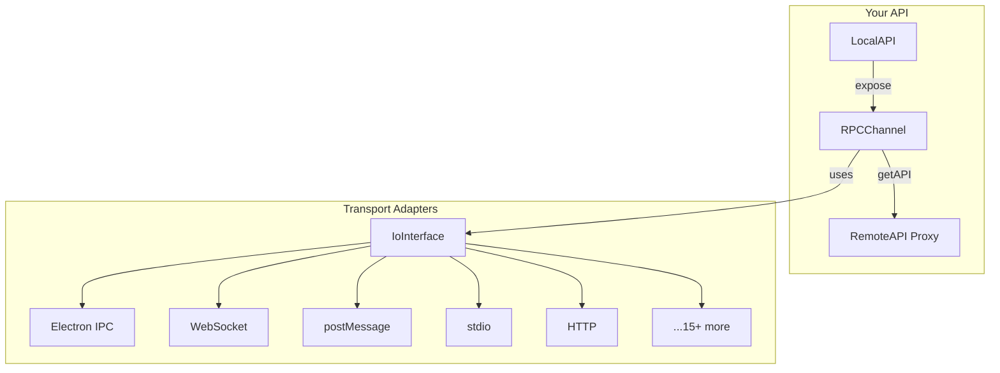

# How Does It Work?

<v-clicks>

- **RPCChannel** - The core bidirectional RPC handler
- **IoInterface** - Abstracts any transport (stdio, HTTP, postMessage...)
- **Adapters** - 15+ ready-to-use transport implementations
- **Zero Config** - No code generation, no schema files

</v-clicks>

<!--
The architecture is beautifully simple.

RPCChannel is the heart - it handles the bidirectional communication.

IoInterface is the abstraction layer - it doesn't care if you're using stdio, HTTP, or postMessage.

We have 15+ adapters ready to use. And best of all - zero configuration. No code generation, no schema files.
-->
