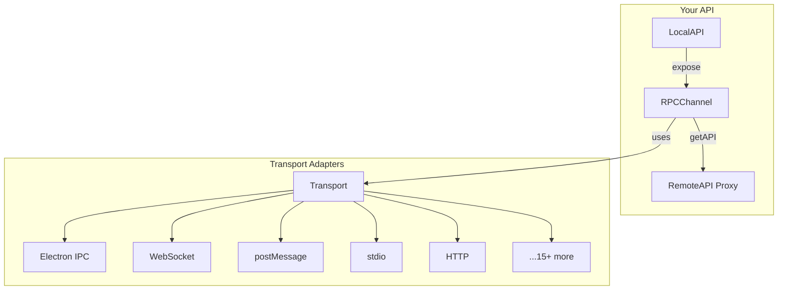

# How Does It Work?

```mermaid {scale: 0.6}
graph TB
    subgraph "Your API"
        A[LocalAPI] -->|expose| B[RPCChannel]
        B -->|getAPI| C[RemoteAPI Proxy]
    end

    B -->|uses| D[Transport]

    subgraph "Transport Adapters"
        D --> E[Electron IPC]
        D --> F[WebSocket]
        D --> G[postMessage]
        D --> H[stdio]
        D --> I[HTTP]
        D --> J[...15+ more]
    end
```

<v-clicks>

- **RPCChannel** - The core bidirectional RPC handler
- **Transport** - Abstracts any message source (stdio, HTTP, postMessage...)
- **Transport factories** - Ready-to-use runtime integrations
- **Zero Config** - No code generation, no schema files

</v-clicks>

<!--
The architecture is beautifully simple.

RPCChannel is the heart - it handles the bidirectional communication.

Transport is the abstraction layer - it doesn't care if you're using stdio, HTTP, or postMessage.

We have 15+ adapters ready to use. And best of all - zero configuration. No code generation, no schema files.
-->
