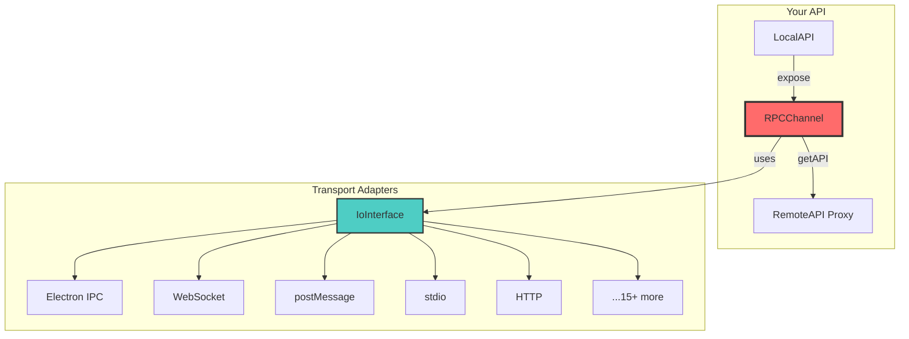

# 🚀 kkRPC

## Type-Safe Cross-Runtime RPC

Seamless bi-directional communication for TypeScript/JavaScript

<div @click="$slidev.nav.next" class="mt-12 py-1" hover:bg="white op-10">
  Press Space to continue <carbon:arrow-right />
</div>

<!--
Welcome! Today I'm going to show you kkRPC, a TypeScript-first RPC library that makes cross-context communication incredibly simple and type-safe.

If you've ever struggled with IPC in Electron, Tauri, Web Workers, or iframes - this is for you.
-->

---

## transition: fade-out

# The Problem

## Cross-Context Communication is Painful

<v-clicks>

- ❌ **No Type Safety** - Event names as strings, manual parsing
- ❌ **Boilerplate Heavy** - Handlers for every single method
- ❌ **No Autocomplete** - Guess the API, check at runtime
- ❌ **Error Prone** - Easy to break, hard to refactor
- ❌ **Limited Features** - No nested APIs, no callbacks

</v-clicks>

<div v-click class="mt-8 text-2xl text-red-400 font-bold">
  When you have hundreds of API calls, this becomes unmaintainable.
</div>

<!--
Let me paint a picture. You're building a desktop app with Electron. You need to communicate between the renderer and main process.

You end up with:
- String-based event names
- Manual message parsing
- No type checking
- Tons of boilerplate

And when your app grows to hundreds of API calls? Good luck maintaining that.
-->

---

transition: slide-up
layout: two-cols
class: "gap-8"

---

# Electron - The Old Way

## Painful IPC

::left::

### ❌ Without kkRPC

```ts {*|1-4|6-9|11-13}
// Preload - Expose methods one by one
contextBridge.exposeInMainWorld("api", {
	getVersion: () => ipcRenderer.invoke("get-version"),
	showDialog: (msg) => ipcRenderer.invoke("show-dialog", msg)
})

// Main - Handler for every method
ipcMain.handle("get-version", () => app.getVersion())
ipcMain.handle("show-dialog", (e, msg) => dialog.show(msg))

// Renderer - No types!
const version = await window.api.getVersion()
// Is it a string? Number? Who knows!
```

::right::

### ✅ With kkRPC

```ts {*|1-4|6-8|10-13}
// Define API once
type MainAPI = {
	getVersion(): Promise<string>
	showDialog(msg: string): Promise<void>
}

// Main - One line setup
const rpc = new RPCChannel(io, {
	expose: { getVersion: () => app.getVersion() }
})

// Renderer - Full autocomplete!
const api = rpc.getAPI<MainAPI>()
const version = await api.getVersion() // ✓ Typed!
```

<!--
Here's a concrete example with Electron.

On the left - the traditional way. You expose methods one by one in the preload, create handlers for each in main, and in the renderer... you have no type safety. You just hope the method exists and returns what you expect.

On the right - with kkRPC. Define your API types once. Set up the channel in one line. Get full autocomplete and type checking. Beautiful.
-->

---

transition: slide-left
layout: two-cols
class: "gap-8"

---

# Tauri - The Old Way

## Limited to Rust Commands

::left::

### ❌ Native Tauri

```ts {*|1-6|8-10}
// Rust - Write commands in Rust
#[tauri::command]
fn greet(name: &str) -> String {
    format!("Hello, {}!", name)
}

// Frontend - Call Rust
import { invoke } from '@tauri-apps/api/core'
const response = await invoke('greet', { name: 'World' })
// Limited type inference
```

::right::

### ✅ With kkRPC

```ts {*|1-5|7-11|13-16}
// Spawn ANY JS runtime
const cmd = Command.create("deno", ["api.ts"])
const process = await cmd.spawn()

// Full TypeScript API!
type API = {
	greet(name: string): Promise<string>
	db: { query(sql: string): Promise<any[]> }
}

const rpc = new RPCChannel(io, { expose: localAPI })
const api = rpc.getAPI<API>()

// Perfect autocomplete!
const result = await api.greet("World")
const data = await api.db.query("SELECT *")
```

<!--
Tauri is great, but you're limited to Rust commands for backend logic.

With kkRPC, you can spawn a Deno, Bun, or Node process as a sidecar and get full TypeScript support on both sides. It's like having Electron's flexibility with Tauri's performance.

The Tauri demo in the examples folder shows this exact pattern.
-->

---

transition: slide-up
layout: two-cols
class: "gap-8"

---

# Web Workers

## Message Passing Nightmare

::left::

### ❌ Manual postMessage

```ts {*|1-4|6-10}
// main.ts
worker.postMessage({
	type: "add",
	data: [1, 2]
})

worker.onmessage = (e) => {
	if (e.data.type === "result") {
		console.log(e.data.result) // 3
	}
}
```

```ts
// worker.ts
self.onmessage = (e) => {
	if (e.data.type === "add") {
		const [a, b] = e.data.data
		self.postMessage({ type: "result", result: a + b })
	}
}
```

::right::

### ✅ Direct Function Calls

```ts {*|1-4|6-8}
// main.ts
const api = rpc.getAPI()
const result = await api.add(1, 2) // 3
await api.math.grade1.add(2, 3) // Nested!
```

```ts
// worker.ts
const rpc = new RPCChannel(io, {
	expose: {
		add: (a, b) => a + b,
		math: { grade1: { add: (a, b) => a + b } }
	}
})
```

<v-click>
<div class="mt-4 p-4 bg-green-900/30 rounded-lg">
  <strong>🎉 Bidirectional:</strong> Worker can call main thread too!
</div>
</v-click>

<!--
Web Workers are powerful but the postMessage API is tedious. You have to:
- Define message types
- Parse messages manually
- Handle errors yourself
- No nested APIs

With kkRPC? Just call functions directly. And it's bidirectional - the worker can call methods exposed by the main thread too.
-->

---

transition: slide-left
layout: two-cols
class: "gap-8"

---

# iframes

## Manual Origin Checking

::left::

### ❌ postMessage Hell

```ts {*|1-8|10-16}
// Parent
iframe.contentWindow.postMessage({ action: "calc", data: 42 }, "https://child.com")

window.addEventListener("message", (e) => {
	if (e.origin !== "https://child.com") return
	console.log(e.data.result)
})

// iframe
window.addEventListener("message", (e) => {
	if (e.origin !== "https://parent.com") return
	// manual action parsing...
})
```

::right::

### ✅ Type-Safe RPC

```ts {*|1-7|9-14}
// Parent
const io = new IframeParentIO(iframe.contentWindow)
const rpc = new RPCChannel(io, { expose: apiImpl })
const api = rpc.getAPI()

// Just call it!
const result = await api.calculate(42)
```

```ts
// iframe
const io = new IframeChildIO()
const rpc = new RPCChannel(io, { expose: childApi })

// Can call parent methods too!
const data = await api.getParentData()
```

<!--
iframes are even worse. You have to check origins manually, parse actions, and maintain the protocol.

kkRPC handles all of that. You get type-safe, bidirectional communication out of the box.
-->

---

## transition: slide-up

# How Does It Work?

## Simple Architecture



<v-clicks>

- **RPCChannel** - The core bidirectional RPC handler
- **IoInterface** - Abstracts any transport (stdio, HTTP, postMessage...)
- **Adapters** - 15+ ready-to-use transport implementations
- **Zero Config** - No code generation, no schema files

</v-clicks>

<!--
The architecture is beautifully simple.

RPCChannel is the heart - it handles the bidirectional communication.

IoInterface is the abstraction layer - it doesn't care if you're using stdio, HTTP, or postMessage.

We have 15+ adapters ready to use. And best of all - zero configuration. No code generation, no schema files.
-->

---

## transition: slide-left

# ✨ Key Features

<div class="grid grid-cols-2 gap-6 mt-4">

<div v-click class="p-4 bg-blue-900/20 rounded-lg">
<h3 class="text-xl font-bold text-blue-400">🔄 Cross-Runtime</h3>
<p>Node.js ↔ Deno ↔ Bun ↔ Browser</p>
</div>

<div v-click class="p-4 bg-green-900/20 rounded-lg">
<h3 class="text-xl font-bold text-green-400">🛡️ Type-Safe</h3>
<p>Full TypeScript inference & autocomplete</p>
</div>

<div v-click class="p-4 bg-purple-900/20 rounded-lg">
<h3 class="text-xl font-bold text-purple-400">↔️ Bidirectional</h3>
<p>Both sides expose & call APIs</p>
</div>

<div v-click class="p-4 bg-yellow-900/20 rounded-lg">
<h3 class="text-xl font-bold text-yellow-400">🔗 Nested APIs</h3>
<p><code>api.math.grade1.add()</code></p>
</div>

<div v-click class="p-4 bg-red-900/20 rounded-lg">
<h3 class="text-xl font-bold text-red-400">💥 Error Preservation</h3>
<p>Complete error objects across boundaries</p>
</div>

<div v-click class="p-4 bg-cyan-900/20 rounded-lg">
<h3 class="text-xl font-bold text-cyan-400">📞 Callbacks</h3>
<p>Pass functions as parameters</p>
</div>

<div v-click class="p-4 bg-orange-900/20 rounded-lg">
<h3 class="text-xl font-bold text-orange-400">🚀 Transferable</h3>
<p>Zero-copy for large data (40-100x faster)</p>
</div>

<div v-click class="p-4 bg-pink-900/20 rounded-lg">
<h3 class="text-xl font-bold text-pink-400">⚡ Zero Config</h3>
<p>No code generation needed</p>
</div>

</div>

<!--
Let's quickly run through the key features.

Cross-runtime - works across Node, Deno, Bun, and browsers.

Type-safe - full TypeScript support with autocomplete.

Bidirectional - unlike tRPC, both sides can call each other.

Nested APIs - organize your API with nested objects.

Error preservation - complete error objects cross boundaries.

Callbacks - yes, you can pass functions as parameters.

Transferable objects - zero-copy for large binary data.

Zero config - just install and use. No setup.
-->

---

## transition: slide-up

# Supported Environments

<div class="flex flex-wrap justify-center gap-4 mt-8">

<div v-click class="flex flex-col items-center p-6 bg-slate-800 rounded-xl w-32">
<div class="text-4xl mb-2">🟢</div>
<div class="font-bold">Node.js</div>
<div class="text-xs text-gray-400">stdio, HTTP, WS</div>
</div>

<div v-click class="flex flex-col items-center p-6 bg-slate-800 rounded-xl w-32">
<div class="text-4xl mb-2">🦕</div>
<div class="font-bold">Deno</div>
<div class="text-xs text-gray-400">stdio, HTTP, WS</div>
</div>

<div v-click class="flex flex-col items-center p-6 bg-slate-800 rounded-xl w-32">
<div class="text-4xl mb-2">🥯</div>
<div class="font-bold">Bun</div>
<div class="text-xs text-gray-400">stdio, HTTP, WS</div>
</div>

<div v-click class="flex flex-col items-center p-6 bg-slate-800 rounded-xl w-32">
<div class="text-4xl mb-2">🌐</div>
<div class="font-bold">Browser</div>
<div class="text-xs text-gray-400">Workers, iframes</div>
</div>

<div v-click class="flex flex-col items-center p-6 bg-slate-800 rounded-xl w-32">
<div class="text-4xl mb-2">⚛️</div>
<div class="font-bold">Electron</div>
<div class="text-xs text-gray-400">IPC, Utility</div>
</div>

<div v-click class="flex flex-col items-center p-6 bg-slate-800 rounded-xl w-32">
<div class="text-4xl mb-2">🦀</div>
<div class="font-bold">Tauri</div>
<div class="text-xs text-gray-400">Sidecar processes</div>
</div>

<div v-click class="flex flex-col items-center p-6 bg-slate-800 rounded-xl w-32">
<div class="text-4xl mb-2">🔌</div>
<div class="font-bold">Chrome Ext</div>
<div class="text-xs text-gray-400">Content, Background</div>
</div>

</div>

<div v-click class="mt-8 text-center">
<p class="text-lg">Plus: <span class="text-blue-400">WebSocket, Socket.IO, Hono, Elysia, RabbitMQ, Redis, Kafka, NATS...</span></p>
</div>

<!--
kkRPC supports virtually every JavaScript environment.

Node, Deno, Bun - with stdio, HTTP, and WebSocket.

Browser - Web Workers and iframes.

Electron - full IPC and utility process support.

Tauri - spawn any JS runtime as a sidecar.

Chrome Extensions - content and background scripts.

And we have adapters for WebSocket variants, message queues, and more.
-->

---

## transition: slide-left

# Quick Example

## Node.js ↔ Deno via stdio

````md magic-move {lines: true}
```ts
// api.ts - Shared API definition
export type API = {
	add(a: number, b: number): Promise<number>
	greet(name: string): Promise<string>
}
```

```ts
// server.ts - Deno process
import { DenoIo, RPCChannel } from "kkrpc"
import type { API } from "./api.ts"

const api: API = {
	add: (a, b) => Promise.resolve(a + b),
	greet: (name) => Promise.resolve(`Hello, ${name}!`)
}

const io = new DenoIo(Deno.stdin.readable)
const rpc = new RPCChannel(io, { expose: api })
```

```ts
// client.ts - Node.js process
import { spawn } from "child_process"
import { NodeIo, RPCChannel } from "kkrpc"
import type { API } from "./api.ts"

const worker = spawn("deno", ["run", "server.ts"])
const io = new NodeIo(worker.stdout, worker.stdin)
const rpc = new RPCChannel<{}, API>(io)
const api = rpc.getAPI()

// Type-safe calls!
console.log(await api.add(2, 3)) // 5
console.log(await api.greet("World")) // Hello, World!
```
````

<!--
Here's a complete example showing Node.js talking to Deno via stdio.

First, define your API types. Then implement on the server side - this is Deno exposing the API.

On the client side - Node.js spawns the Deno process and gets a fully typed API proxy.

That's it. No boilerplate, no handlers, just type-safe function calls.
-->

---

## transition: slide-up

# Advanced Features

## Nested APIs + Callbacks

```ts
// Define nested API
type API = {
	math: {
		grade1: { add(a: number, b: number): Promise<number> }
		grade2: { multiply(a: number, b: number): Promise<number> }
	}
	calculate(n: number, onProgress: (p: number) => void): Promise<number>
}

// Call with nested path AND callback
const api = rpc.getAPI<API>()

// Nested method call
const result = await api.math.grade2.multiply(4, 5)

// With callback
await api.calculate(100, (progress) => {
	console.log(`${progress}% complete`)
})
```

<v-click>
<div class="mt-6 p-4 bg-blue-900/30 rounded-lg text-center">
<p class="text-lg">🎯 <strong>Property Access:</strong> <code>await api.config.theme</code> works too!</p>
</div>
</v-click>

<!--
Some advanced features that set kkRPC apart.

Nested APIs - organize your API hierarchically.

Callbacks - pass functions as parameters for progress updates.

Property access - you can even await remote properties like they're local.

These features make kkRPC feel like you're calling local code, not remote.
-->

---

transition: slide-left
layout: two-cols
class: "gap-8"

---

# vs Alternatives

## How kkRPC Compares

::left::

### tRPC

- ✅ Great for HTTP APIs
- ❌ HTTP only
- ❌ Client calls server only
- ❌ No callbacks

### Comlink

- ✅ Good for Workers
- ❌ Browser only
- ❌ No stdio/HTTP support

::right::

### kkRPC

- ✅ **15+ transports** (stdio, HTTP, WS, postMessage...)
- ✅ **Bidirectional** - both sides call each other
- ✅ **Cross-runtime** (Node, Deno, Bun, Browser)
- ✅ **Callbacks** supported
- ✅ **Nested APIs**
- ✅ **Error preservation**

<v-click>
<div class="mt-6 p-4 bg-green-900/30 rounded-lg">
<strong>Choose kkRPC when:</strong> You need type-safe IPC across different contexts and runtimes.
</div>
</v-click>

<!--
How does kkRPC compare to alternatives?

tRPC is excellent for HTTP APIs but it's HTTP-only and unidirectional.

Comlink is great for Web Workers but limited to browsers.

kkRPC gives you the best of both - any transport, bidirectional, cross-runtime.

Choose kkRPC when you need flexible, type-safe IPC across different contexts.
-->

---

transition: slide-up
class: text-center

---

# 🚀 Get Started

## Installation

<div class="grid grid-cols-2 gap-8 mt-8 text-left">

<div class="p-4 bg-slate-800 rounded-lg">
<h3 class="text-red-400 font-bold">NPM</h3>
<pre class="text-sm">npm install kkrpc</pre>
</div>

<div class="p-4 bg-slate-800 rounded-lg">
<h3 class="text-yellow-400 font-bold">JSR</h3>
<pre class="text-sm">deno add jsr:@kunkun/kkrpc</pre>
</div>

</div>

<div class="mt-8">
<p class="text-xl">📚 <a href="https://kunkunsh.github.io/kkrpc/" target="_blank">Documentation</a></p>
<p class="text-xl mt-2">💻 <a href="https://github.com/kunkunsh/kkrpc" target="_blank">GitHub</a></p>
<p class="text-xl mt-2">📦 <a href="https://www.npmjs.com/package/kkrpc" target="_blank">npm: kkrpc</a></p>
</div>

<!--
Ready to try it?

Install from npm or JSR. The docs have comprehensive examples for every adapter.

Check out the GitHub repo for the source code and examples.
-->

---

layout: center
class: text-center

---

# Thank You!

## Stop Writing Boilerplate IPC

### Start Building with Type-Safe RPC

<div class="mt-12">
<p class="text-2xl">⭐ Star on <a href="https://github.com/kunkunsh/kkrpc" target="_blank">GitHub</a></p>
<p class="text-lg mt-4 text-gray-400">Built by <a href="https://github.com/kunkunsh">@kunkunsh</a></p>
</div>

<!--
Thank you for watching!

Stop writing boilerplate IPC code. Start building with type-safe RPC.

If you found this useful, please star the repo on GitHub.

Questions? Check the docs or open an issue. Happy coding!
-->
