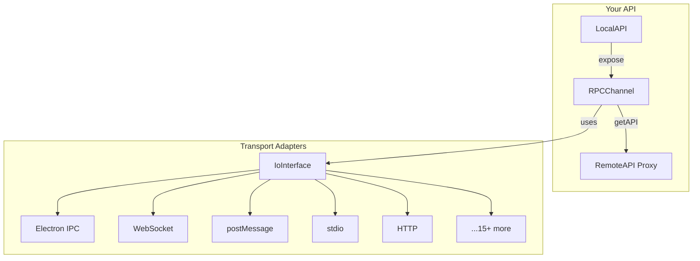

# kkRPC

## Type-Safe Cross-Runtime RPC

Seamless bi-directional communication for TypeScript/JavaScript

<div @click="$slidev.nav.next" class="mt-12 py-1" hover:bg="white op-10">
  Press Space to continue <carbon:arrow-right />
</div>

<!--
Welcome! Today I'm going to show you kkRPC, a TypeScript-first RPC library that makes cross-context communication incredibly simple and type-safe.

If you've ever struggled with IPC in Electron, Tauri, Web Workers, or iframes - this is for you.
-->

---
transition: fade-out
---

# The Problem

## Cross-Context Communication is Painful

<v-clicks>

- **No Type Safety** - Event names as strings, manual parsing
- **Boilerplate Heavy** - Handlers for every single method
- **No Autocomplete** - Guess the API, check at runtime
- **Error Prone** - Easy to break, hard to refactor
- **Limited Features** - No nested APIs, no callbacks

</v-clicks>

<div class="mt-8 text-2xl text-red-400 font-bold">
  When you have hundreds of API calls, this becomes unmaintainable.
</div>

<!--
Let me paint a picture. You're building a desktop app with Electron. You need to communicate between the renderer and main process.

You end up with:
- String-based event names
- Manual message parsing
- No type checking
- Tons of boilerplate

And when your app grows to hundreds of API calls? Good luck maintaining that.
-->

---
transition: slide-up
layout: two-cols-header
layoutClass: gap-4
---

# Electron IPC

::left::

### Traditional IPC

```ts
// preload.ts
import { contextBridge, ipcRenderer } from "electron"

contextBridge.exposeInMainWorld("api", {
	getVersion: () => ipcRenderer.invoke("get-version"),
	showDialog: (msg) => ipcRenderer.invoke("show-dialog", msg)
})

// main.ts
ipcMain.handle("get-version", () => app.getVersion())
ipcMain.handle("show-dialog", (e, msg) => dialog.show(msg))

// renderer.ts - No types!
const version = await window.api.getVersion()
// string? number? any? Who knows!
```

::right::

### With kkRPC

```ts
// types.ts - Define once, use everywhere
type MainAPI = {
	getVersion(): Promise<string>
	showDialog(msg: string): Promise<void>
}

// main.ts - Expose API
const rpc = new RPCChannel(io, {
	expose: { getVersion: () => app.getVersion() }
})

// renderer.ts - Full autocomplete!
const rpc = new RPCChannel<{}, MainAPI>(io)
const api = rpc.getAPI()
const version = await api.getVersion() // string!
```

<!--
Here's a concrete example with Electron.

On the left - the traditional way. You expose methods one by one in the preload, create handlers for each in main, and in the renderer... you have no type safety. You just hope the method exists and returns what you expect. And if you're using TypeScript and you need the types to work, you have to manually cast the types.

On the right - with kkRPC. Define your API types once. Set up the channel in one line. Get full autocomplete and type checking. Beautiful.
Also, in reality you don't even need to manually define the types, you can just infer it from an API object with the typeof keyword.
-->

---
transition: slide-left
layout: two-cols-header
layoutClass: gap-4
---

# Tauri Sidecar

::left::

### Traditional: Spawn + HTTP/JSON-RPC

```ts
// 1. Spawn process
const cmd = Command.create("deno", ["server.ts"])
const process = await cmd.spawn()

// 2. Start HTTP server in sidecar
// 3. Connect via HTTP/WebSocket
// 4. Manual protocol handling

// OR use stdio with manual JSON-RPC
process.write(
	JSON.stringify({
		jsonrpc: "2.0",
		method: "greet",
		params: ["World"],
		id: 1
	})
)
// Parse response manually...
```

::right::

### With kkRPC (Direct Function Calls)

```ts
// sidecar.ts - Runs in Deno/Bun/Node
import { DenoIo, RPCChannel } from "kkrpc"
import { api } from "./api.ts"

const io = new DenoIo(Deno.stdin.readable)
const rpc = new RPCChannel(io, { expose: api })
```

```ts
// Frontend - TypeScript with full autocomplete
import { Command } from "@tauri-apps/plugin-shell"
import { RPCChannel, TauriShellStdio } from "kkrpc/browser"
import type { api as SidecarAPI } from "./api.ts"

const cmd = Command.create("deno", ["sidecar.ts"])
const process = await cmd.spawn()

const io = new TauriShellStdio(cmd.stdout, process)
const rpc = new RPCChannel<{}, typeof SidecarAPI>(io)
const api = rpc.getAPI()

await api.greet("World") // Direct function call!
```

<!--
Traditionally, if you want to call functions defined in another process in Tauri, you need to spawn the process first, then communicate via STDIO using protocols like JSON RPC or simply run an HTTP server or web socket server in the process.

But spawning an HTTP server comes with real costs: extra memory and CPU usage just for the server, the headache of finding and managing an available port to avoid conflicts, and security concerns if you're not using HTTPS encryption for local communication.

With kkRPC: Just spawn the process and call functions directly. No server setup, no port management, no manual protocol handling, no security concerns about unencrypted local HTTP traffic.

The sidecar exposes its API via stdio using kkRPC, and the frontend gets a fully typed proxy. It's that simple.
-->

---
transition: slide-up
layout: two-cols-header
layoutClass: gap-4
---

# Web Workers

> Message Passing Nightmare

::left::

### Manual postMessage

```ts
// main.ts
worker.postMessage({
	type: "add",
	data: [1, 2]
})

worker.onmessage = (e) => {
	if (e.data.type === "result") {
		console.log(e.data.result) // 3
	}
}
```

```ts
// worker.ts
self.onmessage = (e) => {
	if (e.data.type === "add") {
		const [a, b] = e.data.data
		self.postMessage({ type: "result", result: a + b })
	}
}
```

::right::

### Direct Function Calls

```ts
// main.ts
const api = rpc.getAPI()
const result = await api.add(1, 2) // 3
await api.math.grade1.add(2, 3) // Nested!
```

```ts
// worker.ts
const rpc = new RPCChannel(io, {
	expose: {
		add: (a, b) => a + b,
		math: { grade1: { add: (a, b) => a + b } }
	}
})
```

<v-click>
<div class="mt-4 p-4 bg-green-900/30 rounded-lg">
  <strong>Bidirectional:</strong> Worker can call main thread too!
</div>
</v-click>

<!--
Web Workers are powerful but the postMessage API is tedious. You have to:
- Define message types
- Parse messages manually
- Handle errors yourself
- No nested APIs

With kkRPC? Just call functions directly. And it's bidirectional - the worker can call methods exposed by the main thread too.
-->

---
transition: slide-left
layout: two-cols-header
layoutClass: gap-4
---

# RabbitMQ RPC

> From Callback Hell to Type-Safe Functions

::left::

### Traditional RabbitMQ RPC

````md magic-move {lines: true}
```js
// rpc_client.js - Complex setup
var correlationId = generateUuid()

channel.assertQueue("", { exclusive: true }, function (error2, q) {
	// Consume response queue
	channel.consume(
		q.queue,
		function (msg) {
			// Manual correlation matching!
			if (msg.properties.correlationId ===
			    correlationId) {
				console.log(
				  "Got %s",
				  msg.content.toString()
				)
				// No types
			}
		},
		{ noAck: true }
	)

	// Send request
	channel.sendToQueue(
		"rpc_queue",
		Buffer.from(num.toString()),
		{
		correlationId: correlationId,
		replyTo: q.queue
	})
})
```

```js
// rpc_server.js - Manual response
channel.consume("rpc_queue", function reply(msg) {
	var n = parseInt(msg.content.toString())
	var r = fibonacci(n)

	// Manual reply with correlation
	channel.sendToQueue(
		msg.properties.replyTo,
		Buffer.from(r.toString()),
		{
		correlationId:
			  msg.properties.correlationId
	})
	channel.ack(msg)
})
```
````

::right::

### With kkRPC

````md magic-move {lines: true}
```ts
// client.ts - Just call the function
import { RabbitMQIO, RPCChannel } from "kkrpc"
import type { MathAPI } from "./types"

const io = new RabbitMQIO({
	url: "amqp://localhost",
	exchange: "math-service"
})

const rpc = new RPCChannel<{}, MathAPI>(io)
const math = rpc.getAPI()

// Direct function call with full type safety!
const result = await math.fibonacci(30)
// TypeScript knows result is a number ✨
```

```ts
// server.ts - Expose your API
import { RabbitMQIO, RPCChannel } from "kkrpc"

const io = new RabbitMQIO({ url: "amqp://localhost" })

new RPCChannel(io, {
	expose: {
		fibonacci: (n: number): number => {
			if (n === 0 || n === 1) return n
			return fibonacci(n - 1) + fibonacci(n - 2)
		}
	}
})
```
````

<v-click>
<div class="mt-4 p-4 bg-blue-900/30 rounded-lg">
  <strong>Benefits:</strong> No correlation IDs, no manual queue management, automatic serialization, full TypeScript type safety
</div>
</v-click>

<!--
RabbitMQ tutorial 6 shows the official RPC pattern - it's verbose and callback-heavy. You need to:
- Generate correlation IDs
- Create exclusive reply queues
- Manually match responses by correlation ID
- Handle everything as strings

With kkRPC:
- Client just calls await math.fibonacci(30) with full type safety
- Server just exposes functions in a clean object
- Automatic correlation ID management
- Automatic queue/exchange setup
- Bidirectional communication - both sides can call each other

The magic-move animation shows the progression from complex callback-based code to simple async/await function calls.
-->

---
transition: slide-up
layout: two-cols-header
layoutClass: gap-4
---

# Chrome Extension

> Content ↔ Background ↔ Popup Communication

::left::

### Traditional Messaging

```ts
// content.ts - Send message
chrome.runtime.sendMessage(
	{ type: "GET_VERSION" },
	(response) => {
	console.log(response.version)
	// No type safety!
})

// background.ts - Handle message
chrome.runtime.onMessage.addListener(
	(message, sender, sendResponse) => {
	if (message.type === "GET_VERSION") {
		sendResponse({
			version: chrome
			  .runtime
			  .getManifest()
			  .version
		})
	}
	// Must manually check types
	return true // Keep channel open
})
```

::right::

### With kkRPC (Port-Based)

```ts
// content.ts - Direct function call
import { ChromePortIO, RPCChannel } from "kkrpc/chrome-extension"
import type { BackgroundAPI } from "./types"

const port = chrome.runtime.connect({ name: "content" })
const io = new ChromePortIO(port)
const rpc = new RPCChannel<{}, BackgroundAPI>(io)

const bg = rpc.getAPI()
const version = await bg.getExtensionVersion()
// Full type safety! ✨
```

```ts
// background.ts - Expose API
chrome.runtime.onConnect.addListener((port) => {
	const io = new ChromePortIO(port)
	new RPCChannel(io, {
		expose: {
			getExtensionVersion: () => chrome.runtime.getManifest().version
		}
	})
})
```

<v-click>
<div class="mt-4 p-4 bg-purple-900/30 rounded-lg">
  <strong>Long-lived connections:</strong> Bidirectional, type-safe communication between all extension contexts
</div>
</v-click>

<!--
Traditional Chrome extension messaging is painful - string-based message types, manual response handling, no type safety, complex state management.

Traditional approach: sendMessage with type strings, manual listeners, callbacks for responses, no TypeScript autocomplete. Very error-prone.

With kkRPC: Uses Chrome ports for long-lived connections. Both sides can expose APIs. Full TypeScript type safety with autocomplete. Clean function calls instead of message type strings.

Perfect for complex extensions with multiple contexts - content scripts, background, popup, sidepanel all talking to each other type-safely.
-->

---
transition: slide-up
---

# How Does It Work?



<v-clicks>

- **RPCChannel** - The core bidirectional RPC handler
- **IoInterface** - Abstracts any transport (stdio, HTTP, postMessage...)
- **Adapters** - 15+ ready-to-use transport implementations
- **Zero Config** - No code generation, no schema files

</v-clicks>

<!--
The architecture is beautifully simple.

RPCChannel is the heart - it handles the bidirectional communication.

IoInterface is the abstraction layer - it doesn't care if you're using stdio, HTTP, or postMessage.

We have 15+ adapters ready to use. And best of all - zero configuration. No code generation, no schema files.
-->

---
transition: slide-left
---

# Key Features

<div class="grid grid-cols-4 gap-3 mt-2">

<div class="p-2 bg-blue-900/20 rounded-lg">
<h3 class="text-base font-bold text-blue-400">Cross-Runtime</h3>
<p>Node.js - Deno - Bun - Browser</p>
</div>

<div class="p-2 bg-green-900/20 rounded-lg">
<h3 class="text-base font-bold text-green-400">Type-Safe</h3>
<p>Full TypeScript inference & autocomplete</p>
</div>

<div class="p-2 bg-purple-900/20 rounded-lg">
<h3 class="text-base font-bold text-purple-400">Bidirectional</h3>
<p>Both sides expose & call APIs</p>
</div>

<div class="p-2 bg-yellow-900/20 rounded-lg">
<h3 class="text-base font-bold text-yellow-400">Nested APIs</h3>
<p><code>api.math.grade1.add()</code></p>
</div>

<div class="p-2 bg-red-900/20 rounded-lg">
<h3 class="text-base font-bold text-red-400">Error Preservation</h3>
<p>Complete error objects across boundaries</p>
</div>

<div class="p-2 bg-cyan-900/20 rounded-lg">
<h3 class="text-base font-bold text-cyan-400">Callbacks</h3>
<p>Pass functions as parameters</p>
</div>

<div class="p-2 bg-orange-900/20 rounded-lg">
<h3 class="text-base font-bold text-orange-400">Transferable</h3>
<p>Zero-copy for large data (40-100x faster)</p>
</div>

<div class="p-2 bg-pink-900/20 rounded-lg">
<h3 class="text-base font-bold text-pink-400">Zero Config</h3>
<p>No code generation needed</p>
</div>

</div>

<!--
Let's quickly run through the key features.

Cross-runtime - works across Node, Deno, Bun, and browsers.

Type-safe - full TypeScript support with autocomplete.

Bidirectional - unlike tRPC, both sides can call each other.

Nested APIs - organize your API with nested objects.

Error preservation - complete error objects cross boundaries.

Callbacks - yes, you can pass functions as parameters.

Transferable objects - zero-copy for large binary data.

Zero config - just install and use. No setup.
-->

---
transition: slide-up
---

# Supported Environments

<div class="flex flex-wrap justify-center gap-4 mt-8">

<div class="flex flex-col items-center p-6 bg-slate-800 rounded-xl w-32">
<div class="text-4xl mb-2">Node.js</div>
<div class="text-xs text-gray-400">stdio, HTTP, WS</div>
</div>

<div class="flex flex-col items-center p-6 bg-slate-800 rounded-xl w-32">
<div class="text-4xl mb-2">Deno</div>
<div class="text-xs text-gray-400">stdio, HTTP, WS</div>
</div>

<div class="flex flex-col items-center p-6 bg-slate-800 rounded-xl w-32">
<div class="text-4xl mb-2">Bun</div>
<div class="text-xs text-gray-400">stdio, HTTP, WS</div>
</div>

<div class="flex flex-col items-center p-6 bg-slate-800 rounded-xl w-32">
<div class="text-4xl mb-2">Browser</div>
<div class="text-xs text-gray-400">Workers, iframes</div>
</div>

<div class="flex flex-col items-center p-6 bg-slate-800 rounded-xl w-32">
<div class="text-4xl mb-2">Electron</div>
<div class="text-xs text-gray-400">IPC, Utility</div>
</div>

<div class="flex flex-col items-center p-6 bg-slate-800 rounded-xl w-32">
<div class="text-4xl mb-2">Tauri</div>
<div class="text-xs text-gray-400">Sidecar processes</div>
</div>

<div class="flex flex-col items-center p-6 bg-slate-800 rounded-xl w-32">
<div class="text-4xl mb-2">Chrome Ext</div>
<div class="text-xs text-gray-400">Content, Background</div>
</div>

</div>

<div class="mt-8 text-center">
<p class="text-lg">Plus: <span class="text-blue-400">WebSocket, Socket.IO, Hono, Elysia, RabbitMQ, Redis, Kafka, NATS...</span></p>
</div>

<!--
kkRPC supports virtually every JavaScript environment.

Node, Deno, Bun - with stdio, HTTP, and WebSocket.

Browser - Web Workers and iframes.

Electron - full IPC and utility process support.

Tauri - spawn any JS runtime as a sidecar.

Chrome Extensions - content and background scripts.

And we have adapters for WebSocket variants, message queues, and more.
-->

---
transition: slide-left
---

# Quick Example

## Node.js to Deno via stdio

````md magic-move {lines: true}
```ts
// api.ts - Shared API definition
export type API = {
	add(a: number, b: number): Promise<number>
	greet(name: string): Promise<string>
}
```

```ts
// server.ts - Deno process
import { DenoIo, RPCChannel } from "kkrpc"
import type { API } from "./api.ts"

const api: API = {
	add: (a, b) => Promise.resolve(a + b),
	greet: (name) => Promise.resolve(`Hello, ${name}!`)
}

const io = new DenoIo(Deno.stdin.readable)
const rpc = new RPCChannel(io, { expose: api })
```

```ts
// client.ts - Node.js process
import { spawn } from "child_process"
import { NodeIo, RPCChannel } from "kkrpc"
import type { API } from "./api.ts"

const worker = spawn("deno", ["run", "server.ts"])
const io = new NodeIo(worker.stdout, worker.stdin)
const rpc = new RPCChannel<{}, API>(io)
const api = rpc.getAPI()

// Type-safe calls!
console.log(await api.add(2, 3)) // 5
console.log(await api.greet("World")) // Hello, World!
```
````

<!--
Here's a complete example showing Node.js talking to Deno via stdio.

First, define your API types. Then implement on the server side - this is Deno exposing the API.

On the client side - Node.js spawns the Deno process and gets a fully typed API proxy.

That's it. No boilerplate, no handlers, just type-safe function calls.
-->

---
transition: slide-up
layout: two-cols-header
layoutClass: gap-4
---

# Advanced Features

## Nested APIs + Callbacks

::left::

```ts
// Define nested API
type API = {
	math: {
		grade1: { add(a: number, b: number): Promise<number> }
		grade2: { multiply(a: number, b: number): Promise<number> }
	}
	calculate(n: number, onProgress: (p: number) => void): Promise<number>
}

const rpc = new RPCChannel<{}, API>(io)
const api = rpc.getAPI()

// Nested method call
const result = await api.math.grade2.multiply(4, 5)

// With callback
await api.calculate(100, (progress) => {
	console.log(`${progress}% complete`)
})
```

::right::

<div class="p-3 bg-purple-900/20 rounded-lg">
<h3 class="text-base font-bold text-purple-400">Nested APIs</h3>
<p class="text-sm">Organize your API hierarchically</p>
</div>

<div class="p-3 bg-cyan-900/20 rounded-lg mt-3">
<h3 class="text-base font-bold text-cyan-400">Callbacks</h3>
<p class="text-sm">Pass functions as parameters for progress updates</p>
</div>

<div class="p-3 bg-blue-900/20 rounded-lg mt-3">
<h3 class="text-base font-bold text-blue-400">Property Access</h3>
<p class="text-sm"><code>await api.config.theme</code> works too!</p>
</div>

<!--
Some advanced features that set kkRPC apart.

Nested APIs - organize your API hierarchically.

Callbacks - pass functions as parameters for progress updates.

Property access - you can even await remote properties like they're local.

These features make kkRPC feel like you're calling local code, not remote.
-->

---
transition: slide-left
layout: two-cols-header
layoutClass: gap-4
---

# vs Alternatives

## How kkRPC Compares

::left::

### tRPC

- Great for HTTP APIs
- HTTP only
- Client calls server only
- No callbacks

### Comlink

- Good for Workers
- Browser only
- No stdio/HTTP support

::right::

### kkRPC

- **15+ transports** (stdio, HTTP, WS, postMessage...)
- **Bidirectional** - both sides call each other
- **Cross-runtime** (Node, Deno, Bun, Browser)
- **Callbacks** supported
- **Nested APIs**
- **Error preservation**

<v-click>
<div class="mt-6 p-4 bg-green-900/30 rounded-lg">
<strong>Choose kkRPC when:</strong> You need type-safe IPC across different contexts and runtimes.
</div>
</v-click>

<!--
How does kkRPC compare to alternatives?

tRPC is excellent for HTTP APIs but it's HTTP-only and unidirectional.

Comlink is great for Web Workers but limited to browsers.

kkRPC gives you the best of both - any transport, bidirectional, cross-runtime.

Choose kkRPC when you need flexible, type-safe IPC across different contexts.
-->

---
transition: slide-up
class: text-center
---

# Get Started

## Installation

<div class="grid grid-cols-2 gap-8 mt-8 text-left">

<div class="p-2 bg-slate-800 rounded-lg">
<h3 class="text-red-400 font-bold">NPM</h3>
<pre class="text-sm">npm install kkrpc</pre>
</div>

<div class="p-2 bg-slate-800 rounded-lg">
<h3 class="text-yellow-400 font-bold">JSR</h3>
<pre class="text-sm">deno add jsr:@kunkun/kkrpc</pre>
</div>

</div>

<div class="mt-8">
<p class="text-xl"><a href="https://kunkunsh.github.io/kkrpc/" target="_blank">Documentation</a></p>
<p class="text-xl mt-2"><a href="https://github.com/kunkunsh/kkrpc" target="_blank">GitHub</a></p>
<p class="text-xl mt-2"><a href="https://www.npmjs.com/package/kkrpc" target="_blank">npm: kkrpc</a></p>
</div>

<!--
Ready to try it?

Install from npm or JSR. The docs have comprehensive examples for every adapter.

Check out the GitHub repo for the source code and examples.
-->

---
layout: center
class: text-center
---

# Thank You!

## Stop Writing Boilerplate IPC

### Start Building with Type-Safe RPC

<div class="mt-12">
<p class="text-2xl">Star on <a href="https://github.com/kunkunsh/kkrpc" target="_blank">GitHub</a></p>
<p class="text-lg mt-4 text-gray-400">Built by <a href="https://github.com/kunkunsh">@kunkunsh</a></p>
</div>

<!--
Thank you for watching!

Stop writing boilerplate IPC code. Start building with type-safe RPC.

If you found this useful, please star the repo on GitHub.

Questions? Check the docs or open an issue. Happy coding!
-->
