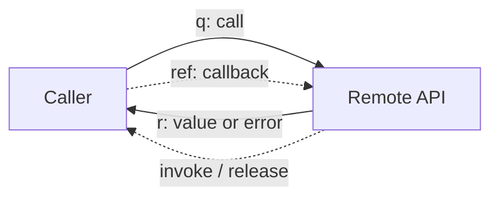

<!-- slide:01 -->

<DeckFrame eyebrow="The promise" title="One typed call. Another runtime." subtitle="Write ordinary TypeScript. Let the implementation live somewhere else." page="01 / 21">

<div class="deck-hero-grid">
  <div class="deck-stack">
    <div class="deck-big">Call it <span class="deck-success">here</span>.<br>Run it <span class="deck-cyan">there</span>.</div>
    <p class="deck-copy">No hand-written message envelope in application code. No string method name to keep in sync.</p>
  </div>
  <div class="deck-panel" v-motion :initial="{x:60,opacity:0}" :enter="{x:0,opacity:1,transition:{duration:500}}">

```ts {1|1-2|all}
const result = await api.math.add(1, 2)
//                              → 3
```

<div v-click class="deck-chip" style="margin-top:16px">same API shape · different runtime</div>
  </div>
</div>

</DeckFrame>

<!--
Let's not start from the protocol format. Start from the code we actually want to write: an ordinary TypeScript method call.

[click] The call happens in the current runtime, but the implementation can live in a Worker, a child process, a desktop host — even the far end of a message queue.

[click] To the application code, the result is still just a Promise. kkRPC's whole goal is to compress cross-boundary communication down to exactly this mental model.
-->

---
title: "The JSON-RPC baseline"
---

<!-- slide:02 -->

<DeckFrame eyebrow="The baseline" title="JSON-RPC solves the wire format" subtitle="But the application still assembles and interprets protocol-shaped objects." page="02 / 21">

<div class="deck-grid-2">
  <div>
    <div class="deck-code-label">caller.ts</div>

```ts {1-5|2|3|4|all}
const request = {
  jsonrpc: '2.0',
  method: 'math.add',
  params: [1, 2],
  id: 42,
}
transport.send(JSON.stringify(request))
```

  </div>
  <div class="deck-stack">
    <div class="deck-panel" v-click>
      <div class="deck-kicker">Protocol work leaks upward</div>
      <p class="deck-copy" style="margin-top:8px">serialize → correlate → dispatch → deserialize</p>
    </div>
    <div class="deck-panel" v-click>
      <div class="deck-kicker deck-amber">The compiler sees data</div>
      <p class="deck-copy" style="margin-top:8px">It does not automatically see a callable API contract.</p>
    </div>
  </div>
</div>

</DeckFrame>

<!--
JSON-RPC is good at defining what goes on the wire: the version, the method name, the params, the id. That part is fine.

[click] But when application code assembles these objects by hand, serialization, request correlation, and dispatch logic leak into every call site.

[click] More importantly, TypeScript only sees a plain object — not an API contract that can evolve together with the server.
-->

---
title: "Where raw JSON-RPC cracks"
---

<!-- slide:03 -->

<DeckFrame eyebrow="The friction" title="Five small cracks become one maintenance problem" subtitle="Raw protocol ≠ typed client surface. OpenRPC or generated clients can add types; the raw call site does not." page="03 / 21">

<div class="deck-grid-2" style="grid-template-columns:.92fr 1.08fr">
  <div class="deck-panel">

```ts {1|2|3|4|5|all}
call('math.ad', [1, 2])       // typo
call('math.add', [1, '2'])    // shape
call('math.add', [1, 2])      // rename?
onMessage(msg => resolve(msg.id))
register('progress', handler)  // callback?
```

  </div>
  <div class="deck-stack" style="gap:9px">
    <div v-click class="deck-panel" style="padding:12px 16px"><b class="deck-danger">Hard-coded paths</b> <span class="deck-muted">hide typos in strings</span></div>
    <div v-click class="deck-panel" style="padding:12px 16px"><b class="deck-danger">Loose parameters</b> <span class="deck-muted">move errors to runtime</span></div>
    <div v-click class="deck-panel" style="padding:12px 16px"><b class="deck-danger">Weak refactors</b> <span class="deck-muted">miss breaking changes</span></div>
    <div v-click class="deck-panel" style="padding:12px 16px"><b class="deck-danger">Boilerplate growth</b> <span class="deck-muted">scales with every method</span></div>
    <div v-click class="deck-panel" style="padding:12px 16px"><b class="deck-danger">Callbacks fight the model</b> <span class="deck-muted">— not JSON values</span></div>
  </div>
</div>

</DeckFrame>

<!--
On their own, none of these is fatal. But inside a plugin system you maintain for years, they amplify each other.

[click] A typo in a string method name — the compiler can't see it. [click] A wrong parameter shape usually waits until the remote runs. [click] When you rename the interface, the IDE can't guarantee every string changes with it.

[click] Then every method adds another layer of request-and-response boilerplate. [click] And the moment a callback shows up in the arguments, the pure-JSON model gets even more awkward.
-->

---
title: "A real build-time error"
---

<!-- slide:04 -->

<DeckFrame eyebrow="Type safety" title="Make the impossible call fail before it travels" subtitle="The diagnostic below is rendered by the TypeScript compiler through Twoslash." page="04 / 21">

<div style="max-width:820px;margin:0 auto">

```ts {1-4|6-7|9|all} twoslash
// @errors: 2345
interface MathAPI {
  math: { add(a: number, b: number): Promise<number> }
}
declare function wrap<T>(transport: unknown): T
declare const transport: unknown

const api = wrap<MathAPI>(transport)
await api.math.add(1, "2")
```

<!-- Twoslash expected diagnostic: Argument of type 'string' is not assignable to parameter of type 'number'. -->

<div v-click class="deck-panel" style="margin-top:15px;padding:12px 16px;text-align:center">
  Fix: <code>await api.math.add(1, <b class="deck-success">2</b>)</code> · a remote breaking change becomes a <span v-mark.circle.red="5">local build error</span>.
</div>
</div>

</DeckFrame>

<!--
This isn't a red underline we drew by hand — it's a real TypeScript diagnostic.

[click] `wrap<MathAPI>` gives the remote capability full local types. [click] So passing a string as the second argument fails before the code sends a single message.

[click] Fix it to a number and the call site looks exactly the same. [click] Later, a renamed method or a changed parameter will surface the breaking change the very same way.
-->

---
title: "Callbacks cross the boundary"
---

<!-- slide:05 -->

<DeckFrame eyebrow="Beyond request / response" title="A callback is behavior, not JSON" subtitle="The useful abstraction must represent a remote reference, not pretend the function was serialized." page="05 / 21">

<div class="deck-grid-2">
  <div class="deck-panel">

```ts {1-4|2|3|all}
await api.download(file, progress => {
  console.log(progress.percent)
})
```

<div v-click class="deck-danger" style="font-size:14px;margin-top:16px">JSON.stringify(() => {}) → undefined</div>
  </div>
  <div class="deck-stack">
    <div v-click class="deck-panel"><b>1 · register</b><p class="deck-copy">Keep the function locally under an id.</p></div>
    <div v-click class="deck-panel"><b>2 · pass a reference</b><p class="deck-copy">Send the id across the transport.</p></div>
    <div v-click class="deck-panel"><b>3 · invoke back</b><p class="deck-copy">Route callback messages to the original function.</p></div>
  </div>
</div>

</DeckFrame>

<!--
A real plugin API is more than one request and one response. Download progress, event subscriptions, interactive prompts — they all need callbacks.

[click] A function can't be JSON-serialized. [click] So kkRPC registers the function locally first and gives it a reference id. [click] What the remote receives isn't the function's source — it's a reference it can send messages back through. [click] That way the callback keeps its natural API shape.
-->

---
title: "Why kkRPC exists"
---

<!-- slide:06 -->

<DeckFrame eyebrow="The origin" title="Kunkun needed one API across many runtimes" subtitle="A browser UI, a Rust host, and plugins running in Deno, Node, Workers, or iframes." page="06 / 21">

<ArchitectureRail :active-step="Math.min($nav.clicks, 3)" />

<div v-click="4" class="deck-panel" style="padding:13px 18px;text-align:center">
  Comlink inspired the API shape — but browser-only endpoints were not enough.
</div>

</DeckFrame>

<!--
kkRPC wasn't invented to coin another RPC buzzword. It came out of Kunkun's concrete constraints.

[click] The front end is a web UI. [click] A Rust host handles permissions and process I/O. [click] Plugins might run in Deno, Node, a Web Worker, or an iframe — and every boundary has a different transport.

[click] Comlink proved the Proxy API feels great, but Kunkun also needed stdio, desktop runtimes, and more backends — so the transport had to be pulled out into its own layer.
-->

---
title: "Expose the implementation"
---

<!-- slide:07 -->

<DeckFrame eyebrow="Step 1 · remote" title="Expose a normal object in the Worker" subtitle="The implementation contains no message envelope and no string dispatcher." page="07 / 21">

<div class="deck-grid-2" style="grid-template-columns:1.25fr .75fr">
  <div>

```ts {1-2|4-8|10-12|all}
import { expose } from 'kkrpc'
import { workerSelfTransport } from 'kkrpc/worker'

export interface WorkerAPI {
  math: {
    add(a: number, b: number): Promise<number>
  }
}

expose<WorkerAPI>({
  math: { add: async (a, b) => a + b },
}, workerSelfTransport())
```

  </div>
  <div class="deck-stack">
    <div v-click class="deck-panel"><div class="deck-kicker">Object shape</div><p class="deck-copy">is the contract</p></div>
    <div v-click class="deck-panel"><div class="deck-kicker">Transport</div><p class="deck-copy">is supplied separately</p></div>
    <div v-click class="deck-panel"><div class="deck-kicker deck-success">Implementation</div><p class="deck-copy">stays ordinary TypeScript</p></div>
  </div>
</div>

</DeckFrame>

<!--
Start with the Worker side. What we expose is an ordinary object, and the real implementation is just `a + b`.

[click] The interface describes the full API shape. [click] `expose` mounts that object onto the channel. [click] `workerSelfTransport()` only handles how the Worker sends and receives. [click] The implementation never needs to understand a request id or a message type.
-->

---
title: "Wrap a typed remote"
---

<!-- slide:08 -->

<DeckFrame eyebrow="Step 2 · caller" title="Wrap the transport into a typed remote API" subtitle="The same interface now drives autocomplete, diagnostics, and refactors on the caller." page="08 / 21">

<div class="deck-grid-2" style="grid-template-columns:1.18fr .82fr">
  <div>

```ts {1-3|5|6|8|all}
import { wrap } from 'kkrpc'
import { workerTransport } from 'kkrpc/worker'
import type { WorkerAPI } from './worker'

const worker = new Worker('./worker.ts')
const api = wrap<WorkerAPI>(workerTransport(worker))

const result = await api.math.add(1, 2)
```

  </div>
  <div class="deck-stack">
    <div v-click class="deck-panel"><b class="deck-cyan">api.</b><span class="deck-muted"> autocomplete</span></div>
    <div v-click class="deck-panel"><b class="deck-purple">math.</b><span class="deck-muted"> nested path</span></div>
    <div v-click class="deck-panel"><b class="deck-success">add(1, 2)</b><span class="deck-muted"> checked call</span></div>
  </div>
</div>

</DeckFrame>

<!--
The main thread just does the symmetric other half: create the transport, then `wrap<WorkerAPI>`.

[click] The worker itself is still a native Worker. [click] `wrap` returns a typed Proxy. [click] So starting from `api.`, the IDE can autocomplete all the way to `math.add`. [click] The arguments and the Promise return type both come from that one interface.
-->

---
title: "Refactors become local"
---

<!-- slide:09 -->

<DeckFrame eyebrow="The payoff" title="Rename the contract; let the compiler find the blast radius" subtitle="String search becomes a type-checked refactor." page="09 / 21">

<div style="max-width:820px;margin:0 auto">

````md magic-move {lines: true}
```ts {1-5|7}
interface WorkerAPI {
  math: { add(a: number, b: number): Promise<number> }
}

await api.math.add(1, 2)
```
```ts {2|5}
interface WorkerAPI {
  math: { sum(a: number, b: number): Promise<number> }
}

await api.math.add(1, 2) // Property 'add' does not exist
```
```ts {2|5|all}
interface WorkerAPI {
  math: { sum(a: number, b: number): Promise<number> }
}

await api.math.sum(1, 2)
```
````

</div>

</DeckFrame>

<!--
The most valuable moment for type safety usually isn't when you first write the code — it's the refactor six months later.

[click] Now rename the server method from `add` to `sum`. [click] Every old call turns red immediately; the breaking change is no longer hidden inside a string. [click] Fix it with an IDE rename, and the interface and its callers line up again.
-->

---
title: "The three-layer model"
---

<!-- slide:10 -->

<DeckFrame eyebrow="Mental model" title="Proxy shapes the call. Channel owns the lifecycle. Transport moves bytes." subtitle="Keep these layers separate and the same API can travel over very different boundaries." page="10 / 21">

<div class="arch-rail" style="grid-template-columns:1fr 38px 1fr 38px 1fr">
  <div v-click class="arch-rail__node is-active"><div class="arch-rail__icon">⌘</div><div class="arch-rail__label">Proxy</div><div class="arch-rail__detail">path · arguments · remote references</div></div>
  <div v-after class="arch-rail__edge is-active"></div>
  <div v-click class="arch-rail__node is-active"><div class="arch-rail__icon">◎</div><div class="arch-rail__label">Channel</div><div class="arch-rail__detail">ids · pending promises · timeout · dispatch</div></div>
  <div v-after class="arch-rail__edge is-active"></div>
  <div v-click class="arch-rail__node is-active"><div class="arch-rail__icon">↔</div><div class="arch-rail__label">Transport</div><div class="arch-rail__detail">send · receive · close</div></div>
</div>

<div v-click class="deck-panel" style="text-align:center;padding:14px"><span v-mark.underline.cyan="4">Change the transport, not the API.</span></div>

</DeckFrame>

<!--
For now, just remember three layers — every capability later maps back onto this picture.

[click] The Proxy turns property access and function calls into a path plus arguments. [click] The Channel manages ids, pending Promises, timeouts, and dispatch. [click] The Transport promises only send, receive, and close. [click] Because the boundaries are clean, swapping the transport doesn't touch the business API.
-->

---
title: "Request journey: outbound"
---

<!-- slide:11 -->

<DeckFrame eyebrow="Under the hood · 1/2" title="One call becomes one correlated request" subtitle="Follow api.math.add(1, 2) from the Proxy to the remote boundary." page="11 / 21">

<RequestJourney :step="Math.min($nav.clicks, 3)" />

<div v-click="4" class="deck-panel" style="margin-top:16px;padding:13px;text-align:center;font-family:ui-monospace,monospace">
  { t: 'q', id, p: ['math', 'add'], a: [1, 2] }
</div>

</DeckFrame>

<!--
Now let's take one call apart. First, the Proxy records the access path `math.add`.

[click] When the call fires, the Channel generates an id and puts the Promise's resolver into the pending map. [click] Then it builds a compact request record. [click] The Transport ships it to the remote. [click] At this point the local call is just waiting — it never pretends to run synchronously.
-->

---
title: "Request journey: return"
---

<!-- slide:12 -->

<DeckFrame eyebrow="Under the hood · 2/2" title="The response finds exactly one waiting Promise" subtitle="The transport is symmetric; the lifecycle is owned by the Channel." page="12 / 21">

<RequestJourney :step="Math.min($nav.clicks + 3, 6)" />

<div v-click="4" class="deck-panel" style="margin-top:16px;padding:13px;text-align:center">
  <span class="deck-muted">pending[id]</span> → clear timeout → resolve(<b class="deck-success">3</b>) → delete entry
</div>

</DeckFrame>

<!--
On the remote side, the request arrives, the path locates `add` on the exposed object, and it runs `1 + 2`.

[click] The result is wrapped into a response carrying the same id. [click] The Transport sends the response back to the caller. [click] The Channel uses the id to find the original resolver, then clears the timeout and the pending entry. [click] Finally the Promise in the application code resolves to 3.
-->

---
title: "A compact protocol with lifecycles"
---

<!-- slide:13 -->

<DeckFrame eyebrow="Protocol" title="Small records, explicit lifecycles" subtitle="Calls stay compact; callbacks and streams add reference and cleanup events instead of pretending to be JSON." page="13 / 21">

<div class="protocol-strip">
  <div class="protocol-record">
    <div class="deck-kicker">request · q</div>
    <code>{ t: 'q', <span v-mark.box.cyan="1">id</span>, <span v-mark.box.purple="2">p</span>, <span v-mark.box.orange="3">a</span> }</code>
  </div>
  <div class="deck-arrow" style="align-self:center;text-align:center">→</div>
  <div class="protocol-record">
    <div class="deck-kicker">response · r</div>
    <code>{ t: 'r', <span v-mark.box.cyan="1">id</span>, <span v-mark.box.green="4">v</span> }</code>
  </div>
</div>

<div style="height:170px;margin-top:18px;position:relative">



<span v-click="5" style="display:none"></span>
<FocusRing :active="$nav.clicks >= 5" :at="5" :x="277" :y="55" :width="145" :height="60" tone="amber" />
</div>

</DeckFrame>

<!--
The wire records can be tiny: `q` is a request, `r` is a response.

[click] `id` correlates the request with its response. [click] `p` is the property path. [click] `a` is the argument array. [click] `v` is the return value or the error.

[click] Callbacks and streams add lifecycle messages like reference, invoke, and release. The point isn't the names — it's that each of them owns an explicit cleanup path.
-->

---
title: "Fifteen adapters"
---

<!-- slide:14 -->

<DeckFrame eyebrow="Transport adapters" title="15 adapters. One call surface." subtitle="Browser boundaries, processes, network servers, desktop shells, and event buses." page="14 / 21">

<AdapterWall :active-group="['browser','process','network','desktop','bus','all'][Math.min($nav.clicks,5)]" />

<div v-click="6" class="deck-panel" style="margin-top:10px;padding:10px;text-align:center">
  <b>Web Worker · stdio · HTTP · WebSocket · Hono · Elysia · iframe · Chrome · Electron · Tauri · Socket.IO · RabbitMQ · Kafka · Redis · NATS</b>
</div>

</DeckFrame>

<!--
This is the most tangible payoff of pulling the Transport out into its own layer.

[click] In the browser there's the Web Worker, the iframe, and the extension. [click] Between processes you can go over stdio. [click] On the network side there's HTTP, WebSocket, Hono, Elysia, and Socket.IO. [click] For desktop apps there's Electron and Tauri. [click] And on the event-bus side there's RabbitMQ, Kafka, Redis Streams, and NATS. [click] Fifteen adapters in the end — but the calls on top are still the same API shape.
-->

---
title: "Adapters do not erase physics"
---

<!-- slide:15 -->

<DeckFrame eyebrow="A necessary caveat" title="Same API does not mean same transport physics" subtitle="The abstraction normalizes calls; it does not invent capabilities the boundary cannot provide." page="15 / 21">

<div class="capability-grid">
  <div v-click class="capability-card"><strong>HTTP</strong><span><b class="deck-amber">unary</b> request / response</span></div>
  <div v-click class="capability-card"><strong>Worker / iframe</strong><span>structured clone and transferables</span></div>
  <div v-click class="capability-card"><strong>WebSocket / Socket.IO</strong><span>duplex connection and remote references</span></div>
  <div v-click class="capability-card"><strong>stdio</strong><span>process lifecycle and framing</span></div>
  <div v-click class="capability-card"><strong>Event buses</strong><span>subjects, consumers, and broadcast semantics</span></div>
  <div v-click class="capability-card"><strong>Object mode</strong><span>avoids forced JSON where the runtime allows it</span></div>
</div>

<div v-click class="deck-panel" style="margin-top:14px;text-align:center;padding:12px"><span v-mark.underline.orange="7">Choose by capability, not by logo.</span></div>

</DeckFrame>

<!--
The adapter wall is impressive, but don't assume every transport behaves identically.

[click] HTTP is fundamentally unary. [click] Workers and iframes can take advantage of structured clone and transferables. [click] WebSocket supports bidirectional remote references more naturally.

[click] stdio has to account for child-process lifecycle and framing. [click] Message queues bring subjects, consumers, and broadcast semantics. [click] Some runtimes can even go straight to object mode. [click] So choose an adapter by capability, not by logo.
-->

---
title: "Optional middleware"
---

<!-- slide:16 -->

<DeckFrame eyebrow="Optional capability" title="Middleware wraps the boundary, not the API" subtitle="Logging, auth, timing, retries, and policy stay at the boundary." page="16 / 21">

<div class="deck-grid-2" style="grid-template-columns:1.2fr .8fr">
  <div>

```ts {1-13|5|6|7|all}
import { middlewarePlugin } from 'kkrpc/middleware'
import type { RPCInterceptor } from 'kkrpc/middleware'

const timing: RPCInterceptor = async (ctx, next) => {
  const started = performance.now()
  const result = await next()
  console.log(ctx.method, performance.now() - started)
  return result
}

expose(api, transport, {
  plugins: [middlewarePlugin([timing])],
})
```

  </div>
  <div class="deck-stack">
    <div v-click class="deck-panel"><b>before</b><p class="deck-copy">inspect context</p></div>
    <div v-click class="deck-panel"><b><span v-mark.circle.cyan="3">next()</span></b><p class="deck-copy">enter the onion</p></div>
    <div v-click class="deck-panel"><b>after</b><p class="deck-copy">observe result or error</p></div>
  </div>
</div>

</DeckFrame>

<!--
Some systems need logging, auth, or metrics — but none of that should live inside every business method.

[click] Middleware gets the call context first. [click] Calling `next()` enters the inner layers. [click] After it returns, you can observe the result, the error, and the elapsed time in one place. [click] And it's optional: simple cases don't pay a complexity cost for a feature they don't use.
-->

---
title: "Optional schema validation"
---

<!-- slide:17 -->

<DeckFrame eyebrow="Optional capability" title="Types protect builds. Schemas protect boundaries." subtitle="Static types disappear at runtime; untrusted inputs do not." page="17 / 21">

<div class="deck-grid-2" style="grid-template-columns:1.2fr .8fr">
  <div>

```ts {1-7|5|6|all}
import { defineMethod } from 'kkrpc/validation'
import { z } from 'zod'

const add = defineMethod({
  input: z.tuple([z.number(), z.number()]),
  output: z.number(),
}, async (a, b) => a + b)
```

  </div>
  <div class="deck-stack">
    <div v-click class="deck-panel"><span v-mark.box.purple="2"><b>input</b></span><p class="deck-copy">reject malformed data before execution</p></div>
    <div v-click class="deck-panel"><span v-mark.box.green="3"><b>output</b></span><p class="deck-copy">verify the implementation contract</p></div>
    <div v-click class="deck-panel"><b class="deck-amber">opt in at trust boundaries</b></div>
  </div>
</div>

</DeckFrame>

<!--
TypeScript can only protect the two ends that were compiled. Data arriving at runtime might still come from an old client or an untrusted plugin.

[click] The input schema validates the arguments before they reach the implementation. [click] The output schema can validate the return value too. [click] So types own the developer experience, and schemas own the runtime boundary. [click] And again, it's optional — you turn it on only at the trust boundaries that actually need it.
-->

---
title: "The capability map"
---

<!-- slide:18 -->

<DeckFrame eyebrow="What is actually included" title="Start small; opt into the boundary features you need" subtitle="The core stays understandable because advanced behavior is additive." page="18 / 21">

<div class="capability-grid">
  <div class="capability-card" style="border-color:var(--deck-cyan)"><strong>Typed nested API</strong><span>Proxy paths + Promise results</span></div>
  <div class="capability-card" style="border-color:var(--deck-cyan)"><strong>15 transports</strong><span>one adapter interface</span></div>
  <div v-click class="capability-card"><strong>Callbacks</strong><span>remote references + release</span></div>
  <div v-click class="capability-card"><strong>Streams</strong><span>lifecycle-aware values</span></div>
  <div v-click class="capability-card"><strong>Middleware</strong><span>cross-cutting policy</span></div>
  <div v-click class="capability-card"><strong>Schema validation</strong><span>runtime input and output checks</span></div>
</div>

<div v-click class="deck-panel" style="margin-top:14px;text-align:center;padding:13px">
  Core mental model: <b class="deck-cyan">Proxy → Channel → Transport</b>
</div>

</DeckFrame>

<!--
Put the capabilities side by side, and kkRPC's core is actually small: a typed nested API plus a swappable transport.

[click] When you need to pass functions across the boundary, turn on callback references. [click] When you need continuous data, reach for the stream lifecycle. [click] Middleware is for cross-cutting policy. [click] Schema validation is for the runtime trust boundary. [click] Whichever capabilities you enable, the mental model still comes back to Proxy, Channel, Transport.
-->

---
title: "A fair comparison"
---

<!-- slide:19 -->

<DeckFrame eyebrow="Trade-offs" title="Three tools. Three different scopes." subtitle="The useful question is not “which one wins?” but “which boundary are you building?”" page="19 / 21">

<ComparisonMatrix :active="Math.min($nav.clicks, 3)" />

<div class="deck-grid-2" style="margin-top:8px">
  <div v-click="4" class="deck-panel" style="padding:5px 10px;font-size:11px;line-height:1.15;min-height:38px"><b>JSON-RPC strength</b><span class="deck-muted"> · simple, language-neutral wire protocol</span></div>
  <div v-click="5" class="deck-panel" style="padding:5px 10px;font-size:11px;line-height:1.15;min-height:38px"><b>Comlink strength</b><span class="deck-muted"> · excellent browser RPC ergonomics</span></div>
</div>

</DeckFrame>

<!--
A fair comparison matters. JSON-RPC's strength is that it's simple and language-neutral, and OpenRPC plus codegen can add a typed client on top.

[click] Comlink's strength is excellent browser RPC ergonomics — and kkRPC was directly inspired by it. [click] kkRPC's trade-off is extending that same typed Proxy to adapter-based runtimes, with optional middleware and validation added in. [click] So it's not an outright replacement — the scopes are just different. [click] Pin down your runtime first, then pick the tool.
-->

---
title: "The decision"
---

<!-- slide:20 -->

<DeckFrame eyebrow="The decision" title="Use kkRPC when the API should outlive the transport" subtitle="Especially when the boundary crosses Workers, processes, desktop hosts, plugins, or event buses." page="20 / 21">

<div class="arch-rail" style="grid-template-columns:1fr 38px 1fr 38px 1fr;height:220px">
  <div v-click class="arch-rail__node is-active"><div class="arch-rail__icon">⌘</div><div class="arch-rail__label">Typed API</div><div class="arch-rail__detail">autocomplete · refactor · build errors</div></div>
  <div v-after class="arch-rail__edge is-active"></div>
  <div v-click class="arch-rail__node is-active"><div class="arch-rail__icon">◎</div><div class="arch-rail__label">Lifecycle</div><div class="arch-rail__detail">requests · callbacks · streams</div></div>
  <div v-after class="arch-rail__edge is-active"></div>
  <div v-click class="arch-rail__node is-active"><div class="arch-rail__icon">↔</div><div class="arch-rail__label">Any adapter</div><div class="arch-rail__detail">choose the boundary you actually have</div></div>
</div>

<div v-click class="deck-big" style="font-size:37px;text-align:center;margin-top:20px">
  One typed call. <span class="deck-cyan">Another runtime.</span>
</div>

</DeckFrame>

<!--
Finally, a conditional verdict: if your API only ever runs inside a simple HTTP request, JSON-RPC or plain REST may already be enough.

[click] But if you want the API shape to take part in autocomplete, refactoring, and build-time checking, [click] while also managing lifecycles like callbacks and streams, [click] and the transport crosses Workers, processes, desktop hosts, plugins, or message queues — then kkRPC fits well. [click] The application sees one typed call, and another runtime is what actually executes it.
-->

---
title: "Start building"
---

<!-- slide:21 -->

<DeckFrame eyebrow="Start building" title="Expose an object. Wrap a transport. Ship." subtitle="Start from a small core, and opt into callbacks, streams, middleware, and validation only where a boundary needs them." page="21 / 21">

<div style="max-width:560px;margin:0 auto">

```bash
npm i kkrpc
# Deno / JSR — deno add jsr:@kunkun/kkrpc
```

</div>

<div style="display:grid;grid-template-columns:repeat(3,1fr);gap:14px;margin-top:22px">
  <div v-click class="deck-panel" style="text-align:center"><div class="deck-kicker">Docs</div><p class="deck-copy" style="margin-top:6px">docs.kkrpc.kunkun.sh</p></div>
  <div v-click class="deck-panel" style="text-align:center"><div class="deck-kicker">Source</div><p class="deck-copy" style="margin-top:6px">github.com/kunkunsh/kkrpc</p></div>
  <div v-click class="deck-panel" style="text-align:center"><div class="deck-kicker">Package</div><p class="deck-copy" style="margin-top:6px">npmjs.com/package/kkrpc</p></div>
</div>

<div v-click class="deck-big" style="font-size:34px;text-align:center;margin-top:26px">One typed call. <span class="deck-cyan">Another runtime.</span></div>

</DeckFrame>

<!--
That's the whole idea: expose an ordinary object on one side, wrap a transport on the other, and call across the boundary as if it were local.

[click] The docs walk through every adapter and each optional capability. [click] The source and issues live on GitHub. [click] It ships today on npm as `kkrpc`, and on JSR as `@kunkun/kkrpc`. [click] One typed call — another runtime. Go build the boundary you actually have.
-->
